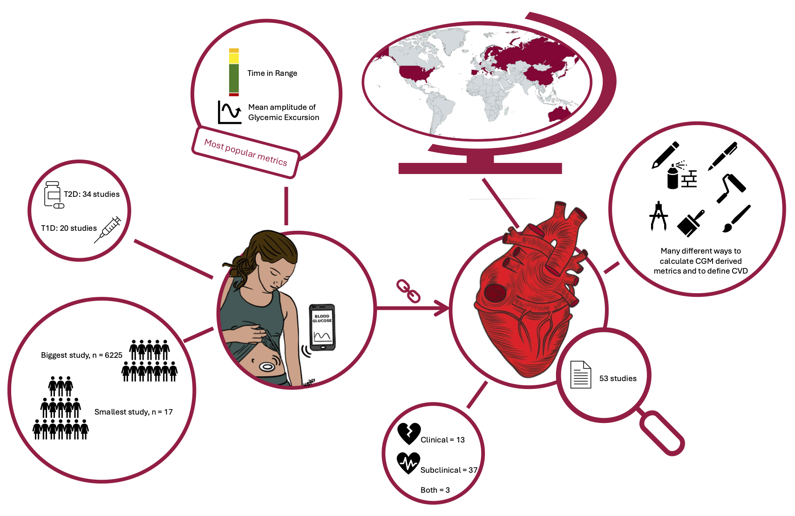
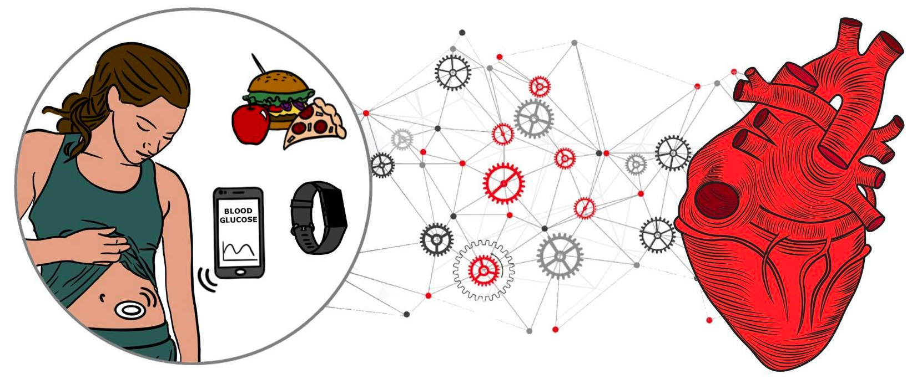
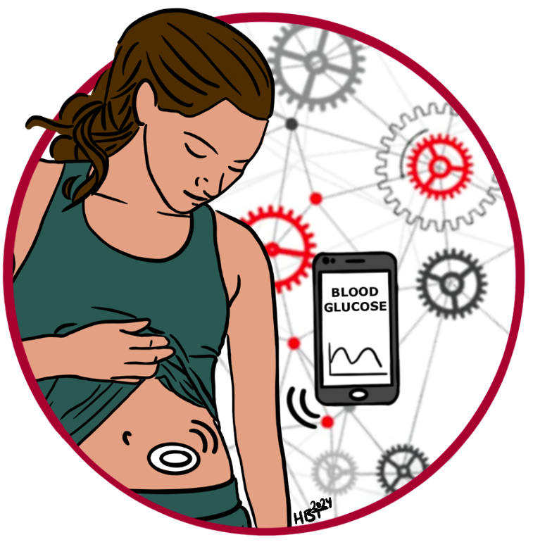

########### Publish Yaml file#############

::: {.content-visible when-format="pdf"}
# Full papers {#sec-papers}

## Paper I
\vspace*{\fill}
```{r}
#| echo: false
#| fig-align: center
#| out-width: 80%


```

\vspace*{\fill}

```{=latex}
\includepdf[pages=-, fitpaper=true]{figures/study_1.pdf}
\includepdf[pages=-, fitpaper=true]{coauthorship_forms/Study_1_Declaration_of_co-authorship_PhD_dissertations_October_2019_aai_hbt_ah.pdf}
```

\newpage

## Paper II

\vspace*{\fill}

```{r}
#| echo: false
#| fig-align: center
#| out-width: 80%


```

\vspace*{\fill}

```{=latex}
\includepdf[pages=-, fitpaper=true]{figures/study_2.pdf}
\includepdf[pages=-, fitpaper=true]{coauthorship_forms/Study_2_Declaration_of_co-authorship_PhD_dissertations_October_2019_ah_hbt.pdf}
```

\newpage

## Paper III

\vspace*{\fill}

```{r}
#| echo: false
#| fig-align: center
#| out-width: 80%


```
\vspace*{\fill}

```{=latex}
\includepdf[pages=-, fitpaper=true]{figures/study_3.pdf}
\includepdf[pages=-, fitpaper=true]{coauthorship_forms/Study_3_Declaration_of_co-authorship_PhD_dissertations_October_2019_ah_hbt.pdf}
```

:::


########## in Disclosure ##############


```{r}
#| label: financial-disclosures
#| eval: false
#| fig-align: center
#| out-width: 80%
#| fig-width: 8
#| fig-height: 3
#| echo: false

library(grid)
library(png)

ddea <- rasterGrob(readPNG("figures/DDEA.png"), interpolate = TRUE)
dca  <- rasterGrob(readPNG("figures/DCA.png"), interpolate = TRUE)
nnf  <- rasterGrob(readPNG("figures/NNF.png"), interpolate = TRUE)

grid.newpage()

pushViewport(viewport(
  layout = grid.layout(
    nrow = 2,
    ncol = 3,
    widths  = unit(c(0.46, 0.08, 0.46), "npc"),
    heights = unit(c(0.5, 0.5), "npc")
  )
))

# DDEA, upper left
pushViewport(viewport(layout.pos.row = 1, layout.pos.col = 1))
grid.draw(ddea)
popViewport()

# DCA, lower left
pushViewport(viewport(layout.pos.row = 2, layout.pos.col = 1))
grid.draw(dca)
popViewport()

# NNF, right side spanning both rows
pushViewport(viewport(layout.pos.row = 1:2, layout.pos.col = 3))
grid.draw(nnf)
popViewport()

popViewport()


```


########### Bottom of suppl.#############
::: {.content-visible when-format="pdf"}
# Full papers {#sec-papers}

## Paper I
\vspace*{\fill}
```{r}
#| echo: false
#| fig-align: center
#| out-width: 80%


```

\vspace*{\fill}

```{=latex}
\includepdf[pages=-, fitpaper=true]{figures/study_1.pdf}
\includepdf[pages=-, fitpaper=true]{coauthorship_forms/Study_1_Declaration_of_co-authorship_PhD_dissertations_October_2019_aai_hbt_ah.pdf}
```

\newpage

## Paper II

\vspace*{\fill}

```{r}
#| echo: false
#| fig-align: center
#| out-width: 80%


```

\vspace*{\fill}

```{=latex}
\includepdf[pages=-, fitpaper=true]{figures/study_2.pdf}
\includepdf[pages=-, fitpaper=true]{coauthorship_forms/Study_2_Declaration_of_co-authorship_PhD_dissertations_October_2019_ah_hbt.pdf}
```

\newpage

## Paper III

\vspace*{\fill}

```{r}
#| echo: false
#| fig-align: center
#| out-width: 80%


```
\vspace*{\fill}

```{=latex}
\includepdf[pages=-, fitpaper=true]{figures/study_3.pdf}
\includepdf[pages=-, fitpaper=true]{coauthorship_forms/Study_3_Declaration_of_co-authorship_PhD_dissertations_October_2019_ah_hbt.pdf}
```

:::