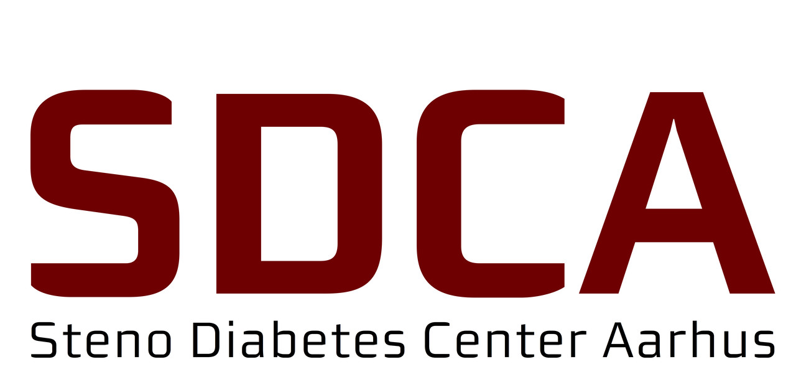

# Notes and disclosures {.unnumbered}

## Financial disclosures
This PhD project was supported by a research grant from the **Danish Diabetes and Endocrine Academy** (NNF22SA0079901) and the **Danish Cardiovascular Academy** (NNF20SA0067242), which are funded by the **Novo Nordisk Foundation**. Furthermore, the project was supported by a research grant from the **Novo Nordisk Foundation** (NNF22OC0076725),

```{r}
#| label: financial-disclosures
#| fig-align: center
#| out-width: 80%
#| echo: false
#| layout-ncol: 3

knitr::include_graphics("figures/au_health_cropped.png")
# knitr::include_graphics("figures/fim.png")

```

::: {.content-visible when-format="pdf"}

## Notes on website version {.unnumbered .unlisted}
This dissertation is available for viewing online at [HeleneThomsen.github.io/dissertation/](https://HeleneThomsen.github.io/dissertation/) or by scanning the QR code in the lower right-hand corner of the title page.

 

:::

::: {.content-hidden unless-format="html"}
## Notes on website version {.unnumbered .unlisted}

This website contains my PhD dissertation in online format. In terms of core content, it is identical to the pdf-file submitted to the graduate school, although the individual articles have been omitted from the website. Links to the papers are provided here [Link](https://HeleneThomsen.github.io/dissertation/0-papers.html) as soon as they are published.


Both the submitted dissertation and this website were made with [Quarto®](https://quarto.org/) Template was taken from Anders Aasted Isaksens GitHub repository [Link](https://aastedet.github.io/dissertation/)
Quarto is an open-source scientific and technical publishing system, with inspiration from the [quartothesis skeleton](https://github.com/biostats-r/quartothesis) by professor Richard Telford of the Department of Biological Sciences, University of Bergen.

The rendered pdf-file can be found here [Link](https://HeleneThomsen.github.io/dissertation/Machine-learning-methods-for-continuous-glucose-monitoring-data-and-their-potential-in-cardiovascular-risk-assessment.pdf).

## Supervisors and assessment committee {.unnumbered .unlisted}

#### PhD student:

**Helene Bei Thomsen**\
Department of Public Health, Aarhus University, Denmark

#### Supervisors:

**Associate Professor Adam Hulman, PhD (main supervisor)**\
Department of Public Health, Aarhus University, Denmark\
Steno Diabetes Center Aarhus, Denmark

**Anders Aasted Isaksen, MD, PhD**\
Steno Diabetes Center Aarhus, Denmark

**Guy Fagherazzi, PhD**\
Director of the Department of Precision Health\
Head of the Deep Digital Phenotyping Research Unit\
Luxembourg Institute of Health, Luxembourg

**Signe Toft Andersen, MD, PhD**\
Steno Diabetes Center Aarhus, Denmark\
Gødstrup Hospital, Denmark

#### Assessment committee:
**Associate Professor Simon Tilma Vistisen (chairman)**\
Department of Clinical Medicine, Aarhus University, Denmark
<!-- Email: vistisen@clin.au.dk -->

**Professor Cristina Soguero-Ruíz**\
Department of Signal Theory and Communications, King Juan Carlos University, Spain\
<!-- Email: cristina.soguero@urjc.es -->

**Associate Professor Simon Lebech Cichosz**\
Department of Health Science and Technology, The Faculty of Medicine, Medical\
Informatics and Image Analysis, Aalborg University, Denmark\
<!-- Email: simcich@hst.aau.dk -->

:::

