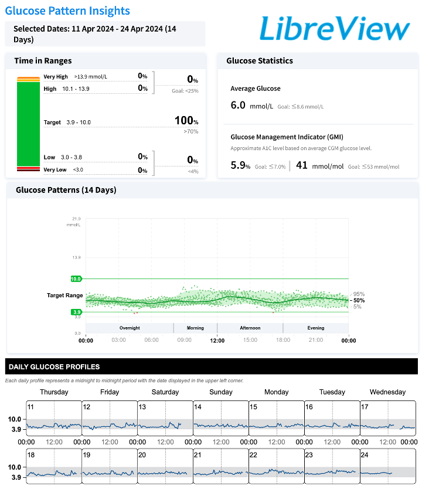

# Introduction {#sec-introduction}

## Diabetes
Diabetes is a metabolic disease characterized by high blood glucose levels known as hyperglycemia.[@Sacks2023]
The disease is one of the fastest growing global healths challenges.[@IDF_ed10_Magliano2021]
In 2021 it was estimated that 537 million people lived with diabetes, and it is expected to reach 643 million by 2030.[@IDF_ed10_Magliano2021]
The most common forms of chronic diabetes are \acr{T1D} and \acr{T2D}.[@Sacks2023]
T1D is an autoimmune disease characterized by the destruction of the pancreatic islet $\beta$-cells, leading to an absolute insulin deficiency.[@ADA2026_ch2]
Approximately 85\%-95\% of all people with diabetes in developing countries have \acr{T2D}.[@Sacks2023]
It is the most common form of diabetes and in contrast to \acr{T1D} it generally begins with insulin resistance in which the body's cells become less responsive to insulin.[@Sachs2023; @Hall2020]
Initially, the pancreas compensates by increasing insulin secretion, but over time progressive $\beta$-cell dysfunction results in inadequate insulin production to meet the body's demands.[@Hall2020; @Sacks2023; @Deshpande2008]
\acr{T2D} is the most which is  is 
Despite their distinct underlying pathophysiology, both \acr{T1D} and \acr{T2D} are characterized by chronic hyperglycemia.

<!-- Diabetes is diagnosed  -->
Diabetes can be diagnosed based on a bloodtest to check \acr{HbA1c} levels or through plasma glucose criteria (@tbl-diagnosis_criteria).[@ADA2026_ch2; @ADA2023_ch6]

::: {#tbl-diagnosis_criteria}
```{=latex}
    \begin{table}[H]
        \centering
        \begin{tabular}{p{4cm} c p{7cm}} \toprule
            \textbf{Test} & \textbf{Criteria} & \textbf{Description}\\ \midrule
            Fasting plasma glucose & $\geq$7.0 [mmol/L] & Fasting is defined as no calorie intake for at least eight hours.\\\midrule
            2-hour plasma glucose & $\geq$11.1 [mmol/L] & Glucose is measured 2 hours after oral ingestion of 75g glucose dissolved in water (OGTT)\\\midrule
            Random plasma glucose & $\geq$11.1 [mmol/L ] & Individuals with classic symptoms of hyperglycemia  (e.g., dehydration and unintentional weight loss) or hyperglycemic crisis (e.g., diabetic ketoacidosis) together with a plasma test taken any time of day. \\\midrule
            Glycated hemoglobin (HbA1c) & $\geq$48 [mmol/mol]& \\
            \bottomrule
        \end{tabular}
        \label{tab:diagnosis}
    \end{table}

```

Diagnostic tests for diabetes

:::

Although both plasma glucose tests and \acr{HbA1c} tests are appropriate for diabetes screening, the \acr{HbA1c} test has several advantages.[@ADA2026_ch2]
Some of the benefits are that it requires no fasting and it is less sensitive to stress and changes in nutrition.[@ADA2026_ch2]
\acr{HbA1c} is an indirect measure of blood glucose levels because glucose binds hemoglobin over  $\sim$ 120 days lifespan of erythrocytes (red blood cells).[@ADA2026_ch2]
However \acr{HbA1c} testing is not always accessible, affordable or suitable (e.g., for people with anemia or under HIV-treatment).[@ADA2026_ch2]
With the guidelines recommendation of using \acr{HbA1c}, a debate has sparked on the controversy of using a set thresholds as it is well known that racial differences in HbA1c exists.[@Selvin2013]
Black individuals have higher HbA1c levels than Hispanic and non-Hispanic White people with diabetes,[@kirk2006; @ADA2026_ch2] however studies show that the association between HbA1c and risk of complications appear to be similar between ethnic race groups.[@Selvin2013, @ADA2026_ch2]

## Blood Glucose Monitoring
\acr{HbA1c} values are also a very important part of diabetes management. The treatment goal is for \acr{HbA1c} to be below 53 mmol/mol for non-pregnant adults without any hyperglycemia or hypoglycemia (low blood glucose levels). However HbA1c goals should be individualized to fit each individuals specific situation HbA1c can vary from e.g., <48mmol/mol to none.[@ADA_2026_ch6; @IDF_2025_guidelines]
There are two tools available for self-assessment of glycemia, the \acr{SMBG} device measuring capillary blood with finger-sticks, and the \acr{CGM} measuring interstitial fluid continuously.[@IDF_2025_guidelines; @Buscemi2010]
Both monitoring devices have shown to improve glycemic control in people with diabetes, however the \acr{CGM} is superior when it comes to immediate information and alerts on asymptomatic hypo- and hyperglycemic events and provide a comprehensive glucose profile including both pre- and postprandial blood glucose measurements.[@IDF_2025_guidelines; @Danne2017; @freckmann2024]


<!-- ## Continuous Glucose Monitoring Devices -->
The \acr{CGM} devices measures the glucose in the interstitial fluid, which is the fluid around and between cells. It corresponds with plasma glucose although a lag can appear when glucose levels rise or fall rapidly.[@ADA2026_ch7]
Use of \acr{CGM} devices has shown to improve glycemic control in both \acr{T1D} and \acr{T2D} with improvements in \acr{HbA1c} levels and more time spent in target range (3.9-10 mmol/L) regardless of age, sex, eduction and income.[@ADA2026_ch6; @ADA2026_ch7]
\acr{CGM} devices focuses on monitoring and it is possible to get an \acr{AGP} report from you device (@fig-agp). The \acr{AGP} report shows summary statistics over all your data (usually a two weeks period). Some of the most important management measures from the \acr{CGM} is \acr{TIR}, and it is the time spent within normal range in percentage over a given time (often two weeks). Other \acr{CGM}-derived metrics are \acr{TAR}, time below range \acr{TBR}, \acr{GMI}, \acr{CV} and the \acr{MBG}, number of days \acr{CGM} was worn and the percentage of time the \acr{CGM} was active (@tbl-agp).[@Danne2017] 

::: {#fig-agp fig-scap='Ambulatory glucose profile report.'}

[](https://raw.githubusercontent.com/HeleneThomsen/dissertation/main/figures/1_intro_fig/agp.png)

Ambulatory glucose profile report from female without diabetes. Data points are from the author herself using an intermittently-scanned (Manuel data upload) FreeStyle LibreLink sensor.
:::


<!-- ::: {#tbl-agp tbl-cap-short="Standardized AGP metrics"}
| Abbreviation | CGM-derived metric | Recommended target value* |
|:------------|:-------------------|:--------------------------|
| TIR | Time in Range (3.9–10.0 mmol/L; 70–180 mg/dL) | >70% |
| TBR | Time Below Range (<3.9 mmol/L; <70 mg/dL) | <4% |
| TBR<sub>54</sub> | Time Below Range (<3.0 mmol/L; <54 mg/dL) | <1% |
| TAR | Time Above Range (>10.0 mmol/L; >180 mg/dL) | <25% |
| TAR<sub>250</sub> | Time Above Range (>13.9 mmol/L; >250 mg/dL) | <5% |
| GMI | Glucose Management Indicator | No specific target; interpreted alongside HbA1c |
| CV | Coefficient of Variation | ≤36% |
| MG | Mean Glucose | No universal target; individualized according to treatment goals |

Overview of the standardized ambulatory glucose profile (AGP) metrics and their recommended target values for most non-pregnant adults with diabetes.
:::
-->


::: {#tbl-agp}

```{=latex}
    \begin{table}[H]
        \centering
        \begin{tabular}{clcc} \toprule
            \textbf{Abbreviation} & \textbf{CGM-derived metric} & \textbf{Range} & \textbf{Recommended target}\\ \midrule
            TIR & Time in Range & 3.9--10.0 mmol/L (70--180 mg/dL) & $>70\%$\\ \midrule
            TBR & Time Below Range & $<3.9$ mmol/L ($<70$ mg/dL) & $<4\%$\\ \midrule
            TBR$_{54}$ & Time Below Range & $<3.0$ mmol/L ($<54$ mg/dL) & $<1\%$\\ \midrule
            TAR & Time Above Range & $>10.0$ mmol/L ($>180$ mg/dL) & $<25\%$\\ \midrule
            TAR$_{250}$ & Time Above Range & $>13.9$ mmol/L ($>250$ mg/dL) & $<5\%$\\ \midrule
            GMI & Glucose Management Indicator & & No specific target\\ \midrule
            CV & Coefficient of Variation & & $\leq36\%$\\
            \bottomrule
        \end{tabular}
        \label{tab:agp-metrics}
    \end{table}

```
CGM-derived metrics presented in the ambulatory glucose profile report with target values.

:::


## Management
## Glycemic markers and glucose monitoring
- [x] HbA1c and its limitations
- [x] Continuous glucose monitoring (CGM)
- [ ] AIDs use CGMs and algorithms to adjust insulin delivery. [@ADA2026_ch7]
- [ ]Glycemic variability
    - [ ] Metrics of glycemic variability
    - [ ] Clinical challenges of glycemic variability (Think HbA1c and MBG and variability study)

## Cardiovascular diseases and Diabetes

<!-- @ADA2026_ch2

Once hyperglycemia occurs, people with all forms
of diabetes are at risk for developing the
same chronic complications, although rates
of progression may differ -->


<!-- Keeping blood glucose levels within normal range is essential to avoid future diabetes-related complications, such as cardiovascular diseases, blindness, renal failure, and lower extremity amputations [race 2–5]. -->

* Cardiovascular complications
* Heart failure in diabetes

Williams2020 expenditures and complications: https://www.sciencedirect.com/science/article/pii/S0168822720301388
## Cardiovascular risk prediction in diabetes
* Traditional risk models
    * SCORE2-Diabetes risk score
    * What is SCORE2-Diabetes 10 year CVD risk score?
* Limitations of conventional predictors

## Machine learning


**Relevant?**
Artificial Intelligence: The Future for Diabetes Care: https://www.clinicalkey.com/#!/content/playContent/1-s2.0-S0002934320303399?returnurl=https:%2F%2Flinkinghub.elsevier.com%2Fretrieve%2Fpii%2FS0002934320303399%3Fshowall%3Dtrue&referrer=


* Data-driven vs hypothesis-drivenly(knowledge-based) paradigms
* Why machine learning in diabetes and cardiovascular risk prediction?
* Why are ML fantastic for CGM data?
* Types of machine learning methods
    * Logistic regression
    * LSTM and CNNs
    * Foundation models and their advantage
        <!-- * CGM data has been processed and interpreted based on plotting the data and extracting CGM-derived metrics from time series signal sampled every 3-15 minutes. However new techniques within the machine learning field has allowed us to process the whole time series signals like CGM data, which can retain more information from the original CGM data then the derived metrics can. Foundation models are machine learning models that are trained on huge amount of data and thereafter can be retrained to be specialized into a specific task. This is one solution to the limitation of small datasets that are not sufficient enough for the data hungry machine learning models. -->
        <!-- * The CGMformer is a transformer-based model that was trained on a large dataset of CGM data and is designed to learn representations of glucose dynamics. The model takes in sequences of CGM measurements and outputs embeddings that capture the underlying patterns in the glucose data. These embeddings can then be used for downstream tasks such as predicting cardiovascular risk or other health outcomes. -->
        <!-- * The embeddings are learned representations that capture the underlying patterns and relationships in the input data, allowing for more efficient and effective downstream tasks such as classification, regression, or clustering. -->

    * The CGMformer is bla bla bla [@YurunLu2025]

* Challenges and pitfalls of machine learning in healthcare
    * Overfitting and generalizability
    * Interpretability and explainability

## Fairness and bias in machine learning
* Define race and ethnicity
* Algorithmic bias and group fairness
* Fairness metrics and mitigation strategies

* Trends in the quality of care and racial disparities in Medicare managed care: https://pubmed.ncbi.nlm.nih.gov/16107622/

<!-- https://github.com/Aastedet/dissertation -->
<!-- https://superfrey.github.io/PhD_dissertation/1-introduction.html -->


<!-- ::: {#fig-classifir-diffs}
[](https://aastedet.github.io/dissertation/figures/classifierdiffs.svg):::  This is anders example with figures, calling an URL link inside the figure code to make the figure clickable like a button which will take you to the origin of the image. (not necesary for this project but maybe in the future for thesis writing)-->