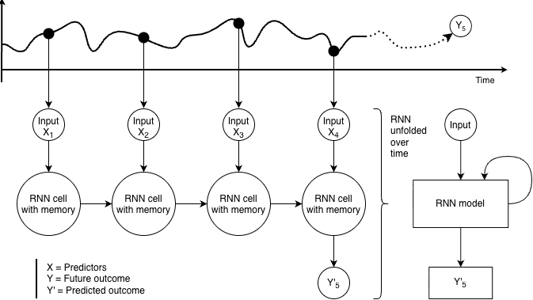
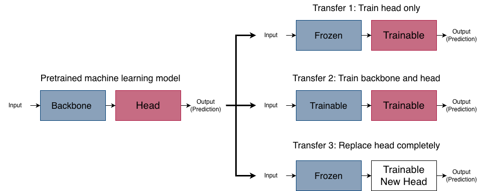

# Introduction {#sec-introduction}

## Diabetes
Diabetes is a metabolic disease characterized by high blood glucose levels known as hyperglycemia.[@Sacks2023; @Deshpande2008]
The most common forms of chronic diabetes are \acr{T1D} and \acr{T2D}.[@Sacks2023]
T1D is an autoimmune disease characterized by the destruction of the pancreatic islet $\beta$-cells, leading to an absolute insulin deficiency.[@ADA2026_ch2]
T2D is the most common form of diabetes and in contrast to \acr{T1D} it generally begins with insulin resistance in which the body's cells become less responsive to insulin.[@Sacks2023; @Hall2020]
Insulin lowers blood glucose by promoting glucose uptake in insulin-sensitive tissues, particularly skeletal muscle and adipose tissue, and by stimulating glycogen synthesis in the liver. As an anabolic hormone, insulin also promotes energy storage and may contribute to weight gain.[@ijms2021]
Initially, the pancreas compensates by increasing insulin secretion, however over time progressive $\beta$-cell dysfunction results in inadequate insulin production to meet the body's demands.[@Hall2020; @Sacks2023; @Deshpande2008]
Despite their distinct underlying pathophysiology, both \acr{T1D} and \acr{T2D} are characterized by chronic hyperglycemia.

<!-- Diabetes is diagnosed  -->
Diabetes can be diagnosed based on a bloodtest to check \acr{HbA1c} levels or through plasma glucose criteria (@tbl-diagnosis_criteria).[@ADA2026_ch2; @ADA2023_ch6]

::: {#tbl-diagnosis_criteria tbl-pos="H"}
```{=latex}
    \begin{table}[H]
        \centering
        \begin{tabular}{p{4cm} c p{7cm}} \toprule
            \textbf{Test} & \textbf{Criteria} & \textbf{Description}\\ \midrule
            Fasting plasma glucose & $\geq$7.0 [mmol/L] & Fasting is defined as no calorie intake for at least eight hours.\\\midrule
            2-hour plasma glucose & $\geq$11.1 [mmol/L] & Glucose is measured 2 hours after oral ingestion of 75g glucose dissolved in water (OGTT)\\\midrule
            Random plasma glucose & $\geq$11.1 [mmol/L] & Individuals with classic symptoms of hyperglycemia  (e.g., dehydration and unintentional weight loss) or hyperglycemic crisis (e.g., diabetic ketoacidosis) together with a plasma test taken any time of day. \\\midrule
            Glycated hemoglobin (HbA1c) & $\geq$48 [mmol/mol]& \\
            \bottomrule
        \end{tabular}
        \label{tab:diagnosis}
    \end{table}

```

Diagnostic tests for diabetes.

:::

Although both plasma glucose tests and \acr{HbA1c} measurements are appropriate for diabetes screening, the \acr{HbA1c} measurement has several advantages.[@ADA2026_ch2]
Some of the benefits are that it requires no fasting and it is less sensitive to stress and changes in nutrition.[@ADA2026_ch2]
\acr{HbA1c} is an indirect measure of blood glucose levels because glucose binds to hemoglobin over  $\sim$ 120 days lifespan of erythrocytes (red blood cells).[@ADA2026_ch2]
However \acr{HbA1c} testing is not always accessible, affordable or suitable (e.g., for people with anemia or under HIV-treatment).[@ADA2026_ch2]

## Blood Glucose Monitoring
A common treatment goal for non-pregnant adults with diabetes is for \acr{HbA1c} to be below 53 mmol/mol and not have any hyperglycemia or hypoglycemia (low blood glucose levels).[@ADA2026_ch6; @IDF_2025_guidelines] This corresponds to an estimated average glucose of 8.6 mmol/L.[@ADA2026_ch6] However \acr{HbA1c} goals should be individualized to fit each individual's specific situation and may be higher or lower than 53 mmol/mol.[@ADA2026_ch6; @IDF_2025_guidelines]
There are two tools available for self-assessment of glycemia, the \acr{SMBG} device measuring capillary blood with finger-sticks, and the \acr{CGM} device measuring interstitial fluid (fluid around and between cells) continuously.[@IDF_2025_guidelines; @Buscemi2010]
Both monitoring devices have shown to improve glycemic control in people with diabetes, however the \acr{CGM} devices are superior when it comes to immediate information and alerts on asymptomatic hypo- and hyperglycemic events and provide a comprehensive glucose profile including both pre- and postprandial blood glucose measurements.[@IDF_2025_guidelines; @Danne2017; @Freckmann2024]


### Continuous Glucose Monitoring and Automated Insulin Delivery
The \acr{CGM} devices measure the glucose in the interstitial fluid, which corresponds with plasma glucose although a lag can appear when glucose levels rise or fall rapidly.[@ADA2026_ch7]
Use of \acr{CGM} devices has shown to improve glycemic control in both \acr{T1D} and \acr{T2D} with improvements in \acr{HbA1c} levels and more time spent in target range (standard: 3.9-10 mmol/L) regardless of age, sex, eduction and income.[@ADA2026_ch6; @ADA2026_ch7]
\acr{CGM} devices focus on monitoring and it is possible to get an \acr{AGP} report from the devices (@fig-agp).
The \acr{AGP} report shows summary statistics over all data (usually a two weeks period) including \acr{CGM}-derived metrics as shown in (@tbl-agp).[@Danne2017]
Besides monitoring, data from \acr{CGM} devices are now used in combination with insulin delivery systems to automate the process of administering insulin.[@ADA2026_ch7]
\acr{AID} systems typically use data from \acr{CGM} devices to determine or adjust insulin delivery.
The simplest \acr{AID}s are threshold-based low-glucose suspend systems in which insulin delivery is automatically suspended when blood glucose levels drop below a predefined threshold.[@Templer2022]
\acr{AID} systems are becoming increasingly sophisticated, with the long-term goal of approximating the physiological regulation of glucose by a healthy pancreas. However, the delayed onset and peak action of subcutaneously administered insulin limit the ability of these systems to respond rapidly to changing glucose concentrations.[@Rimon2024] Consequently, accurate short-term glucose forecasting has become increasingly important, particularly for anticipating postprandial glucose excursions and enabling earlier insulin adjustments to reduce the risk of both hyper- and hypoglycemia.[@Rimon2024]
More advanced systems are beginning to utilize additional information such as carbohydrate intake and physical activity to optimize insulin delivery.[@Jaloli2023; @Gao2020] 

::: {#fig-agp fig-scap='Ambulatory glucose profile report'}

[](https://raw.githubusercontent.com/HeleneThomsen/dissertation/main/figures/1_intro_fig/agp.png)

Ambulatory glucose profile report from female without diabetes. Data points are from the author herself using an intermittently-scanned (Manuel data upload) FreeStyle LibreLink sensor.
:::


::: {#tbl-agp tbl-pos="H"}

```{=latex}
    \begin{table}[H]
        \centering
        \begin{tabular}{clcc} \toprule
            \textbf{Abbreviation}         & \textbf{CGM-derived metric} & \textbf{Range} & \textbf{Recommended target}\\ \midrule
            GMI        & Glucose Management Indicator & & No specific target\\ \midrule
            TIR        & Time in Range    & \begin{tabular}[c]{@{}l@{}}3.9-10.0 mmol/L\\(70-180 mg/dL)\end{tabular} & $>70\%$\\ \midrule
            TBR$_{54}$ & Time Below Range & \begin{tabular}[c]{@{}l@{}} $<3.0$ mmol/L\\ ($<54$ mg/dL)\end{tabular}  & $<1\%$\\ \midrule
            TBR$_{70}$ & Time Below Range & \begin{tabular}[c]{@{}l@{}}$<3.9$ mmol/L\\  ($<70$ mg/dL)\end{tabular}  & $<4\%^{*}$\\ \midrule
            TAR$_{180}$ & Time Above Range & \begin{tabular}[c]{@{}l@{}}$>10.0$ mmol/L\\ ($>180$ mg/dL)\end{tabular}& $<25\%^{**}$\\ \midrule
            TAR$_{250}$& Time Above Range & \begin{tabular}[c]{@{}l@{}}$>13.9$ mmol/L\\ ($>250$ mg/dL)\end{tabular} & $<5\%$\\ \midrule
            CV         & Coefficient of Variation     & & $\leq36\%$\\\midrule
                        & Number of days sensor was worn &  & \begin{tabular}[c]{@{}l@{}}$\geq14 $ days for\\ pattern management\end{tabular}\\\midrule
                        & Active sensor time & & 70\% of 14 days \\
            \bottomrule
        \end{tabular}
        \label{tab:agp-metrics}
    \end{table}

```

::: {.content-visible when-format="pdf"}
```{=latex}
\tablenote[0.90\linewidth]{
    \textsuperscript{*} This goal include both TBR$_{54}$ and TBR$_{70}$.\newline
    \textsuperscript{**} This goal include both TAR$_{180}$ and TAR$_{250}$
}
```
:::

CGM-derived metrics presented in the ambulatory glucose profile report with target values.

:::

## Glycemic Control and Variability
A challenge in achieving good glycemic control is keeping blood glucose levels low enough to reduce the risk of long-term complications, while avoiding hypoglycemia, which can cause acute symptoms and, in insulin-treated individuals, may be life-threatening.[@Kovatchev2016]
The variability in the blood glucose fluctuations needs to be reduced in order to lower the average blood glucose levels while still avoiding hypoglycemia.[@Kovatchev2016]
Advances in \acr{CGM} technology have enabled the quantification of glucose variability, a measure of the extent of fluctuations in blood glucose levels over time, including both peaks and nadirs.[@Mo2024]
Describing the variability is important because two individuals with similar \acr{HbA1c} levels may exhibit different glycemic variability profiles.[@Kovatchev2016]
Numerous metrics have been developed to characterize different aspects of glucose variability, but no single measure captures all of its dimensions.
Although international consensus recommendations advocate the routine reporting of glucose variability using \acr{CV}, \acr{MAGE}, and \acr{SD}, with particular emphasis on \acr{CV},[@Danne2017] glucose variability encompasses multiple dimensions, including within- and between-day variability, the amplitude of glucose excursions, and temporal glucose patterns.[@Kovatchev2016] As a result, no single metric has been shown to comprehensively capture all aspects of glucose variability, and no consensus currently exists regarding the optimal measure.[@Kovatchev2016; @Mo2024]

\newpage
## Cardiovascular Diseases and Heart Failure
Although advances in diabetes management have reduced the incidence of several diabetes-related complications, \acr{CVD} remains a major cause of morbidity and mortality in people with diabetes.[@rawshani2017; @ADA2026_ch10; @Pennells2023_score2dm] Chronic hyperglycemia can lead to long-term complications such as atherosclerotic \acr{CVD}, although the progression and manifestation of these complications vary between individuals.[@ADA2026_ch2] Identifying individuals at increased risk of \acr{CVD} or heart failure before clinical disease develops is therefore an important component of diabetes care.[@ADA2026_ch10]

Heart failure is at least twice as prevalent among people with diabetes as in the general population.[@ADA2026_ch10; @Hoek2024]
It is characterized by symptoms such as breathlessness, fatigue, and ankle swelling, which may be accompanied by clinical signs such as elevated jugular venous pressure, pulmonary crackles, and peripheral oedema.[@mcdonagh2021] 
Heart failure may present as either acute or chronic, with acute heart failure typically involving rapid onset or worsening of symptoms and signs.[@mcdonagh2021]
In individuals with suspected chronic heart failure based on risk factors, symptoms, clinical findings, and supporting investigations such as electrocardiography, measurement of natriuretic peptides, including \acr{NT-proBNP}, is recommended as part of the diagnostic work-up.[@mcdonagh2021]
An \acr{NT-proBNP} concentration of ≥125 pg/mL or higher indicates the need for further cardiac evaluation, whereas concentrations below this threshold make chronic heart failure unlikely and alternative diagnoses should be considered.[@mcdonagh2021]
Although \acr{NT-proBNP} levels may be influenced by non-cardiac factors, including age, ischemic stroke, and renal dysfunction,[@mcdonagh2021] it remains clinically useful in the assessment of individuals at increased risk of chronic heart failure.


##  Cardiovascular Risk Prediction Models
To facilitate early identification of individuals at increased cardiovascular risk, several clinical prediction models have been developed.[@Framingham2007; @Pennells2023_score2dm; @QRISK_2007; @Segar2019]
By estimating the probability of a \acr{CVD} event within a specified time horizon, these models can increase awareness of cardiovascular risk, encourage adherence to recommended lifestyle changes and medical treatment, and help identify individuals who are most likely to benefit from preventive interventions.[@Donald2010]
Among these, the \acr{SCORE2-Diabetes} model estimates the 10-year risk of \acr{CVD} in individuals with \acr{T2D}. It was developed and calibrated using European cohorts, making it particularly relevant for the Danish cohort included in this dissertation.[@Pennells2023_score2dm]
However, the \acr{SCORE2-Diabetes} model relies solely on traditional clinical variables, including age, sex, smoking status, systolic blood pressure, \acr{HDL cholesterol}, age at diabetes diagnosis, \acr{HbA1c}, and \acr{eGFR}, and does not incorporate information on glucose dynamics beyond the long-term glycemic exposure reflected by \acr{HbA1c}.[@Pennells2023_score2dm]
\acr{HbA1c} has been independently associated with risk of heart failure,[@Hsiao2025] however it does not capture the short-term glucose fluctuations, which may be associated with the progression of vascular complications in diabetes.[@Belli2023]

## Association vs Prediction
Association and prediction are distinct analytical objectives, although the terms are sometimes used interchangeably in the medical literature. However the distinction is necessary because associations do not necessarily imply predictive utility.[@TiborVarga2020] Association studies aim to identify relationships between variables and an outcome at group level, whereas prediction models are developed to estimate future outcomes for individual patients.[@TiborVarga2020]

Traditional statistical association modelling is often used to test hypotheses regarding associations between exposures, $X$ and outcomes, $Y$.[@Shmueli2010] Regression models applied to observational data are commonly used to evaluate hypotheses derived from prior knowledge, where the choice of exposures is guided by existing theory.[@Shmueli2010]
These approaches are based on the premise that the chosen statistical model adequately represents the underlying data-generating mechanism, allowing conclusions to be drawn from the estimated model parameters.[@Breiman2001]
Results from association studies are typically summarized using estimated effect measures, such as regression coefficients, odds ratios, hazard ratios, or risk ratios, together with confidence intervals and significance tests.[@TiborVarga2020] 

In contrast, prediction modelling applies statistical models to predict future outcomes, $Y$ based on a set of predictors, $X$.[@Breiman2001]
Prediction models may be implemented using a wide range of approaches, including regression models, decision trees, and machine learning algorithms.[@Shmueli2010; @Breiman2001]
The prediction models are fitted to data (the predictors) and the predicted output, $Y´$ is evaluated based on the outcome, $Y$. [@Breiman2001]
Evaluation metrics on prediction studies often include classification metrics such as \acr{AUROC}, sensitivity, specificity and calibration plots for binary outcomes[@VanCalster2025] and \acr{RMSE}, for continuous outcomes.[@vanDoorn2021]


## Machine Learning 
The widespread adoption of \acr{CGM} has generated large volumes of glucose data, enabling the application of machine learning methods in diabetes care.[@Jaloli2023; @Ellahham2020]
Machine learning is often associated with complex algorithms that are hard to interpret, however many machine learning methods are closely related to familiar statistical approaches.[@Badillo2020] Similarly, linear regression can be applied in a data-driven modelling framework and are among the most interpretable machine learning methods.[@Badillo2020]
Machine learning models can in general be divided into supervised and unsupervised machine learning.[@Badillo2020]
Supervised machine learning uses labelled data where each sample (e.g., age and sex from one individual) has a label or an outcome (e.g., elevated \acr{NT-proBNP}) to predict new outcomes for previously unseen data. Unsupervised machine learning on the other hand uses data without labels to explore underlying structures or clusters in data.[@Badillo2020]

Among supervised learning methods, deep neural networks are particularly notable because they can automatically extract information directly from raw data for tasks such as prediction or classification, reducing the need for manual feature engineering such as calculating CGM-derived metrics by hand.[@Jaloli2023; @Bengio2013]
Consequently, deep neural networks offer an alternative to relying on predefined \acr{CGM}-derived metrics.
Since \acr{CGM} data are collected continuously over time, methods that can account for temporal dependencies are particularly relevant. A \acr{LSTM} is a type of recurrent neural network, which have been designed for time-series data and used for glucose prediction tasks as illustrated in @fig-lstm.[@Foreman2021; @Jaloli2023; @Badillo2020] These models can use previous glucose values to inform predictions of future glucose levels, making them suitable for short-term forecasting.

::: {#fig-lstm fig-scap='A recurrent neural network.'}

{width=80%}

Schematic illustration of a recurrent neural network for prediction. Previous values are processed sequentially, allowing information from earlier time points (X) to be retained and updated over time. The learned temporal representation is then used to predict a future outcome (Y').
Figure created by the author. The visual design was inspired by explanatory videos by StatQuest with Josh Starmer.[@StatQuest]

:::


## Foundation Models and Transfer Learning
In recent years, machine learning models have grown substantially in scale, complexity, and applicability. This development has led to the emergence of foundation models, which are defined as *"any model that is trained on broad data (generally using self-supervision at scale) that can be adapted (e.g., fine-tuned) to a wide range of downstream tasks"*.[@Bommasani2022]  Two \acr{CGM} specialized foundation models exist in the literature which both uses self-supervised machine learning.[@YurunLu2025; @Lutsker2026] Self-supervised machine learning is a technique used to train models on unlabelled data through different techniques, one of them including masked learning (e.g., predicting manually masked words in text or values in time-series signals).[@Bommasani2022; @YurunLu2025; @Lutsker2026]
A foundation model is first pretrained on a general task, such as predicting masked values in CGM data, allowing it to learn representations of glucose dynamics. These representations can subsequently be adapted to a downstream task, such as predicting cardiovascular outcomes, through transfer learning.[@Bommasani2022; @Lutsker2026]
A foundation model can be conceptualized as comprising a pretrained backbone and a task-specific head (@fig-tl).[@Deng2021] The backbone extracts representations from the input data, whereas the head uses the representations to perform the downstream task. Transfer-learning strategies differ primarily in how the pretrained backbone is used. It may remain fixed and serve as a feature extractor, with only a downstream model or task-specific head being trained, or some or all of the model may be updated through fine-tuning.[@Deng2021; @Peters2019] The choice of strategy depends partly on the similarity between the pretraining and downstream tasks.[@Peters2019]
Transfer learning addresses the need for large amounts of data in deep neural networks by reusing knowledge learned from large datasets and applying it to related tasks with limited labelled data.
This is particularly relevant in clinical risk prediction, where labelled data are often scarce, especially for minority populations.[@Deng2021; @Haw2021; @Muralidharan2024]

::: {#fig-tl fig-scap='Overview of Transfer Learning Strategies.'}



Overview of transfer learning strategies. Inspired by Deng et al.[@Deng2021] under the Creative Commons Attribution 4.0 International (CC BY 4.0) licence.
:::

## Health Disparities and Bias in Machine Learning
Fairness is being integrated more and more into reporting guidelines for clinical prediction models, because unequal model performance across population strata defined by sensitive attributes, such as race, sex, and socioeconomic status, may contribute to or reinforce societal inequalities.[@Chakradeo2025; @Collins2024]
In clinical prediction modelling, fairness implies that models should perform accurately, equitably, and reliably across diverse populations. This requires transparent model development, evaluation, and monitoring, so that potential disparities can be identified and addressed.[@Chakradeo2025]
There is however still a lack of reporting on race and ethnicity in trials even though diabetes affects individuals across all racial and ethnic groups and differences have been reported in glycemic response, glycemic control, insulin resistance and the burden of diabetes-related complications between populations.[@Turner2022; @Muralidharan2024; @Danielson2010; @doVale2021; @Bergenstal2017 @Selvin2013; @kirk2006; @ADA2026_ch2]
A study by Turner et al.[@Turner2022] showed that among 20,692 US-based clinical trials, only 43% reported participants' race or ethnicity. Although the reporting of race and ethnicity increased between 2010 and 2020, racial and ethnic minority groups remained underrepresented relative to their proportions in the US population.[@Turner2022] Furthermore, this lack of information is not only present in clinical trials but also in reportings of FDA-approved AI medical devices.[@Turner2022; @Muralidharan2024]
A study by Muralidharan et al.[@Muralidharan2024] found that only 3.6\% of the FDA approval documents (Summary of Safety and Effectiveness Data Documents) provided information on race and/or ethnicity of the intended or testet users.[@Muralidharan2024]
Lack of ethnic and racial information in datasets problematic in data-driven models such as machine learning models since they reflect the populations represented in their training data and when minority groups are underrepresented, the resulting models may not generalize equally well to all patients.[@Muralidharan2024; @Cronje2023]
Consequently, models developed predominantly using one population may not achieve comparable predictive performance in others and potentially reinforcing existing healthcare disparities.[@Cronje2023]
For example, risk prediction models have been shown to underestimate the risk of T2D among non-Hispanic Black individuals,[@Cronje2023] and algorithmic bias has been demonstrated to substantially influence the allocation of healthcare resources.[@Obermeyer2019] Developing equitable prediction models therefore requires both representative data and careful evaluation of model performance across demographic groups. Transfer learning becomes particularly relevant in such cases where labelled data are often scarce, especially for minority populations.[@Deng2021; @Haw2021; @Muralidharan2024; @Turner2022]


