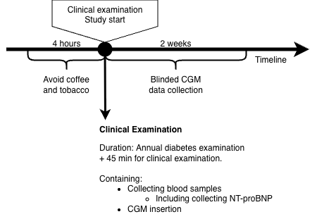
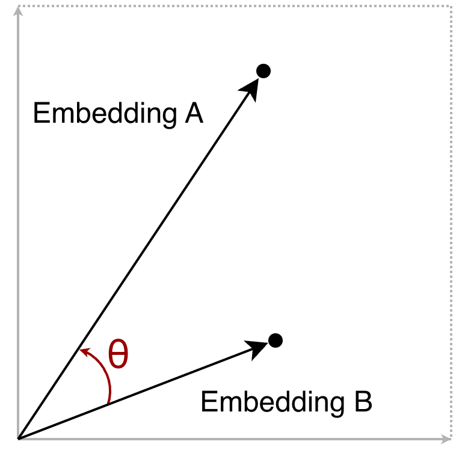
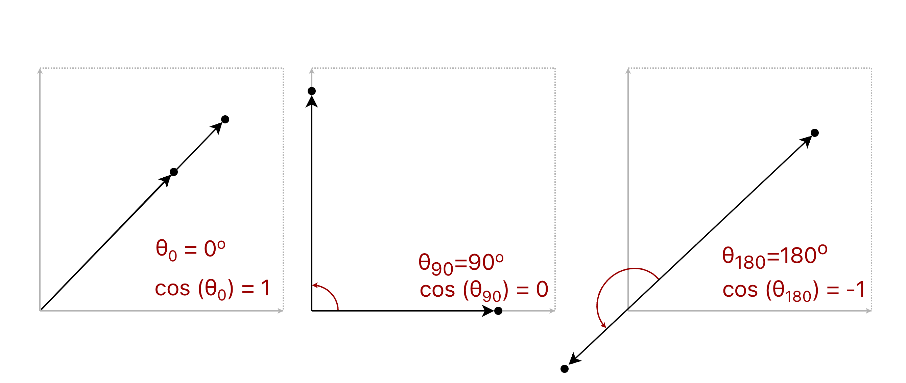
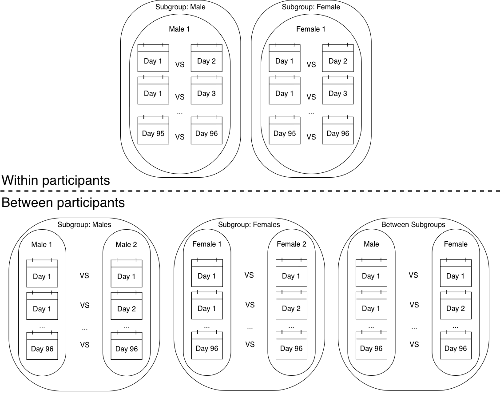
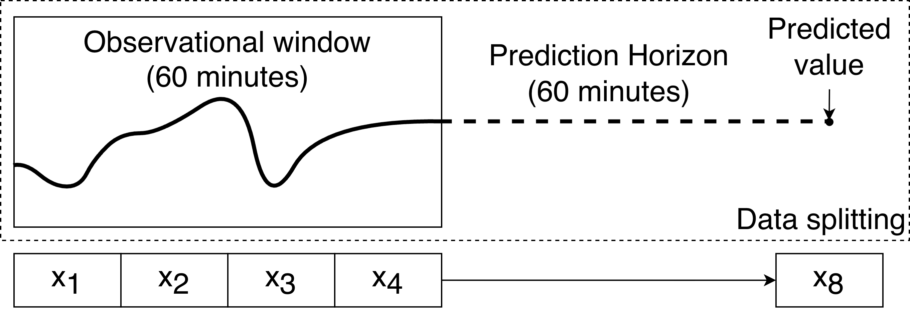
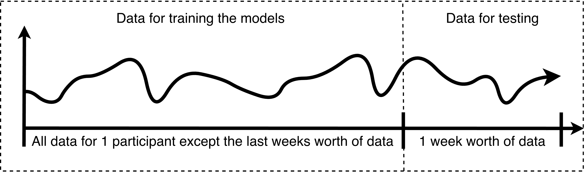
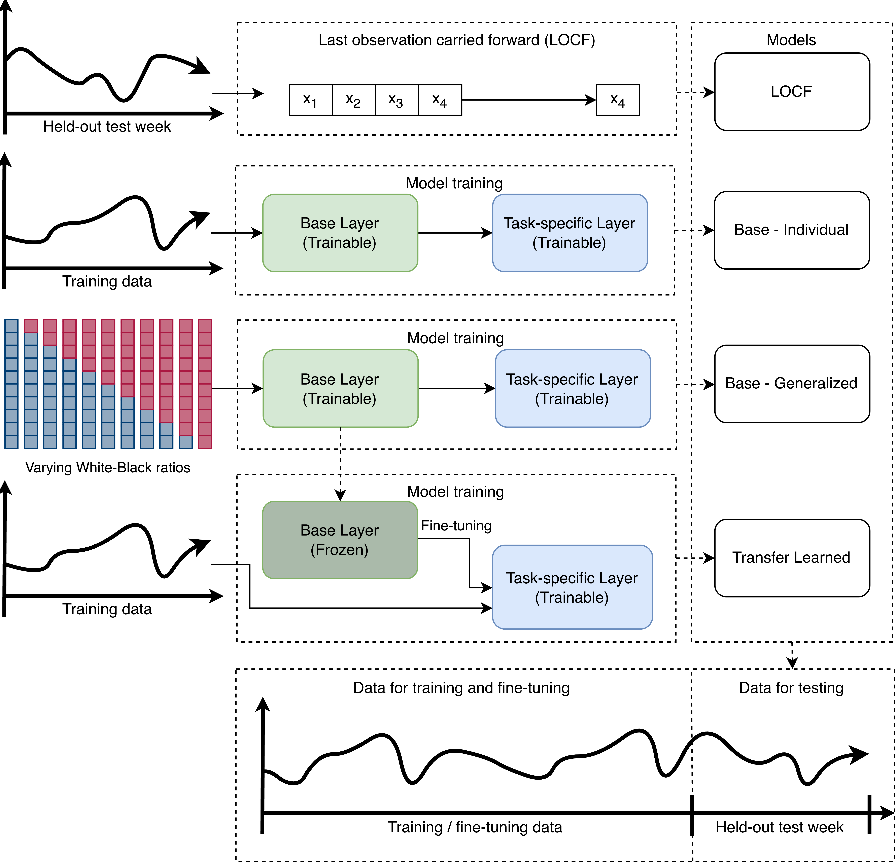
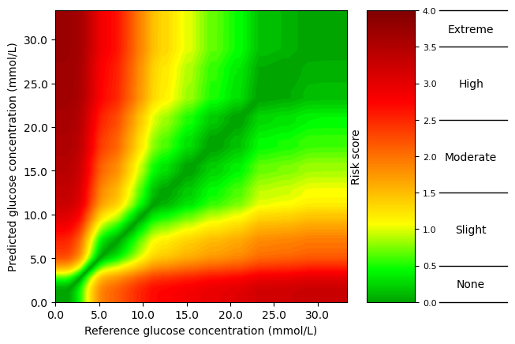

# Methods

In this chapter the three studies included in this PhD will be presented. The data will be described together with the chosen methods of the three studies and the different clinical variables, CGM-derived metrics and relevant cardiovascular outcomes will be explained.

- [ ] What was done (Description)
- [ ] Why it was done (Justification)
- [ ] Add search string?
- [ ] tell about the 7-point fingerprick?

## Overview of the studies

+---------------------------------+-----------------------------------------------------------------------------------------------------------------------------+---------------------------------------------------------------------------------------------------------------------------------------------+------------------------------------------------------------------------------------------------------------------------+
|                                 | Study I                                                                                                                     | Study II                                                                                                                                    | Study III                                                                                                              |
+=================================+=============================================================================================================================+=============================================================================================================================================+========================================================================================================================+
| Title                           | Continuous Glucose Monitoring–Derived Metrics and Cardiovascular Risk Among People With Diabetes: Systematic Scoping Review | Foundation model–derived representations of continuous glucose monitoring data: relation to glycemic patterns and cardiovascular risk | Racial disparities in continuous glucose monitoring-based 60-min glucose predictions among people with type 1 diabetes |
+---------------------------------+-----------------------------------------------------------------------------------------------------------------------------+---------------------------------------------------------------------------------------------------------------------------------------------+------------------------------------------------------------------------------------------------------------------------+
| Study Type                      | Review                                                                                                                      | CGM foundation model evaluation study                                                                                                       | Algorithmic fairness study                                                                                             |
+---------------------------------+-----------------------------------------------------------------------------------------------------------------------------+---------------------------------------------------------------------------------------------------------------------------------------------+------------------------------------------------------------------------------------------------------------------------+
| Data Sources                    | Literature on Embase and MEDLINE                                                                                            | The CANCAN study and the T1D Exchange (T1DX) dataset                                                                                        | T1D Exchange (T1DX) dataset                                                                                            |
+---------------------------------+-----------------------------------------------------------------------------------------------------------------------------+---------------------------------------------------------------------------------------------------------------------------------------------+------------------------------------------------------------------------------------------------------------------------+
| Population                      | Studies including people with type 1 diabetes, type 2 diabetes and/or prediabetes                                           | 159 people with type 2 diabetes\                                                                                                            | 205 people with type 1 Diabetes                                                                                        |
|                                 |                                                                                                                             | 205 people with type 1 Diabetes                                                                                                             |                                                                                                                        |
+---------------------------------+-----------------------------------------------------------------------------------------------------------------------------+---------------------------------------------------------------------------------------------------------------------------------------------+------------------------------------------------------------------------------------------------------------------------+
| Input, predictors and exposures | Search strategy and eligibility criteria                                                                                    | Clinical variables, CGM-derived metrics and continuous CGM data                                                                             | Continuous CGM data                                                                                                    |
+---------------------------------+-----------------------------------------------------------------------------------------------------------------------------+---------------------------------------------------------------------------------------------------------------------------------------------+------------------------------------------------------------------------------------------------------------------------+
| Outcome, target                 | All studies that uses CGM data to say something about cardiovascular disease risk and outcomes                              | Visualisation of foundation model embeddings and elevated NT-proBNP prediction                                                              | Next blood glucose value                                                                                               |
+---------------------------------+-----------------------------------------------------------------------------------------------------------------------------+---------------------------------------------------------------------------------------------------------------------------------------------+------------------------------------------------------------------------------------------------------------------------+
| Analysis                        | Systematic scoping review, study characterization, and narrative synthesis                                                  | Foundation models and logistic regression models                                                                                            | Long short term memory models (LSTM) and Linear mixed effect models (LMEM)                                             |
+---------------------------------+-----------------------------------------------------------------------------------------------------------------------------+---------------------------------------------------------------------------------------------------------------------------------------------+------------------------------------------------------------------------------------------------------------------------+

## Study I: A scoping Review

- [ ] Explain why scoping review and not a systematic review

A scoping review was conducted to investigate current knowledge of CGM-data and its possible connection and predictive power to clinical and subclinical cardiovascular outcomes.
Given the expected heterogeneity between studies, a scoping review was considered the most appropriate methodology.
The scoping review followed the Manual for Evidence Synthesis (Chapter 10 - Scoping reviews) from the Joanna Briggs Institute and reported according to the Preferred Reporting Items for Systematic Reviews and Meta-analyses extension for scoping review (PRISMA-ScR) guidelines.[@Tricco2018; @Peters2024]

### Concepts and Definitions

The review focused solely on CGM-data for the input to any association or prediction models in the literature. This meant that studies only investigating self-monitored blood glucose with finger-prick measurements or blood sample measurements such as HbA1c were not considered in this review. CVD outcomes were divided into subclinical or clinical For the clinical CVD, the following outcomes were considered: cardiovascular mortality, major adverse cardiovascular events, coronary artery disease, heart failure, stroke, and peripheral artery disease with synonymous terms included (e.g., ischemic heart diseases) and also clinical events (e.g., undergoing coronary artery bypass surgery). Subclinical CVD was grouped into six subcategories: arterial stiffness, flow resistance, arterial wall thickness, arterial wall composition, cardiac and pulse-related measures, and arterial lumen. CVD outcomes did not include broader risk factors nonspecific to cardiovascular risk (e.g., age or sex). Eligibility criterias for the scoping review[@Thomsen2026] (Study I) can be found in @tbl-study1-eligibility-criteria.

::: {#tbl-study1-eligibility-criteria}
+-----------------------------------------------------------------------------------------------------------------------------------------------------------+--------------------------------------------------------------------------------------------------------------------------+
| Inclusion Criteria                                                                                                                                        | Exclusion Criteria                                                                                                       |
+:==========================================================================================================================================================+:=========================================================================================================================+
| Human clinical studies including participants with prediabetes or any type of diabetes except for gestational diabetes, regardless of definitions         | Review articles, editorials, case reports, protocols, conference abstracts, and preprints.                               |
|                                                                                                                                                           |                                                                                                                          |
| Peer-reviewed published original articles (including brief reports).                                                                                      | Animal studies not including any human participants.                                                                     |
|                                                                                                                                                           |                                                                                                                          |
| Studies investigating either:\                                                                                                                            | Studies not including metrics derived from continuous glucose monitoring device data.                                    |
|   a) The association between CGM-derived metrics of glycemic control and cardiovascular risk markers or cardiovascular diseases (prevalent or incident).\ |                                                                                                                          |
|   b) CGM-derived metrics of glycemic control as predictors of cardiovascular risk markers or cardiovascular diseases (prevalent or incident).             | Studies including CGM-derived metrics as outcomes.                                                                       |
|                                                                                                                                                           |                                                                                                                          |
|                                                                                                                                                           | Studies not focusing on CVD outcomes according to our definition, as outlined in the “Concepts and Definitions” section. |
|                                                                                                                                                           |                                                                                                                          |
|                                                                                                                                                           | Studies focusing on pregnant women with any form of diabetes including gestational diabetes.                             |
|                                                                                                                                                           |                                                                                                                          |
|                                                                                                                                                           | Studies where participants were monitored post-surgery or during hospitalization (e.g. Intensive care unit).             |
|                                                                                                                                                           |                                                                                                                          |
|                                                                                                                                                           | Language not understood by authors                                                                                       |
+-----------------------------------------------------------------------------------------------------------------------------------------------------------+--------------------------------------------------------------------------------------------------------------------------+

: Eligibility criteria for the scoping review (Study I)
:::

### Search and Selection of Sources

The databases Embase and Medline were searched from inception to March 11, 2025. The seach strategy was tested against 13 articles in the field, found through an initial exploratory search.[@Foreman2021; @Yapanis2022; @Helleputte2022; @Lu2021; @Martinez2021; @Mita2023; @Lu2020; @Mo2013; @Wakasugi2021; @Magri2018; @Su2011; @Tang2016; @Zhang2013].
The full search strategy can be found in @sec-suppl-search-strings.

All identified records were uploaded into EPPI reviewer 6[@Thomas2023] and duplicates were removed. Titles and abstracts were screened by at least two independent reviewers and a meeting was held after \~5% of the titles and abstracts had been screened, to resolve disagreements and ensure consistency between reviewers. Afterwards full-text screening was performed by two independent reviewers and held up against eligibility criteria. Disagreements were resolved through discussion at physical meetings between reviewers.

Backward and forward citation searching was performed on all the included studies after the screening process using citationchaser[@Haddaway2022] and the screen process was repeated until no further new studies were identified through the citationchaser.

### Data Charting Process and Data Items

Research questions were defined before the screening process and data was extracted based on these research questions (@nte-study1-research-q ) and following the requirements from the PRISMA-ScR checklist.[@Tricco2018]

::: {#nte-study1-research-q .callout-note appearance="simple" icon="false"}
### Research Questions (Study 1)

1.  Is there an association between glycemic control and CVD risk?
2.  Can CGM-derived metrics predict CVD risk?
3.  What CGM-derived metrics are used in the literature?
4.  Which cardiovascular markers and diseases are included as outcomes in the studies?
5.  What characterizes study populations (age, sex, ethnicity, geographic location)?
6.  What study designs are used (e.g., longitudinal cohort studies, randomized controlled trials, cross-sectional studies)?
7.  How was data collected (e.g., clinical trial, epidemiological study, routinely collected data)?
8.  What CGM devices were used?
9.  What statistical models were used in the studies?
10. Is the data openly available?
11. Is the code openly available?
:::

### Synthesis of Results

Study characteristics were synthesized using descriptive statistics and supplemented by a narrative summary. Only the most adjusted models in the main population for each study was considered in this review. This approach was necessary as several studies reported numerous estimates across varying adjustments, different combinations of CGM-derived metrics and CVD outcomes, and/or distinct subgroup stratifications. Given the large volume of literature, studies investigating clinical cardiovascular outcomes were prioritized in the main synthesis. While subclinical markers offer valuable insight into early vascular changes and disease progression, clinical outcomes are more directly relevant to cardiovascular risk prediction and clinical decision-making. The main synthesis of clinical outcomes included both effect estimates and measures of statistical significance whereas the supplementary synthesis on subclinical CVD focused primarily on creating an overview of the chosen CGM-derived metrics and the statistical significance of reported associations. All evaluation metrics mentioned in the studies doing prediction analyses were reported based on what the studies reported.

## Study Populations

Two datasets were used in this PhD (Study II and study III) which are presented in the following sections

### CANCAN

The CANCAN dataset was collected in an observational case-control study from three hospital outpatient clinics (Denmark). The aim of the CANCAN Study was to investigate if cardiac autonomic neuropathy (CAN) assessments, CGM and heart failure indicators could be used in risk stratification in people with T2D. Participants were included if they were adults (\< 18 years old) and had T2D for at least a year. Exclusion criteria were atrial fibrillation or laser-treated eye disease within the past three months, were pregnant or lactating, had a life-threatening disease (expected survival \< 1 year), or had cognitive disabilities rendering them unable to understand and give consent. Data were collected during a clinical examination, during which blood and urine samples were obtained, and a blinded CGM sensor was inserted. Blood samples to obtain NT-proBNP values were collected when the CGM sensors were returned, after the 2-week CGM data collection period had ended (@fig-cancan-timeline). In total, 159 participants were incluceded since the rest were missing age, sex, HbA1c, BMI, NT-proBNP, HDL, total cholesterol, or eGFR and these values were needed for the analyses in Study II.

::: {#fig-cancan-timeline}

Data collection timeline for the CANCAN Study
:::

### T1DX
The publicly available T1D Exchange (T1DX) dataset, distributed by the JAEB Center for Health Research under the protocol "Racial Differences in Mean CGM Glucose in Relation to HbA1c, was collected in 10 diabetes centers (US).[@JAEB_2016] The data was collected to determine if there is a racial difference in the association between mean glucose and glycated hemoglobin (HbA1c) between non-Hispanic African Americans or black (Black) and non-Hispanic white (White) people with T1D. In the T1DX study ethnicity and race was defined through self-identified and self-reported ethnicity/race verification forms where ethnicity was defined as Hispanic or Latino as: *“a person of Cuban, Mexican, Puerto Rican, South or Central American, or other Spanish culture or origin, regardless of race. The term “Spanish origin” could be used in addition to “Hispanic” or “Latino”"*.[@Bergenstal2017] For race a participant defined as White was *“a person having origins in any of the original peoples of Europe, the Middle East or North Africa.” and Black or African American as “a person having origins in any of the Black racial groups of Africa. Terms such as “Haitian” or “Negro” can be used in addition to “Black” or “African American””*.[@Bergenstal2017] In this thesis, the term race will be used moving forward, as it aligns with the terminology used by Bergenstal et al.[@Bergenstal2017], it is, however, acknowledge that it is inherently difficult to define race.[@Kaneshiro2011] The T1DX study adhered to the tenets of the Declaration of Helsinki and was approved by the local institutional review boards and 205 people completed the study by providing written informed consent and assent when applicable.[@Bergenstal2017] All 205 participants were included in further analyses. Of the 205 participants, 101 were White and 104 were Black. For each race, two age groups were sampled 8 to \<18 years old and \>18. Each participant wore a blinded modified investigational version of Abbott Diabetes Care’s Flash Glucose Monitoring System (CGM) as continuously as possible for 12 weeks. CGM data was sampled every 15 minutes in a range between 2.21 - 27.65 mmol/L (40 and 498 mg/dL). Blood samples were taken for measurement at enrollment, at some of the follow-up visits, and at the end of enrollment. <!-- Furthermore, a log was kept for 7 days recording mealtimes, insulin dosing, and exercise. Some participants were asked to wear an accelerometer during the 7-day log time. -->

<!-- ****************************************************************************************** -->
## Study II: Foundation models and predictive utility of CGM data

The second study was focused on investigating the knowledge and predictive utility of CGM data, both extracting a novel CGM-derived metric and the classical known ones found in study I.[@Thomsen2026]

### Data and Participant Selection
Both the CANCAN and the T1DX dataset was used for Study II.
Participants with missing age, sex, HbA1c or BMI were removed for both cohorts and additional CANCAN participants with missing NT-proBNP, HDL, total cholesterol, and eGFR were also removed, since it was wished to calculate the SCORE2-Diabetes risk score.
T1DX participants with missing race data were also removed.
Days with less than 70% of CGM data were removed as well as participants with less than one day of data from both datasets to ensure sufficient data for the analyses.
The final number of participants included in Study II was 159 from the CANCAN dataset and 205 from the T1DX dataset.

### Embeddings
Two promising CGM specific foundation models exist, both published within the last year.[@YurunLu2025, @Lutsker2026] Of the two foundation models, only one model is fully open access, the CGMformer.[@YurunLu2025]
The CGMformer was therefore chosen and the data was organized in 24-hour long-format input to match the input requirements of the CGMformer.
The output of the foundation model is an embedding, which is a numerical vector that summarizes the characteristics of the input glucose profile.
A simple vector can be drawn as an arrow in a 2-dimensional space as shown in @fig-cancan-embedding, however the CGMformer gives a 128-dimensional embedding vector for each 24-hour CGM data input which is not possible to visualize.
Uniform Manifold Approximation and Projection (UMAP) algorithm was used to reduce the dimensionality of the embeddings to two dimensions for visualization purposes and to compare with current literature.[@McInnes2018_umap; @YurunLu2025; @Lutsker2026]. The UMAPs were colored by TIR, and MAGE to investigate if the embeddings were able to capture relevant information about glycemic patterns. History of CVD and elevated NT-proBNPfor the CANCAN embeddings were also used to color the UMAPs to investigate if the embeddings were able to capture relevant information about cardiovascular risk and race was used to color the T1DX embeddings to investigate if the embeddings were able to capture relevant information about racial differences in glycemic patterns.

::: {#fig-cancan-embedding}

Embeddings shown as 2-dimensional vectors with the angle $\theta$ between the two embeddings.
:::

Because embeddings are numerical vectors, they can be compared to quantify the similarity between glucose profiles. Cosine similarity was used because it measures the angle between two embedding vectors independent of their magnitude (the length of the vectors).
The cosine similarity is calculated by measuring the cosine angle between two vectors as shown by $\theta$ in @fig-cancan-embedding. The cosine similarity is a number between -1 and 1, where 1 means the two vectors are identical, 0 means they are unrelated, and -1 means that they are pointing in opposite directions(@fig-cancan-co_sim_emb). For the analyses in this study, cosine distance (1 − cosine similarity) was used because it expresses similarity as a distance measure, allowing embeddings with similar orientations to have small distances and facilitating downstream analyses and visualizations. The cosine distances range from 0 to 2 where 0 means the two vectors are identical, 1 means they are unrelated, and 2 means that they are pointing in opposite directions.

::: {#fig-cancan-co_sim_emb}

Embeddings shown with different cosine similarities. The cosine similarity is calculated as the cosine of the angle ($\theta$) between two embeddings.
:::

Kernel density plots were used to visualize the distribution of cosine distances within specific clinical strata and across differing participants (@fig-cancan-clin_strata).
Groupings were made based on days from the same participant, days from different participants with the same clinical strata, and days from different participants with different clinical strata. The main focus was on TIR and HbA1c were the thresholds were as followed: TIR ≥ 70% (70–180 mg/dL, 3.9–10.0 mmol/L) and HbA1c <7.0 % (< 53 mmol/mol).
Other UMAPS coloring and groupings were also explored including race, MAGE, previous history of CVD, NT-proBNP, and SCORE2-Diabetes scores.

::: {#fig-cancan-clin_strata}

The sex strata is used as an example to illustrate  the cosine distance analysis of the within and between cosine distance pairs

:::

## Cardiovascular risk assessment
The following section is about cardiovascular risk assessment evaluated predicting NT-proBNP as a binary outcome using a >125 pg/mL threshold.[@source]
The CANCAN dataset was the only dataset used for this CVD risk assessment.
The focus was to test the predictive power of CGM data both as represented as embeddings and as well-established CGM-derived metrics. Some models also included clinical predictors to compare up against baseline models.[@Danne2017 ,@source_kovatchev?orAnotherSourceOnMAGE]
Prediction models integrated clinical, standard CGM-derived, and learned representations.

### NT-proBNP - The target
- [ ] What is NT-proBNP (scale, unit and connection with heart failure)

### Predictors
- [ ] Add table with CGM derived metrics?

Inspiration was drawn from the SCORE2-Diabetes risk score, which is a 10-year CVD risk score for european people with diabetes. It was decided to use the input predictors of the SCORE2-Diabetes risk score as the clinical set of predictors used in this study.[@source] This resulted in set of clinical predictors including age, sex, smoking status, systolic blood pressure, total cholesterol, and HbA1c.[@source]
Initial testing quickly showed that the numbers of predictors had to be limited and the SCORE2-Diabetes risk score was chosen as another way to represent the clinical predictor set while keeping the number of predictors down.
Additionally age was tested as a predictor on its own to see if it was a strong predictor of elevated NT-proBNP, since NT-proBNP is known to increase with age.[@NICE_2028_guidelines]
Time in range (TIR) and mean amplitude of glycemic excursions (MAGE) were chosen as they were the CGM-derived metrics most commonly used in the literature based on the findings from Study I.[@Thomsen2026]
All CGM-derived metrics in this thesis were calculated using the IGLU package[@source] in R with default settings. TIR was calculated as the percentage of time spent in the range of 3.9–10.0 mmol/L (70–180 mg/dL). [@Danne2017] 
MAGE was calculated as the mean amplitude of glucose excursions, where the included excursions were consecutive peak-to-nadir (or nadir-to-peak) glucose differences exceeding one standard deviation of the individual's glucose measurementsDoes . The iglu implementation computationally reproduces the original manual procedure proposed by Service et al.[@Service1970]
To aggregate multiple days into a single observation per participant, daily CGMformer representations were minimum-, maximum-, and mean-pooled, and reduced to two dimensions via UMAP. Maximum pooling was considered the default based on previous work.[@Lutsker2026]
The CGMformer generated one 128-dimensional embedding for each 24-hour CGM recording. Because NT-proBNP was measured at the participant level, a single embedding was required for each participant. Therefore, embeddings from multiple recording days were aggregated using pooling to obtain one participant-level embedding. Both minimum, maximum, and mean pooling were explored to determine the most effective aggregation method.
The resulting 128-dimensional embeddings were subsequently reduced to two dimensions using UMAP, thereby enabling their use in the prediction models while keeping the number of predictors down to a minimum.

### Model development and evaluation
- [ ] Check if any of the models pulled from supplementary uses ridge anf if yes, then include it here as well and explain why ridge is used

Prediction models were developed using logistic regression to predict elevated NT-proBNP (>125 pg/mL) as a binary outcome. The models were evaluated using the area under the receiver operating characteristic curve (AUROC) as the primary metric.
Bootstrap with optimism correction was employed for internal validation because of the limited sample size and the absence of an external validation cohort. The method repeatedly sampled bootstrap samples by sampling with replacement from the original dataset. For each bootstrap sample, the prediction model is fitted and its performance is evaluated both in the bootstrap sample (apparent performance) and in the original dataset (test performance). The difference between these two performance estimates represents the optimism due to overfitting. Averaging the optimism across all bootstrap samples and subtracting it from the apparent performance of the model fitted to the full dataset yields an optimism-corrected estimate of model performance. Internal validation was performed using 500 bootstrap resamples.[@Collins2024; @Riley2023]
Risk distribution plots were reported for each model across all bootstrap samples.[@VanCalster2025; @Riley2023]

### Prediction scheme overview
The prediction models were structured hierarchically based on clinical variables (Model A) and the calculated SCORE2-Diabetes score (Model B) in the configurations shown in @tbl-models

::: {#tbl-prediction_models}

| Model family | Model | Baseline predictors | Additional predictors |
|:--------------|:-----:|:--------------------|:----------------------|
| Clinical | **A0** | Age | – |
| Clinical | **A1** | Clinical variables* | – |
| Clinical | **A2** | Clinical variables* | TIR + MAGE |
| Clinical | **A3** | Clinical variables* | UMAP dimensions|
| SCORE2-Diabetes | **B1** | SCORE2-Diabetes score | – |
| SCORE2-Diabetes | **B2** | SCORE2-Diabetes score | TIR + MAGE |
| SCORE2-Diabetes | **B3** | SCORE2-Diabetes score | UMAP dimensions |
| CGM only | **C1** | TIR + MAGE | – |
| Embeddings only | **D1** | UMAP dimensions|

: Overview of models and predictors {#tbl-models}Grr

^*^*Clinical variables are the same as those included in the SCORE2-Diabetes risk model: Age, sex, smoking status, systolic blood pressure, HDL cholesterol, total cholesterol, diabetes duration, HbA1c, and eGFR.[@Pennells2023_score2dm]*  
*TIR = Time in Range; MAGE = Mean Amplitude of Glycemic Excursions.*

:::

<!-- ****************************************************************************************** -->
## Study III: Algorithmic Fairness in Blood Glucose Forecasting

The third study was investigating racial bias in a data driven machine learning model only based on blood glucose measurements from a CGM-sensor as this is an important consideration in the path to get ML models into use

### Preprocessing of CGM data for Forecasting
All data was sorted into 60 minutes windows with 4 values to predict 60-minutes into the future as visualized in @fig-study3_pred_horizon.
There are no clear answers in the literature about which prediction horizon is the best to choose, however CGM devices measure in the interstitial fluid and there is a physiological delay between the measured blood glucose and the interstitial glucose levels.[@source]
Of the European approved CGM devices it is only the Dexcom that shows trends to the users and since CGM devices mainly focuses on monitoring, the forecasting question is only really interesting when administering insulin in order to catch hypo- and hyperglycemic events ahead of time.[@source] It is very difficult to figure out how the prediction algorithms in insulin pumps are made and so far I have had very little luck in figuring it out. It is assumed that the companies use linear regression and the last 20 minutes of data to predict the next values which is usually the last four samples since the resolution of the used CGM devices usually are between 1 to 5 minutes.[@source]
With a CGM measurement every 15 minutes and the physiological delay in mind, the 60 minutes were decided to be a good prediction horizon.
All samples with missing values were removed.

::: {#fig-study3_pred_horizon}

The prediction horizon and overview of the creation of samples (predictors and targets).
:::

### Partitioning of the Dataset
The T1DX dataset was randomly resampled without replacement at the participant level to avoid data leakage and to evaluate model performance on independent participants. As illustrated in @fig-study3_partitioning, training subsets with varying proportions of Black and White participants were generated by randomly selecting participants from the original dataset while keeping the train-test split at the participant level. Eleven training set compositions were created, ranging from 100% White/0% Black to 0% White/100% Black in 10% increments.

Because some training subsets consisted entirely of participants from a single racial group, the maximum training set size was constrained by the size of the smaller racial group minus the participant kept for testing. Consequently, each training subset contained approximately half the number of participants in the original T1DX dataset. Repeating this procedure for each participant resulted in 2,255 training datasets (205 participants × 11 training set compositions) and 205 independent test sets. Throughout all resampling procedures, all CGM recordings from a participant were kept together to prevent data leakage between the training and test sets.

::: {#fig-study3_partitioning}

The prediction horizon and overview of the creation of subsets for training.
:::

Eleven subsets were created for each of the participants and the last weeks worth of data was chosen to test on as illustrated in @fig-study3_train_finetune_test_split
The one week was chosen because participants had varying amount of CGM data and the participant with the least amount of data had ~ 2 weeks, and all participants were wished to be kept due to the small number of participants in the T1DX dataset.
The remaining data were used for training the models.

::: {#fig-study3_train_finetune_test_split}

The splitting of a participants data to create training, fine-tuning and test sets

:::
### Training Approaches and Model Selection
Four training approaches were developed as illustrated in @fig-study3_training_approaches. The training approaches included a naive baseline and three different machine learning models as described in @tbl-study3_training_approaches.

A long short-term memory model (LSTM) and overall architecture was chosen for the machine learning model, based on a previously described LSTM in van Doorn et al.@vanDoorn2021 (two LSTM layers followed by a dense layer) since there were good performance with this model.
All the training data were scaled to be within the range of zero to one.
Hyperparameters included the number of neurons in LSTM layers, activation functions, dropout rate, batch size, learning rate, decay rate, and early stopping. These hyperparameters were tuned using a grid search, heatmaps, and manual tuning. Further information is given in in Thomsen et al.[@Thomsen2025] and the code repository[@Thomsen_github_1].

::: {#fig-study3_training_approaches}

The four training approaches. The Base-Individual, Base-Generalized, and Transfer Learned models were based on an LSTM architecture. The base layer (green) consisted of two LSTM layers, while the task-specific layer (blue) consisted of a single dense layer. 

:::

<!--
To address the problem of small dataset, transfer learning33–36 can be employed, which stores knowledge gained while solving one problem (i.e.,
population data) and then applying it to a different but related
problem (i.e., patient-specific data). Deng2021-->

One of the machine learning models were developed using transfer learning. It is a machine learning technique in which knowledge learned from one  domain is transferred to another related domain. One common transfer learning approach is fine-tuning, where a pretrained model is further trained using new data.[@Deng2021] In this analysis, generalized glucose prediction models were first trained using data from multiple participants (Base-Generalized model) and subsequently fine-tuned using participant-specific data to personalize glucose predictions (Transfer Learned model).

| Model names | Description | Training data |
|:-------------|:-------------|:---------------|
| Last observation carried forward (LOCF) | naive baseline: In the LOCF model, a given CGM measurement (x4) was used to predict blood glucose values 60 minutes in advance (x8) in the test set by assuming no change in the last 60 minutes. | No training data required |
| Base-Individual | In the Base-Individual model, each participant’s complete CGM data (except for the last week, which was used for the testing data) was used for training. | Only data from 1 participant @fig-study3_train_finetune_test_split |
| Base-Generalized | Here, for each participant, the 11 training corresponding datasets described above were used to generate 11 separate models, which were all subsequently tested on the given participant’s last week of CGM data. | All the different subsets of data @fig-study3_partitioning |
| Transfer Learned | This model mirrored the Base-Generalized Model’s setup. However, the 11 trained models for each participant were subsequently tailored, i.e., fine-tuned with transfer learning to the given participant’s complete CGM data (except for the last week, which was used for the testing data) | Only data from 1 participant @fig-study3_train_finetune_test_split |

: The four training approaches used to develop glucose prediction models for each participant in the T1DX dataset. {#tbl-study3_training_approaches tbl-colwidths="[20,60,20]"}

### Model Evaluation
To evaluate model performance, each participant's last weeks worth of data (672 measurements) was reserved for internal testing (@fig-study3_train_finetune_test_split).
Model accuracy was assessed by calculating the root mean squared error (RMSE) for each participant across all four modeling approaches. For the LOCF and Base-Individual models, this yielded one RMSE value for each of the 101 White participants and 104 Black participants.
For the Base-Generalized and Transfer Learned models, RMSEs were calculated for each participant across 11 data subsets, each representing a unique proportion of White and Black participants.
Performance was summarized as the mean RMSE with corresponding 95% confidence intervals (CIs) for each racial group.

To evaluate the predictive performance across different ratios for the Base-Generalized and Transfer Learned models a linear mixed effect model (LMEM) was used since data was dependent due to participants having an RMSE value for each subset with varying proportions of White and Black participants.
It was assumed that RMSE values would vary between individuals and therefore a random intercept was included and the following covariates were included: ratio (proportion of White and Black), race, age, sex, and training data sample size. (Categorical: Race, age, and sex; continuous: RMSE, ratio, and sample size)
It was further assumed that the varying proportions of Black and White participants in the training data subsets would affect the performance and an interaction term was therefore added. The interaction term allowed for different slopes in the LMEM which allowed us to test the hypothesis

Surveillance error grids (SEG) were used to get a general idea of the  clinical risk of the prediction models.[@Tian2024] The error grids are originally developed for the regulatory bodies to asses clinical accuracy of blood glucose monitoring in post-surveillance before the wide spread use of CGM devices. [@Tian2024, @Klonoff2014] and the results should therefore be interpreted with caution when using CGM data. The SEG is a 600x600 grid assigned an individual risk score to each datapoint with 15 colored zones, each indicating severity of a monitoring error that is acted upon in regards to risk of hypoglycemia or hyperglycemia (@fig-study3_SEG). [@Klonoff2014]
To facilitate interpretation, the 15 surveillance error grid zones were collapsed into the five broader risk zones ("No", "Slight", "Moderate", "High", and "Extreme"), as previously suggested in the literature.[@Tian2024]
Predictions outside of 0–33 mmol/L were changed to 0 or 33 mmol/L to keep within the upper and lower bounds of the surveillance error grid.

::: {#fig-study3_SEG}

An empty surveillance error grid

:::

## Bias in machine learning models (Study III)

- [ ] Fairness metrics
- [ ] Mitigation strategies -\> Fine-tuning LSTM
- [ ] Regression analysis and coefficients?
- [ ] Evaluate bias when output is not binary (e.g., LMEM models)
- [ ] CGM specific error grids

# Helenes Notes\*\*

- [x] Study I
- [ ] Study II
- [ ] NT-proBNP as a biomarker of cardiovascular risk
- [ ] Present CGM-derived metrics
- [x] Study II

