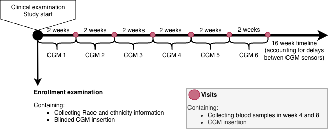
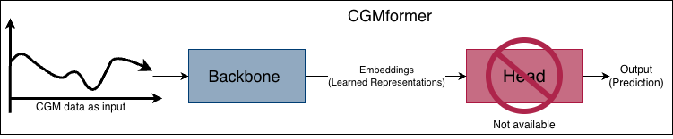
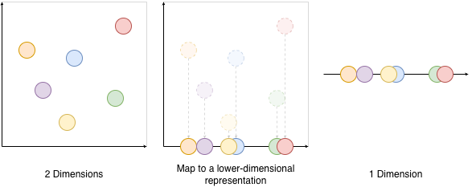
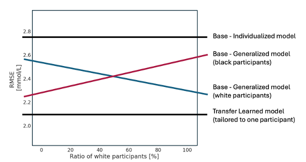

# Methods {#sec-methods}

In this chapter the three studies included in this PhD will be presented together with a description of the datasets and methods used in the studies.

## Overview of Studies
This dissertation includes three studies which are summarized in @tbl-overview-studies.

| | Study I | Study II | Study III |
|:-|:----|:----|:----|
| Title | Continuous Glucose Monitoring–Derived Metrics and Cardiovascular Risk Among People With Diabetes: Systematic Scoping Review | Foundation model–derived representations of continuous glucose monitoring data: relation to glycemic patterns and cardiovascular risk | Racial disparities in continuous glucose monitoring-based 60-min glucose predictions among people with type 1 diabetes |
|||||
| Study Type | Review | \acr{CGM} foundation model evaluation study | Algorithmic fairness study |
|||||
| Data Sources | Literature on Embase and MEDLINE | The CANCAN study and the \acr{T1DX} dataset | \acr{T1DX} dataset |
|||||
| Population | Studies including people with type 1 diabetes, type 2 diabetes and/or prediabetes | 159 people with type 2 diabetes 205 people with type 1 Diabetes | 205 people with type 1 Diabetes |
|||||
| Input, predictors and exposures | Search strategy and eligibility criteria | Clinical variables, CGM-derived metrics and CGM data | CGM data |
|||||
| Outcome, target | All studies that uses CGM data to investigate cardiovascular disease risks and outcomes | Visualization of foundation model embeddings and elevated NT-proBNP prediction | 60-minute glucose prediction |
|||||
| Analysis | Systematic scoping review, study characterization, and narrative synthesis | Foundation models and logistic regression models | long short term memory model (LSTM) and \acr{LMEM} |


: Overview of the included studies {#tbl-overview-studies bl-lines="rows"} 


## Scoping Review Methodology
A scoping review was conducted to investigate current knowledge of CGM-data and its possible connection and predictive power to clinical and subclinical cardiovascular outcomes.
Given the expected heterogeneity between studies and the broad exploratory nature of the research question, a scoping review was considered the most appropriate methodology, as the aim was to map the existing evidence within this field.[@Tricco2018]
The scoping review followed the Manual for Evidence Synthesis (Chapter 10 - Scoping reviews) from the Joanna Briggs Institute (JBI) and reported according to the Preferred Reporting Items for Systematic Reviews and Meta-analyses extension for scoping review (PRISMA-ScR) guidelines.[@Tricco2018; @Peters2024]

### Concepts and Definitions {#sec-concepts}
The review focused exclusively on studies using CGM data as input for analyses of associations with, or prediction of, \acr{CVD}.
This meant that studies only investigating self-monitored blood glucose with finger-prick measurements or blood sample measurements such as HbA1c were not considered in this review. CVD outcomes were divided into subclinical or clinical.
For the clinical CVD, the following outcomes were considered: cardiovascular mortality, major adverse cardiovascular events, coronary artery disease, heart failure, stroke, and peripheral artery disease with synonymous terms included (e.g., ischemic heart diseases) and also clinical events (e.g., undergoing coronary artery bypass surgery). Subclinical CVD was grouped into six subcategories: arterial stiffness, flow resistance, arterial wall thickness, arterial wall composition, cardiac and pulse-related measures, and arterial lumen. CVD outcomes did not include broader risk factors nonspecific to cardiovascular risk (e.g., age or sex). Eligibility criterias for the scoping review[@Thomsen2026] (Study I) can be found in @tbl-study1-eligibility-criteria.

::: {#tbl-study1-eligibility-criteria}

::: {.content-visible when-format="pdf"}

```{=latex}

    \begin{table}[ht]
        \centering
        \begin{tabular}{|p{7cm}|p{7cm}|}
            \toprule
            \textbf{Inclusion Criteria} &
            \textbf{Exclusion Criteria} \\
            \midrule

            Human clinical studies including participants with prediabetes or any type of diabetes except gestational diabetes, regardless of definitions.
            \vspace{0.6em}
            Peer-reviewed published original articles (including brief reports).
            \vspace{0.6em}
            Studies investigating either:
            \begin{itemize}
            \item[a)] The association between CGM-derived metrics of glycemic control and cardiovascular risk markers or cardiovascular diseases (prevalent or incident).
            \item[b)] CGM-derived metrics of glycemic control as predictors of cardiovascular risk markers or cardiovascular diseases (prevalent or incident).
            \end{itemize}

            &

            Review articles, editorials, case reports, protocols, conference abstracts and preprints.
            \vspace{0.6em}
            Animal studies not including human participants.
            \vspace{0.6em}
            Studies not including metrics derived from CGM device data.
            \vspace{0.6em}
            Studies including CGM-derived metrics as outcomes.
            \vspace{0.6em}
            Studies not focusing on CVD outcomes according to the definition in \textit{Concepts and Definitions} section.
            \vspace{0.6em}
            Studies focusing on pregnant women with any form of diabetes, including gestational diabetes.
            \vspace{0.6em}
            Studies where participants were monitored post-surgery or during hospitalization (e.g., intensive care unit).
            \vspace{0.6em}
            Language not understood by the authors.
            \\\bottomrule
        \end{tabular}
    \end{table}
```
:::

:::{.content-visible when-format="html"}
| Inclusion Criteria | Exclusion Criteria |
|---|---|
| Human clinical studies including participants with prediabetes or any type of diabetes except for gestational diabetes, regardless of definitions | Review articles, editorials, case reports, protocols, conference abstracts, and preprints. |
| Peer-reviewed published original articles (including brief reports). | Animal studies not including any human participants. |
| Studies investigating either: | Studies not including metrics derived from \acr{CGM} device data |
| a) The association between CGM-derived metrics of glycemic control and cardiovascular risk markers or cardiovascular diseases (prevalent or incident). | Studies including CGM-derived metrics as outcomes. |
| b) CGM-derived metrics of glycemic control as predictors of cardiovascular risk markers or cardiovascular diseases (prevalent or incident). | Studies not focusing on CVD outcomes according to our definition, as outlined in @sec-concepts. |
|  | Studies focusing on pregnant women with any form of diabetes including gestational diabetes. |
|  | Studies where participants were monitored post-surgery or during hospitalization (e.g. Intensive care unit). |
|  | Language not understood by authors |
:::

Eligibility criteria for the scoping review (Study I)

:::

### Search and Selection of Sources
MEDLINE and Embase were searched from inception to March 11, 2025. 
The two databases were selected because they are core databases for biomedical literature. Owing to the resources available to the review team, the search could not be extended to additional databases.
The search strategy was developed in collaboration with information specialists.
An exploratory search was held and 13 studies within the field was identified and used to test the search strategy by ensuring the 13 identified studies were included in the final search string.[@Foreman2021; @Yapanis2022; @Helleputte2022; @Lu2021; @Martinez2021; @Mita2023; @Lu2020; @Mo2013; @Wakasugi2021; @Magri2018; @Su2011; @Tang2016; @Zhang2013].
The search strategy was wished to be kept broad as it was known beforehand that the field contained inconsistent terminology and overlapping search categories (e.g., 'blood glucose monitoring' and 'glycemic control' both encompass finger-prick measurements) in order to ensure identification of all the relevant studies in MEDLINE and Embase.
The full search strategy can be found in @sec-suppl-search-strings.

All identified records were uploaded into EPPI reviewer 6[@Thomas2023] and duplicates were removed. Titles and abstracts were screened by at least two independent reviewers and a meeting was held after \~5% of the titles and abstracts had been screened, to resolve disagreements and ensure consistency between reviewers. Afterwards full-text screening was performed by two independent reviewers and held up against eligibility criteria. Disagreements were resolved through discussion at physical meetings between reviewers.

Backward and forward citation searching was performed on all the included studies after the screening process using citationchaser[@Haddaway2022] and the screen process was repeated until no further new studies were identified through citationchaser.

### Data Charting Process and Data Items

Research questions were defined before the screening process and data was extracted based on the research questions in @nte-study1-research-q.

::: {#nte-study1-research-q .callout-note appearance="simple" icon="false"}
### Research Questions (Study 1)

1.  Is there an association between glycemic control and CVD risk?
2.  Can CGM-derived metrics predict CVD risk?
3.  What CGM-derived metrics are used in the literature?
4.  Which cardiovascular markers and diseases are included as outcomes in the studies?
5.  What characterizes study populations (age, sex, ethnicity, geographic location)?
6.  What study designs are used (e.g., longitudinal cohort studies, randomized controlled trials, cross-sectional studies)?
7.  How was data collected (e.g., clinical trial, epidemiological study, routinely collected data)?
8.  What CGM devices were used?
9.  What statistical models were used in the studies?
10. Is the data openly available?
11. Is the code openly available?
:::

### Synthesis of Results

Study characteristics were synthesized using descriptive statistics and supplemented by a narrative summary. Only the most adjusted models in the main population for each study was considered in this review. This approach was necessary as several studies reported numerous estimates across varying adjustments, different combinations of CGM-derived metrics and CVD outcomes, and/or distinct subgroup stratifications. Given the large volume of literature, studies investigating clinical cardiovascular outcomes were prioritized in the main synthesis. While subclinical markers offer valuable insight into early vascular changes and disease progression, clinical outcomes are more directly relevant to cardiovascular risk prediction and clinical decision-making. The main synthesis of clinical outcomes included both effect estimates and measures of statistical significance whereas the supplementary synthesis on subclinical CVD focused primarily on creating an overview of the chosen CGM-derived metrics and the statistical significance of reported associations. All evaluation metrics mentioned in the studies doing prediction analyses were reported based on what the studies reported.

## Study Populations
- [ ] Signe, do you have ethical approval number or paper/protocol I can cite for the CANCAN study?

Two datasets were used in this PhD project and are described in the following sections. Both studies were conducted in accordance with the principles of the Declaration of Helsinki and approved by the relevant institutional review boards. Written informed consent was obtained from all participants.<!-- [@Bergenstal2017] -->

### CANCAN Data

The CANCAN dataset was collected in an observational case-control study from three hospital outpatient clinics (Denmark). The aim of the CANCAN Study was to investigate if cardiac autonomic neuropathy (CAN) assessments, CGM and heart failure indicators could be used in risk stratification in people with T2D. Participants were included if they were adults (\> 18 years old) and had T2D for at least a year. Exclusion criteria were atrial fibrillation or laser-treated eye disease within the past three months, were pregnant or lactating, had a life-threatening disease (expected survival \< 1 year), or had cognitive disabilities rendering them unable to understand and give consent. Data were collected during a clinical examination, during which blood and urine samples were obtained, and a blinded CGM sensor was inserted. Blood samples to obtain NT-proBNP values were collected when the CGM sensors were returned, after the 2-week CGM data collection period had ended (@fig-cancan-timeline). In total, 159 participants were included since the rest were missing age, sex, HbA1c, BMI, NT-proBNP, HDL, total cholesterol, or eGFR and these values were needed for the analyses in Study II.

::: {#fig-cancan-timeline}
[](https://raw.githubusercontent.com/HeleneThomsen/dissertation/main/figures/3_methods_fig/cancan_timeline.png)

Data collection timeline for the CANCAN Study
:::

### T1D Exchange Data
The publicly available T1D Exchange (T1DX) dataset, distributed by the Jaeb Center for Health Research under the protocol "Racial Differences in Mean CGM Glucose in Relation to HbA1c, was collected in 10 diabetes centers (US).[@JAEB_2016] The data was collected to determine if there is a racial difference in the association between mean glucose and HbA1c between non-Hispanic Black (Black) and non-Hispanic White (White) people with T1D. In the T1DX study ethnicity and race was defined through self-identified and self-reported ethnicity/race verification forms where ethnicity was defined as Hispanic or Latino as: *“a person of Cuban, Mexican, Puerto Rican, South or Central American, or other Spanish culture or origin, regardless of race. The term “Spanish origin” could be used in addition to “Hispanic” or “Latino”"*.[@Bergenstal2017, suppl] For race a participant defined as White was *“a person having origins in any of the original peoples of Europe, the Middle East or North Africa.”* and Black or African American people were defined as *“a person having origins in any of the Black racial groups of Africa. Terms such as “Haitian” or “Negro” can be used in addition to “Black” or “African American””*.[@Bergenstal2017, suppl] In this thesis, the term race will be used moving forward, as it aligns with the terminology used by Bergenstal et al.[@Bergenstal2017]. However, I acknowledge that it is difficult to define race.[@Kaneshiro2011]
Of the 205 participants included in the study[@Bergenstal2017], 101 were White and 104 were Black. For each race, two age groups were sampled 8 to \<18 years old and \>18. Each participant wore a blinded modified investigational version of Abbott Diabetes Care’s Flash Glucose Monitoring System (CGM) as continuously as possible for 12 weeks (@fig-t1dx-timeline). CGM data was sampled every 15 minutes in a range between 2.21 - 27.65 mmol/L (40 and 498 mg/dL). Blood samples were taken at enrollment, at some of the follow-up visits, and at the end of enrollment. 

::: {#fig-t1dx-timeline}


Data collection timeline for the T1DX Study
:::


## Foundation Models and Predictive Utility of CGM data

The second study investigated whether a CGM foundation model could learn meaningful representations of CGM data and compared these learned representations with conventional CGM-derived metrics identified in Study I.[@Thomsen2026]

### Data and Participant Selection
- [ ] Check cancan data to find the range of the CGM censor in that study

Both the CANCAN and the T1DX dataset was used for Study II.
Participants with missing age, sex, HbA1c or BMI were excluded from both cohorts and in addition, CANCAN participants with missing NT-proBNP, HDL, total cholesterol, and \acr{eGFR} they were also removed, since it was necessary to calculate the SCORE2-Diabetes risk score.
T1DX participants with missing race data was also removed.
Days with less than 70% of CGM data was removed as well as participants with less than one day of data from both datasets to ensure sufficient data for the analyses.
Values exceeding the measurable range of the CGM devices were retained as the device's upper and lower measurement limits. *For the CANCAN data, this range was (_____)* and for the T1DX data, the range was 2.21 - 27.65 mmol/L.
<!-- The final number of participants included in Study II was 159 from the CANCAN dataset and 205 from the T1DX dataset. -->


### Transfer Learning, Foundation Models and Embeddings
Of the two CGM-specific foundation models based on self-supervised learning currently described in the literature (CGMformer by Lu et al., 2025[@YurunLu2025] and GLUformer by Lutsker et al., 2026[@Lutsker2026]), only the pretrained weights from the CGMformer by Lu et al.[@YurunLu2025] were made publicly available, enabling reuse of the CGMformer model for downstream tasks.
The CGMformer was therefore chosen and the data was organized in 24-hour long-format input to match the input requirements of the CGMformer.
The output of the foundation model is learned representations of the input data, also known as embeddings and the head of the CGMformer were not available for retraining (@fig-cgmformer). By only having the backbone, the transfer learning strategy being used had to be replacing the head with a new, as shown in @fig-tl as transfer three.

::: {#fig-cgmformer}
[](https://raw.githubusercontent.com/HeleneThomsen/dissertation/main/figures/3_methods_fig/study2_cgmformer.png)

Illustration of how CGMformer is used in this analysis
:::

Embeddings are numerical vectors that summarizes the characteristics of the input glucose profile. A simple vector can be drawn as an arrow in a 2-dimensional space as shown in @fig-cancan-embedding, however the CGMformer gives a 128-dimensional embedding vector for each 24-hour CGM data input which is not easily visualized.

::: {#fig-cancan-embedding}
[](https://raw.githubusercontent.com/HeleneThomsen/dissertation/main/figures/3_methods_fig/study2_embedding.png)

Embeddings shown as 2-dimensional vectors with the angle $\theta$ between the two embeddings.
:::

\acr{UMAP} algorithm was used to reduce the dimensionality of the embeddings to two dimensions. The concept of dimensionality reduction is illustrated in @fig-dim_reduce. The \acr{UMAP}s were visualized and compared with current literature, and later on used for prediction purposes.[@McInnes2018_umap; @YurunLu2025; @Lutsker2026]. The UMAPs were colored by TIR, and MAGE to investigate if the embeddings were able to capture relevant information about glycemic patterns. History of CVD and elevated NT-proBNP for the CANCAN embeddings were also used to color the UMAPs to investigate if the embeddings were able to capture relevant information about cardiovascular risk and race was used to color the T1DX embeddings to investigate if the embeddings were able to capture relevant information about racial differences in glycemic patterns.


::: {#fig-dim_reduce fig-scap='Conceptual dimensionality reduction illustration'}
[](https://raw.githubusercontent.com/HeleneThomsen/dissertation/main/figures/3_methods_fig/study_2_dim_reduce.png)

Conceptual illustration of dimensionality reduction (read from left to right). Information from multiple dimensions can be represented using fewer dimensions while preserving information. This illustration does not show how UMAP works but instead is intended to convey the general concept of dimensionality reduction.

:::

Because embeddings are numerical vectors, they can be compared to quantify the similarity between glucose profiles, as demonstrated by Lutsker et al.[@Lutsker2026] We therefore adopted a similar approach to assess the similarity between CGM-derived embeddings.
Cosine similarity was used and it measures the angle between two embedding vectors independent of their magnitude (the length of the vectors).
The cosine similarity is calculated by measuring the cosine angle between two vectors as shown by $\theta$ in @fig-cancan-embedding. The cosine similarity is a number between -1 and 1, where 1 means the two vectors are identical, 0 means they are unrelated, and -1 means that they are pointing in opposite directions(@fig-cancan-co_sim_emb). For the analyses in this study, cosine distance (1 − cosine similarity) was used because it expresses similarity as a distance measure, allowing embeddings with similar orientations to have small distances and facilitating downstream analyses and visualizations. The cosine distances range from 0 to 2 where 0 means the two vectors are pointing in the same direction, 1 means they are unrelated, and 2 means that they are pointing in opposite directions.

::: {#fig-cancan-co_sim_emb}
[](https://raw.githubusercontent.com/HeleneThomsen/dissertation/main/figures/3_methods_fig/study2_co_sim_emb.png)

Embeddings shown with different cosine similarities. The cosine similarity is calculated as the cosine of the angle ($\theta$) between two embeddings.
:::

Kernel density plots were used to visualize the distribution of cosine distances within specific clinical strata and across differing participants (@fig-cancan-clin_strata).
Groupings were made based on days from the same participant (within-participant comparison), days from different participants with the same clinical strata (between-participant comparison), and days from different participants with different clinical strata(between-participant comparison) (@fig-cancan-clin_strata).

::: {#fig-cancan-clin_strata fig-scap='Within and between participants comparison'}
[](https://raw.githubusercontent.com/HeleneThomsen/dissertation/main/figures/3_methods_fig/study2_clin_strata.png)

The sex strata is used as an example to illustrate the cosine distance analysis of the within and between cosine distance pairs

:::

The main focus for the participant comparisons were TIR and HbA1c. The thresholds were as followed: TIR ≥ 70% (70–180 mg/dL, 3.9–10.0 mmol/L) and HbA1c <7.0 % (< 53 mmol/mol).[@Danne2017, @ADA2026_ch7]
Additional UMAP visualizations were generated by coloring participants according to race, MAGE (\< 70 mg/dL ( \< 3.9 mmol/L )),[@Danne2017] and  NT-proBNP (NT-proBNP ≤ 125 pg/mL).[@Heidenreich2022, @Welsh2022] These categorizations were used solely to facilitate interpretation of the UMAP visualizations and were not incorporated into model development or any statistical analyses. Participants with missing values for a given characteristic were excluded only from the corresponding visualization and remained eligible for all subsequent analyses.

## Cardiovascular Risk Assessment
The following section is about cardiovascular risk assessment evaluated predicting NT-proBNP as a binary outcome using a >125 pg/mL threshold.[@mcdonagh2021; @Heidenreich2022; @Welsh2022]
Only the cross-sectional CANCAN dataset was used for the cardiovascular risk assessment.
The focus was to test the predictive power of CGM data both as represented as embeddings and as well-established CGM-derived metrics. Some models also included clinical predictors to compare up against baseline models.
Prediction models integrated clinical, standard CGM-derived, and learned representations.


### Predictors

Inspiration was drawn from the SCORE2-Diabetes risk score, which is a 10-year CVD risk score for european people with diabetes. It was decided to use the input predictors of the SCORE2-Diabetes risk score as the clinical set of predictors used in this study.[@Pennells2023_score2dm] This resulted in set of clinical predictors including age, sex, smoking status, systolic blood pressure, total cholesterol, and HbA1c.[@Pennells2023_score2dm]
Initial testing showed that the numbers of predictors had to be limited due to the small sample size and the SCORE2-Diabetes risk score was chosen as another way to represent the clinical predictor set while keeping the number of predictors down.
Additionally age was tested as a predictor on its own to see if it was a strong predictor of elevated NT-proBNP, since NT-proBNP is known to increase with age.[@NICE_2028_guidelines]
Time in range (TIR) and mean amplitude of glycemic excursions (MAGE) were chosen as they were the CGM-derived metrics most commonly used in the literature based on the findings from Study I.[@Thomsen2026]
All CGM-derived metrics in this thesis were calculated using the \acr{IGLU} package[@iglu_package; @iglu_package_paper] in R (default settings). TIR was calculated as the percentage of time spent in the range of 3.9–10.0 mmol/L (70–180 mg/dL). [@Danne2017] 
MAGE was calculated as the mean amplitude of glucose excursions, where the included excursions were consecutive peak-to-nadir (or nadir-to-peak) glucose differences exceeding one standard deviation of the individual's glucose measurementsDoes . The \acr{IGLU} implementation computationally reproduces the original manual procedure proposed by Service et al.[@Service1970]
The CGMformer generated one 128-dimensional embedding for each 24-hour CGM recording. Because NT-proBNP was measured at the participant level, a single embedding was required for each participant. Therefore, embeddings from multiple recording days were aggregated using pooling to obtain one participant-level embedding. Both minimum, maximum, and mean pooling were explored to determine the most effective aggregation method. Maximum pooling was considered the default based on previous work.[@Lutsker2026]
The resulting 128-dimensional embeddings were subsequently reduced to two dimensions using UMAP, thereby enabling their use in the prediction models while keeping the number of predictors down to a minimum.

### Model Development and Evaluation
Prediction models were developed using logistic regression to predict elevated NT-proBNP (>125 pg/mL) as a binary outcome. The models were evaluated using the area under the receiver operating characteristic curve (AUROC) as the primary metric.
Bootstrap with optimism correction was employed for internal validation because of the limited sample size and the absence of an external validation cohort.[@Collins2024; @Wahl2016; @Riley2023] 
The method repeatedly sampled bootstrap samples by sampling with replacement from the original dataset. For each bootstrap sample, the prediction model is fitted and its performance is evaluated both in the bootstrap sample (apparent performance) and in the original dataset (test performance). The difference between these two performance estimates represents the optimism due to overfitting. Averaging the optimism across all bootstrap samples and subtracting it from the apparent performance of the model fitted to the full dataset yields an optimism-corrected estimate of model performance. Internal validation was performed using 500 bootstrap resamples.[@Collins2024; @Riley2023] Prediction stability plots were reported for each model to evaluate the stability of predictions produced by a specific model strategy when the training data changes.[@Riley2023]
<!-- Risk distribution plots were reported for each model across all bootstrap samples.[@VanCalster2025; @Riley2023] -->

### Prediction Scheme Overview
The prediction models were structured hierarchically based on clinical variables (Model A) and the calculated SCORE2-Diabetes score (Model B) in the configurations shown in @tbl-models

::: {#tbl-models}

| Model family | Model | Baseline predictors | Additional predictors |
|:--------------|:-----:|:--------------------|:----------------------|
| Clinical | **A0** | Age | – |
| Clinical | **A1** | Clinical variables* | – |
| Clinical | **A2** | Clinical variables* | TIR + MAGE |
| Clinical | **A3** | Clinical variables* | UMAP dimensions|
| SCORE2-Diabetes | **B1** | SCORE2-Diabetes score | – |
| SCORE2-Diabetes | **B2** | SCORE2-Diabetes score | TIR + MAGE |
| SCORE2-Diabetes | **B3** | SCORE2-Diabetes score | UMAP dimensions |
| CGM only | **C1** | TIR + MAGE | – |
| Embeddings only | **D1** | UMAP dimensions|

<div style="font-size: 0.85em; margin-top: -10px;">
^*^*Clinical variables are the same as those included in the SCORE2-Diabetes risk model: Age, sex, smoking status, systolic blood pressure, HDL cholesterol, total cholesterol, diabetes duration, HbA1c, and eGFR.[@Pennells2023_score2dm]*  
*TIR = Time in Range; MAGE = Mean Amplitude of Glycemic Excursions.*
</div>

Overview of models and predictors 

:::

<!-- ****************************************************************************************** -->
## Algorithmic Fairness and Blood Glucose Prediction

The third study was investigating racial bias in a data driven machine learning model only based on blood glucose measurements from a CGM device.
Although the primary focus of this thesis is cardiovascular risk assessment, glucose forecasting provides an appropriate setting for investigating algorithmic fairness in CGM-based machine learning. In contrast to participant-level cardiovascular prediction, glucose forecasting is trained on a continuous stream of CGM measurements, allowing each participant to contribute numerous samples over the recording period rather than a single outcome.
This results in substantially more training examples, enabling the development and evaluation of more complex machine learning models. Consequently, glucose forecasting provides a suitable framework for studying how training data composition influences model performance across racial groups.

### Preprocessing of CGM data for Forecasting
A prediction horizon of 60 minutes was chosen because it provides sufficient time for preventive interventions for hypoglycemia and hyperglycemia, such as insulin dose adjustments or carbohydrate intake, while accounting for the 15-minute sampling interval of the CGM device and the physiological delay between blood and interstitial glucose measurements.[@ADA2026_ch7]

Accordingly, the CGM data were divided into consecutive 60-minute windows containing four glucose measurements to predict glucose levels 60 minutes into the future, as illustrated in @fig-study3_pred_horizon. Prediction windows containing missing CGM values were excluded.

::: {#fig-study3_pred_horizon fig-scap='The creation of samples in study III'}
[](https://raw.githubusercontent.com/HeleneThomsen/dissertation/main/figures/3_methods_fig/study3_pred_horizon.png)

The prediction horizon and overview of the creation of samples (predictors and outcomes).

:::

### Partitioning of the Dataset
The T1DX dataset was randomly resampled without replacement at the participant level to avoid data leakage and to evaluate model performance on independent participants. As illustrated in @fig-study3_partitioning, training subsets with varying proportions of Black and White participants were generated by randomly selecting participants from the original dataset while keeping the train-test split at the participant level. Eleven training set compositions were created, ranging from 100% White/0% Black to 0% White/100% Black in 10% increments.

Because some training subsets consisted entirely of participants from a single racial group, the maximum training set size on participant level was constrained by the size of the smaller racial group minus the participants kept for testing. Consequently, each training subset contained approximately half the number of participants in the original T1DX dataset. Repeating this procedure for each participant resulted in 2,255 training datasets (205 participants × 11 training set compositions) and 205 independent test sets. Throughout all resampling procedures, all CGM recordings from a participant were kept together to prevent data leakage between the training and test sets.

::: {#fig-study3_partitioning}
[](https://raw.githubusercontent.com/HeleneThomsen/dissertation/main/figures/3_methods_fig/study3_partitioning.png)

The prediction horizon and overview of the creation of subsets for training.
:::

Eleven subsets were created for each of the participants and the last week's data was chosen to test on as illustrated in @fig-study3_train_finetune_test_split
To preserve sample size, one week was chosen because participants had varying amount of CGM data and the participant with the least amount of data had ~ 2 weeks.
The remaining data was used for training the models.

::: {#fig-study3_train_finetune_test_split fig-scap='Creating training and test sets'}
[](https://raw.githubusercontent.com/HeleneThomsen/dissertation/main/figures/3_methods_fig/study3_train_finetune_test_split.png)

The splitting of a participants data to create training and test sets

:::
###  Model Selection and Training Approaches
A \acr{LSTM} network architecture based on van Doorn et al.[@vanDoorn2021] was used (two LSTM layers followed by a dense layer).
All the training data was scaled to be within the range of zero to one.
Hyperparameters were optimized once prior to the repeated model development using grid search and data from all participants except the last week.
The gridsearch included the number of neurons in the LSTM layers, activation function, dropout rate, batch size, learning rate, learning rate decay, and early stopping patience.
The selected hyperparameter configuration was subsequently fixed and applied to all \acr{LSTM} models
The complete hyperparameter tuning procedure and implementation are available in the accompanying GitHub repository.[@Thomsen_github_1]

Four training approaches were used when the models for each participant were developed as described below and illustrated in @fig-study3_training_approaches. Three \acr{LSTM} models and the \acr{LOCF} as a naive baseline.
1.	**\acr{LOCF}:** In the LOCF model, a given CGM measurement (x4) was used to predict blood glucose values 60 minutes in advance (x8) in the test set by assuming no change in the last 60 minutes. 
2.	**Base-Individual:** In the Base-Individual model, each participant’s complete CGM data (except for the last week, which was used for the testing data) was used for training.
3.	**Base-Generalized:** Here, for each participant, the 11 training corresponding datasets described above were used to generate 11 separate models, which were all subsequently tested on the given participant’s last week of CGM data.
4.	**Transfer Learned:** This model mirrored the Base-Generalized Model’s setup. However, the 11 trained models for each participant were subsequently tailored to the given participant’s complete CGM data (except for the last week, which was used for the testing data). The transfer learning technique used is described as transfer 2 in @fig-tl.


::: {#fig-study3_training_approaches fig-scap='The four training approaches in study III'}
[](https://raw.githubusercontent.com/HeleneThomsen/dissertation/main/figures/3_methods_fig/study3_training_approaches.png)

The four training approaches. The Base-Individual, Base-Generalized, and Transfer Learned models were based on an LSTM architecture. The base layer (green) consisted of two LSTM layers, while the task-specific layer (blue) consisted of a single dense layer. 

:::


### Model Evaluation
To evaluate model performance, each participant's last week's data (672 measurements) was reserved for internal testing (@fig-study3_train_finetune_test_split).
Model accuracy was assessed by calculating the root mean squared error (RMSE) for each participant across all four modeling approaches. For the LOCF and Base-Individual models, this yielded one RMSE value for each of the 101 White participants and 104 Black participants.
For the Base-Generalized and Transfer Learned models, RMSEs were calculated for each participant across 11 data subsets, each representing a unique proportion of White and Black participants.
Performance was summarized as the mean RMSE with corresponding 95% confidence intervals (CIs) for each racial group.
To evaluate the predictive performance across different training subset compositions for the Base-Generalized and Transfer Learned models, an \acr{LMEM} was fitted because each participant contributed multiple RMSE values from training subsets with varying proportions of White and Black participants. Participant-specific random intercepts were included to account for the repeated-measures structure. Fixed effects included the proportion of White participants in the training data, participant race, age, sex, training data sample size, and their interaction terms.
It was further assumed that the varying proportions of Black and White participants in the training data subsets would affect the performance and an interaction term was therefore added. The interaction term allowed for different slopes in the LMEM which allowed us to test the hypothesis. It was hypothesized that when plotting the proportion of White participants in the training data against the RMSE, the slope would be negative for White participants and positive for Black participants (@fig-study3_rmse). This would indicate that as the proportion of White participants in the training data increased, the RMSE decreased for White participants and increased for Black participants, indicating racial bias in the model. The Base-Individual model would perform the worst since it was trained on the least amount of data and the Transfer Learned model would remove the slopes that were expected to be seen in the Base-Generalized models.

::: {#fig-study3_rmse}

[](https://raw.githubusercontent.com/HeleneThomsen/dissertation/main/figures/3_methods_fig/study3_rmse.png)

The hypothesis for the results of the linear mixed effect models. 

:::

Surveillance error grids (SEG) were used to get a general idea of the  clinical risk of the prediction models.[@Tian2024] The error grids are originally developed for the regulatory bodies to asses clinical accuracy of blood glucose monitoring in post-surveillance before the wide spread use of CGM devices. [@Tian2024, @Klonoff2014] and the results should therefore be interpreted with caution when using CGM data. The SEG is a 600x600 grid assigned an individual risk score to each datapoint with 15 colored zones, each indicating severity of a monitoring error that is acted upon in regards to risk of hypoglycemia or hyperglycemia (@fig-study3_SEG). [@Klonoff2014]
To facilitate interpretation, the 15 surveillance error grid zones were collapsed into the five broader risk zones ("No", "Slight", "Moderate", "High", and "Extreme"), as previously suggested in the literature.[@Tian2024]
Predictions outside of 0–33 mmol/L were changed to 0 or 33 mmol/L to keep within the upper and lower bounds of the surveillance error grid.

::: {#fig-study3_SEG fig-scap='surveillance error grid'}
[](https://raw.githubusercontent.com/HeleneThomsen/dissertation/main/figures/3_methods_fig/study3_SEG_empty.png)

Surveillance error grid showing the clinical risk associated with prediction errors. The green region indicates no clinical risk, whereas yellow, orange, and red regions represent increasing levels of clinical risk.


:::
