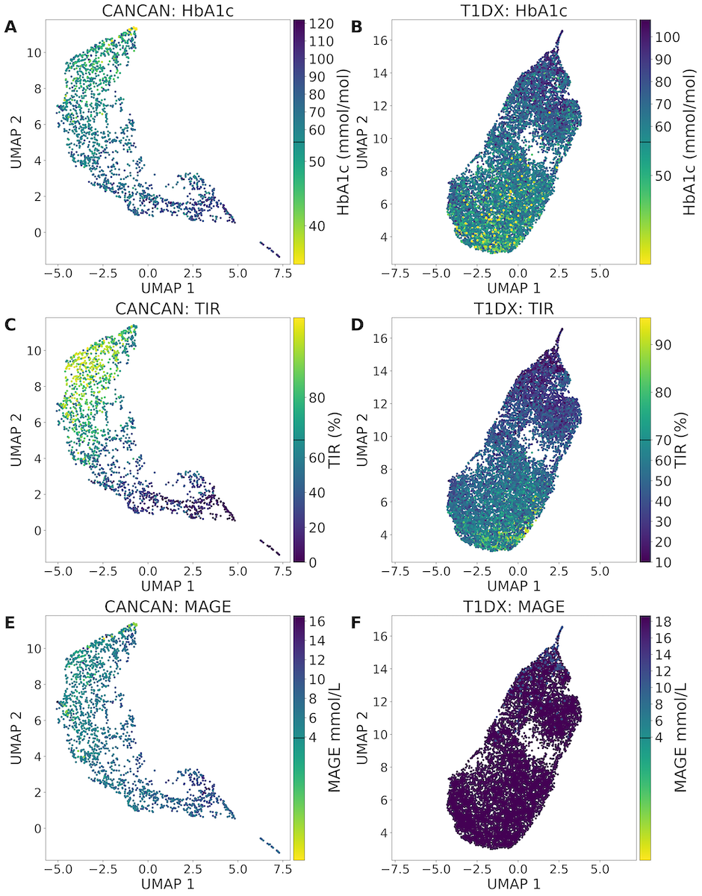
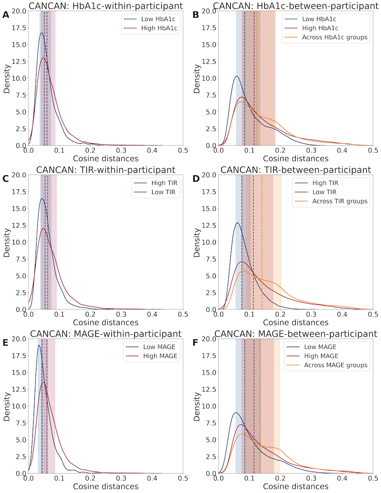

## Study II: Foundation Model Embedding Analysis
The following section contains UMAP visualizations and cosine distance analyses results including kernel density plots and the median and interquartile ranges of the distances.

### UMAPs and Glycemic Control
UMAP projections of the learned CGM representations showed one main cluster in both datasets (@fig-cosim_umap). When colored by glycemic metrics, the projections showed smooth gradients for TIR and HbA1c, indicating that the learned representations captured variation in glycemic control. The gradient was less distinct for MAGE, particularly in the T1DX cohort, where all participants except one had MAGE values above 3.9 mmol/L.

::: {#fig-cosim_umap fig-scap='UMAP projections of CGM embeddings by glycemic control' width=100%}

::: {.content-visible when-format="html"}

[](https://raw.githubusercontent.com/HeleneThomsen/dissertation/main/figures/4_results_fig/study_2_co_sim_umaps.png){width=100%}

:::

::: {.content-visible when-format="pdf"}

{width=100%}

:::
Uniform Manifold Approximation and Projection 

:::

Correlations between the UMAP dimensions and glycemic metrics supported these visual patterns (@tbl-umaps_gv). In the CANCAN dataset, UMAP dimensions were strongly correlated with TIR and moderately to strongly correlated with HbA1c and MAGE. In the T1DX dataset, UMAP dimensions were moderately correlated with TIR, HbA1c, and MAGE.


::: {#tbl-umaps_gv tbl-pos="H"}

```{=latex}
    \begin{table}[H]
        \begin{tabular}{c|c|rr|rr}
        \toprule
                                   & \multicolumn{1}{l|}{} & \multicolumn{2}{c|}{CANCAN}  & \multicolumn{2}{c|}{T1DX} \\
                                   & UMAP Dimension       & \multicolumn{1}{c}{$\rho$}       & \multicolumn{1}{c|}{p-value}    & \multicolumn{1}{c}{$\rho$} & \multicolumn{1}{c}{p-value}\\\midrule
            \multirow{2}{*}{HbA1c} & 1 & 0.48  & p<0.001 & 0.30  & p<0.001 \\
                                   & 2 & -0.65 & p<0.001 & 0.50  & p<0.001 \\\hline
            \multirow{2}{*}{TIR}   & 1 & 0.71  & p<0.001 & -0.39 & p<0.001 \\
                                   & 2 & 0.81  & p<0.001 & -0.65 & p<0.001 \\\hline
            \multirow{2}{*}{MAGE}  & 1 & 0.57  & p<0.001 & 0.37  & p<0.001 \\
                                   & 2 & -0.49 & p<0.001 & 0.59  & p<0.001 \\
            \bottomrule
        \end{tabular}
    \end{table}
```

Pearson correlation between UMAP dimensions and glycemic control measures
:::

### Cosine Distances

Within-participant pairs had lower median cosine distances than between-participant pairs in both CANCAN and T1DX, indicating greater similarity between CGM representations from the same participant (@fig-cosim1). This pattern was observed in CANCAN (0.058 [IQR: 0.040–0.084] vs. 0.117 [IQR: 0.076–0.182]) and T1DX (0.064 [IQR: 0.047–0.090] vs. 0.082 [IQR: 0.057–0.122]) (@tbl-cosim1).

::: {#fig-cosim1 fig-scap='Cosine distance distributions for within- and between-participant pairs'}
[](https://raw.githubusercontent.com/HeleneThomsen/dissertation/main/figures/4_results_fig/study_2_co_sim1.png)

Cosine distance distributions for within- and between-participant pairs in CANCAN (A) and T1DX (B). Dashed lines show medians; shaded bands show interquartile ranges.

:::

::: {#tbl-cosim1 tbl-pos="H"}

```{=latex}
\begin{table}[H]
    \begin{tabular}{l|l|rc}
        \toprule
        Panel & Group & n & Median {[}IQR{]} \\ \midrule
        \multirow{2}{*}{CANCAN} & Within-participant pairs  & 9459     & 0.058 {[}0.040, 0.084{]} \\
                                & Between-participant pairs & 1529676  & 0.117 {[}0.076, 0.182{]} \\ \hline
        \multirow{2}{*}{T1DX}   & Within-participant pairs  & 351598   & 0.064 {[}0.047, 0.090{]} \\
                                & Between-participant pairs & 68134358 & 0.082 {[}0.057, 0.122{]} \\
        \bottomrule
    \end{tabular}
\end{table}
```

Cosine distances for within- and between-participant pairs

:::

#### Cosine Distances and Glycemic Targets
When stratified by clinical thresholds participants who met glycemic targets, defined as HbA1c <53 mmol/mol, TIR $\geq 70\%$ or MAGE $\leq 3.9$ mmol/L, tended to have lower and more narrowly distributed cosine distances (@fig-cosim_cancan and @fig-cosim_t1dx). For between-participant comparisons, distances among individuals within target ranges shifted downward and partly overlapped with the range observed within participants. The largest distances were observed between participants from opposing TIR groups (@tbl-cosim_cancan and @tbl-cosim_t1dx).

::: {#fig-cosim_cancan fig-scap='Cosine distance distributions and glycemic targets for CANCAN' width=100%}
::: {.content-visible when-format="html"}
[](https://raw.githubusercontent.com/HeleneThomsen/dissertation/main/figures/4_results_fig/study_2_co_sim_cancan_gv.png){width=100%}
:::
::: {.content-visible when-format="pdf"}
{width=100%}
:::

Cosine distance distributions for within- and between-participant pairs in CANCAN across glycemic targets (HbA1c <53 mmol/mol, TIR $\geq 70\%$ or MAGE $\leq 3.9$ mmol/L). Dashed lines show medians; shaded bands show interquartile ranges.

:::

::: {#fig-cosim_t1dx fig-scap='Cosine distance distributions and glycemic targets for T1DX' width=100%}
::: {.content-visible when-format="html"}
[](https://raw.githubusercontent.com/HeleneThomsen/dissertation/main/figures/4_results_fig/study_2_co_sim_t1dx_gv.png){width=100%}
:::
::: {.content-visible when-format="pdf"}
{width=100%}
:::

Cosine distance distributions for within- and between-participant pairs in T1DX across glycemic targets (HbA1c <53 mmol/mol, TIR $\geq 70\%$ or MAGE $\leq 3.9$ mmol/L).. Dashed lines show medians; shaded bands show interquartile ranges.

:::


::: {#tbl-cosim_cancan tbl-pos="H"}

```{=latex}
% Please add the following required packages to your document preamble:
% \usepackage{multirow}
    \begin{table}[H]
        \begin{tabular}{l|l|rr|rr}
        \toprule
                            &                     & \multicolumn{2}{l|}{Within-participant pairs}     & \multicolumn{2}{l}{Between-participant pairs} \\
        Metrics             & Group               & n                     & Median {[}IQR{]}         & n             & Median {[}IQR{]}              \\\midrule
        \multirow{3}{*}{HbA1c}& Low HbA1c         & 1707                  & 0.051 {[}0.037, 0.072{]} & 46809         & 0.085 {[}0.058, 0.135{]}      \\
                            & High HbA1c          & 7752                  & 0.060 {[}0.041, 0.086{]} & 1032651       & 0.115 {[}0.076, 0.181{]}      \\
                            & Across HbA1c groups & \multicolumn{1}{c}{-}& \multicolumn{1}{c|}{-} & 450216        & 0.124 {[}0.079, 0.186{]}      \\
        \multirow{3}{*}{TIR}& High TIR            & 3509                  & 0.054 {[}0.038, 0.073{]} & 206119        & 0.076 {[}0.056, 0.104{]}      \\
                            & Low TIR             & 5950                  & 0.062 {[}0.041, 0.091{]} & 606221        & 0.113 {[}0.074, 0.176{]}      \\
                            & Across TIR groups   & \multicolumn{1}{c}{-} & \multicolumn{1}{c|}{-}& 717336        & 0.141 {[}0.090, 0.203{]}      \\
        \multirow{3}{*}{MAGE} & High MAGE         & 8750                  & 0.059 {[}0.041, 0.086{]} & 1310750       & 0.114 {[}0.075, 0.178{]}      \\
                            & Low MAGE            & 709                   & 0.044 {[}0.031, 0.062{]} & 7676          & 0.085 {[}0.056, 0.137{]}      \\
                            & Across MAGE groups  & \multicolumn{1}{c}{-} & \multicolumn{1}{c|}{-}& 211250        & 0.134 {[}0.083, 0.198{]}     \\
        \bottomrule
        \end{tabular}
    \end{table}
```
Cosine distances stratified on glycemic control in the CANCAN data
:::


::: {#tbl-cosim_t1dx tbl-pos="H"}

```{=latex}
    % Please add the following required packages to your document preamble:
    % \usepackage{multirow}
    % Please add the following required packages to your document preamble:
    % \usepackage{multirow}
    \begin{table}[H]
        \begin{tabular}{l|l|rr|rr}
            \toprule
                                &                     & \multicolumn{2}{l|}{Within-participant pairs}    & \multicolumn{2}{l}{Between-participants pairs} \\\midrule
                                & Group               & n                     & Median {[}IQR{]}         & n              & Median {[}IQR{]}              \\
            \multirow{3}{*}{HbA1c} & Low HbA1c        & 56543                 & 0.057 {[}0.042, 0.077{]} & 1489618        & 0.066 {[}0.048, 0.089{]}      \\
                                & High HbA1c          & 295055                & 0.066 {[}0.048, 0.092{]} & 49151485       & 0.083 {[}0.058, 0.124{]}      \\
                                & Across HbA1c groups & \multicolumn{1}{c}{-} & \multicolumn{1}{c|}{-}    & 17493255       & 0.082 {[}0.057, 0.121{]}      \\
            \multirow{3}{*}{TIR}& High TIR            & 42716                 & 0.056 {[}0.041, 0.076{]} & 735412         & 0.063 {[}0.047, 0.085{]}      \\
                                & Low TIR             & 308882                & 0.066 {[}0.047, 0.092{]} & 54349858       & 0.081 {[}0.057, 0.121{]}      \\
                                & Across TIR groups   & \multicolumn{1}{c}{-} & \multicolumn{1}{c|}{-}    & 13049088       & 0.087 {[}0.060, 0.129{]}      \\
            \multirow{3}{*}{MAGE}& High MAGE          & 348358                & 0.064 {[}0.047, 0.090{]} & 67192895       & 0.082 {[}0.057, 0.122{]}      \\
                                & Low MAGE            & 3240                  & 0.048 {[}0.037, 0.064{]} & 0              & 0                             \\
                                & Across MAGE groups  & \multicolumn{1}{c}{-} & \multicolumn{1}{c|}{-}    & 941463         & 0.093 {[}0.065, 0.135{]}     \\\bottomrule
        \end{tabular}
    \end{table}
```

Cosine distances stratified on glycemic control in the T1DX data

::: 


::: {.landscape}
### Cosine Distances, NT-proBNP and Race
UMAP visualizations and cosine distance analyses stratified by  NT-proBNP > 125 pg/mL (@fig-cosim_ntprobnp) or race (@fig-cosim_race) appeared to show no clear clusterings in the colors upon visual inspection of the UMAPs.
The cosine distance analyses stratified by these variables showed similar patterns to those observed for glycemic control measurements, with within-participant pairs being more similar than between-participant pairs. The medians and interquartile ranges can be found in @sec-suppl-cosim.


::: {#fig-cosim_ntprobnp fig-scap='UMAPs and kernel density plots grouped by NT-proBNP' width=100%}
::: {.content-visible when-format="html"}
[](https://raw.githubusercontent.com/HeleneThomsen/dissertation/main/figures/4_results_fig/study_2_co_sim_ntprobnp.png){width=100%}
:::
::: {.content-visible when-format="pdf"}
{width=100%}
:::

Cosine distance distributions for within- and between-participant pairs in CANCAN for NT-proBNP (Elevated NT-proBNP < 125 pg/mL). Dashed lines show medians; shaded bands show interquartile ranges. Pearson correlation with long-transformed NT-proBNP were $\rho = -0.04$, p=0.063 and $\rho = 0.18$, p<0.001.

:::


::: {#fig-cosim_race fig-scap='UMAPs and kernel density plots grouped by race' width=100%}
::: {.content-visible when-format="html"}
[](https://raw.githubusercontent.com/HeleneThomsen/dissertation/main/figures/4_results_fig/study_2_co_sim_race.png){width=100%}
:::
::: {.content-visible when-format="pdf"}
{width=100%}
:::

Cosine distance distributions for within- and between-participant pairs in T1DX for race. Dashed lines show medians; shaded bands show interquartile ranges.

:::


:::


