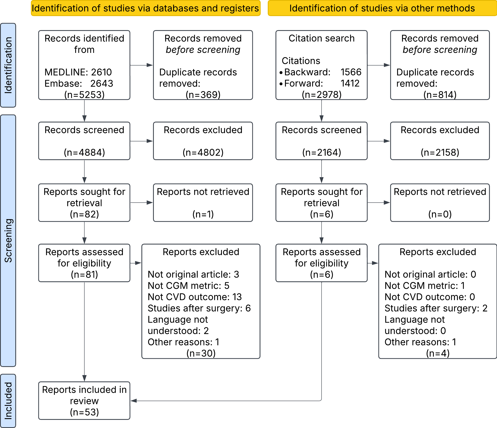
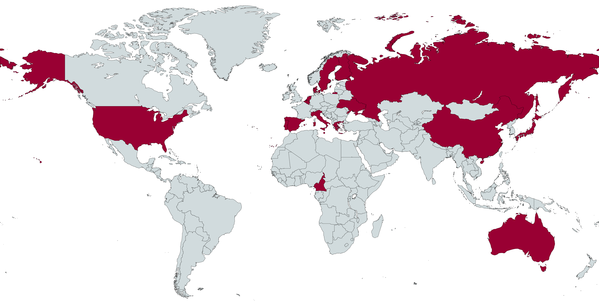
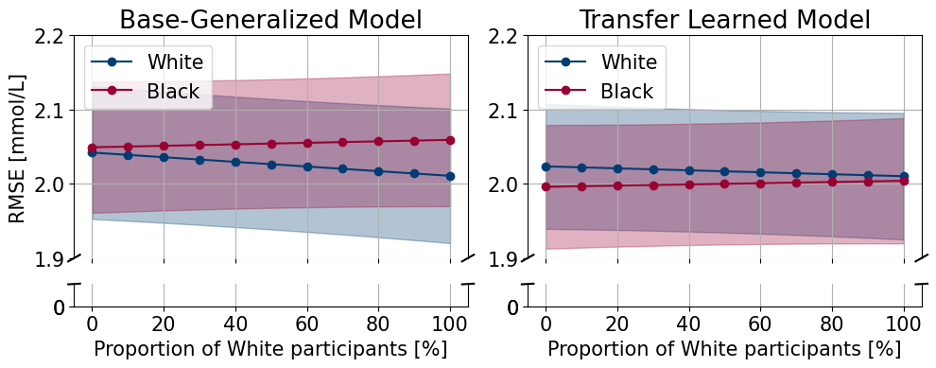

# Results
<!-- 
## metrics used in the papers - Study 1 - Scoping review
- [ ] CGM metrics and CVD definitions'
- [ ] Demographics
- [ ] Study designs / cohorts
- [ ] Diabetes types
- [ ] CGM metrics
- [ ] CVD risk factors
- [ ] Statistical methods used
- [ ] Check big and small letters in headers (uppercase/lowercase beginnings) -->

## Study I: Results from a Scoping Review

### Study Selection
The study selection process is summarized in @fig-prisma. The Medline and Embase search resulted in 4884 records screened on title and abstract, and 81 reports were assessed for eligibility based on full-text review by two independent reviewers. The citation search on the included 51 reports resulted in 2 additional reports, which finally resulted in 53 included reports in the review. All included and excluded reports are reported in @sec-suppl-study1-reports.

::: {#fig-prisma}

Flow diagram of study selection
:::

### Study Populations
The study population most common was people with T2D (34 of studies), then people with T1D (20 of 53) and lastly prediabetes (4 of 53). Most studies included adult participants, whereas seven focused on children younger than 18 years. Two studies included only male participants, whereas the remaining studies included both male and female participants.

The geographic distribution was found based on the hospitals and centers where data was collected or by the first author's affiliation when the other option was not available. The distribution was uneven as shown in  @fig-geographical.
Most studies were conducted in Asia (27 of 53) or Europe (22 of 53). Three studies included data from North America, one was conducted in Australia, and only one included data from an African country, although its study population was predominantly White.[@Borg2011] No data was included from South America (@sec-suppl-geo-map).

::: {#fig-geographical}

Geographical location of the studies. Countries colored in red indicate the geographical locations where the studies were conducted. Map was created using MapChart [https://www.mapchart.net/](https://www.mapchart.net).

:::

### Study Designs and Demographics
- [ ] Check table is correct with the published article
- [ ] Add references to all citations

Only one study was a randomized controlled trial,[@33] and the remaining studies were observational.
Most studies used a cross-sectional design, with the cardiovascular outcome assessed at the same time as the CGM sensor was given.
Only six studies performed longitudinal analyses. Study sample sizes varied considerably, ranging from 17[@34] to 6,225[@18] participants, with a median of 152.
CGM data were obtained either from participants' own devices (11 studies) or from CGM devices provided as part of the study (42 studies). 
Statistical analyses most commonly included linear regression (22 studies) and logistic regression (22 studies), followed by Spearman or Pearson correlation analyses (11 studies) and Cox proportional hazards regression (3 studies). ´
Several studies also performed additional exploratory analyses, such as correlation analyses, to identify relevant covariates for inclusion in regression models.

All included studies primarily investigated associations between CGM-derived measures and cardiovascular outcomes. Only three studies reported predictive performance measures as part of secondary analyses,[@Su2011, @Hua, @Koroleva] and none applied machine learning methods. Furthermore, none of the included studies provided openly available data or source code. Instead, availability was either not addressed or limited to access upon reasonable request from the corresponding author.

### Continuous Glucose Monitoring
- [ ] Add a row "Number of CVD outcomes"- only if time permits and add information to the text as well.
Medtronic CGM devices were the most frequently used (28 of 53 studies), followed by Abbott (9 of 53) and Dexcom (5 of 53). Other manufacturers included Menarini, Meiqi Company, and SIBIONICS. Sampling intervals ranged from 3 to 15 minutes but were reported in only a minority of studies (21 of 53).
TIR (22 studies) and MAGE (23 studies) were the most frequently investigated CGM-derived metrics (@tbl-study1-cgm-count)
When stratified by T1D and T2D then TIR was the most frequently investigated metric in T1D populations (10 of 23 studies), whereas MAGE was less commonly investigated (5 of 22 studies). In T2D populations, TIR and MAGE were investigated in 11 of 23 and 14 of 22 studies, respectively. Studies conducted in T2D populations also tended to include larger sample sizes than those in T1D populations (median [IQR]: TIR, 510 [405–600] vs. 214 [119–547]; MAGE, 251 [89–411] vs. 57 [30–215]).

::: {#tbl-study1-cgm-count  tbl-colwidths="\[25, 15, 10, 10, 10, 10, 10, 10\]"}

| CGM-derived   Metrics: | TIR | MAGE | MBG | SD | CV | TBR | TAR |
|:---|:---:|:---:|:---:|:---:|:---:|:---:|:---:|
| **Number of Studies, n** | 23 | 22 | 21 | 19 | 19 | 16 | 15 |
| &nbsp;&nbsp;&nbsp; T1D, n | 10 | 5 | 9 | 7 | 8 | 9 | 8 |
| &nbsp;&nbsp;&nbsp; T2D, n    | 11 | 14 | 8 | 10 | 8 | 7 | 7 |
| &nbsp;&nbsp;&nbsp; T1D, T2D and/or predabetes | 2 | 3 | 4 | 2 | 3 | 0 | 0 |
| **Total study size for the CGM-derived metrics, median [IQR]** | 445 [157-577] | 156 [63-344] | 105 [71-427] | 267 [77-480] | 342 [98-577] | 123 [77-312] | 152 [77-425] |
| &nbsp;&nbsp;&nbsp; T1D, median [IQR] | 214 [119-547] | 57 [30-215] | 105 [31-347] | 267 [54-515] | 152 [91-515] | 124 [102-161] | 138 [98-188] |
| &nbsp;&nbsp;&nbsp; T2D, median [IQR] | 510 [405-600] | 251 [89-411] | 405 [77-499] | 371 [95-484] | 499 [358-632] | 121 [75-499] | 405 [75-499] |

*Abbreviations:* MAGE: mean amplitude of glycemic excursions, TIR: time in range, MBG: mean blood glucose, SD: standard deviation, CV: coefficient of variation, TBR: time below range, TAR: time above range.

Summary of the popularity of the seven most used CGM-derived metrics

:::

### Prediction studies
Only three studies evaluated the predictive performance of CGM-derived metrics for cardiovascular outcomes, all using logistic regression models with MAGE as the predictor. Two studies reported receiver operating characteristic area under the curve (ROC-AUC) values of 0.61 and 0.62, respectively,[@43,28] and both found MAGE to outperform HbA1c (ROC-AUC: 0.55 and 0.58, respectively). The third study used receiver operating characteristic analysis to determine the optimal threshold for dichotomizing MAGE during variable selection but did not report the ROC-AUC.[@44] Instead, a threshold of MAGE ≥ 3.4 mmol/L was identified as a risk factor for stenosis and/or occlusion, with a sensitivity of 0.60 and a specificity of 0.61.

### Association studies
- [ ] Format table with abbreviations and CVD outcomes so that each outcome is on a new line in the pdf. since line-shift in qmd doesn't work
- [ ] Format table with study designs so that spaces and rows looks better
An overview of the different outcomes found in the literature both clinical and subclinical are shown in @tbl-study3-clin-subclin-cvd.

:::{#tbl-study3-clin-subclin-cvd}
| Clinical | Subclinical |
|:---|:---|
|• CVD = Cardiovascular disease  &nbsp;&nbsp; - Macrovascular complications  &nbsp;&nbsp; - Diabetic macroangiopathy  • CAD = Coronary artery disease   &nbsp;&nbsp; - CHD = Coronary heart disease  &nbsp;&nbsp; - MI = Myocardial infarction  &nbsp;&nbsp; - Heart attack  &nbsp;&nbsp; - Heart failure  &nbsp;&nbsp; - (Unstable) angina pectoris  • Cardiovascular events  &nbsp;&nbsp; - Ishemic heart disease (IHD)  • LEAD = Lower extremity artery disease  • MACE = Major adverse cardiovascular events  • PAD = Peripheral artery disease  • Stroke = Stroke, Cerebrovascular disease, or Cerebrovascular accident |• ABI = Ankle–brachial index • BP = Blood pressure • Carotid artery distensibility = Carotid artery distensibility or carotid distensibility coefficient • CCA = Common carotid artery • CIMT = Carotid artery intima-media thickness • DBP = Diastolic blood pressure • FMD = Flow-mediated dilation of the brachial artery • GSM = Gray-scale median of the carotid arteries • HRV = Heart rate variability • IMT = Intima-media thickness • PWV = Pulse wave velocity &nbsp;&nbsp; - ba-PWV = Brachial-ankle pulse wave velocity &nbsp;&nbsp; - cr-PWV = Carotid-radial pulse wave velocity &nbsp;&nbsp; - cf-PWV = Carotid-femoral pulse wave velocity &nbsp;&nbsp; - Aortic PWV = Aortic pulse wave velocity • SBP = Systolic blood pressure |

: Summary of established clinical and subclinical outcomes and corresponding abbreviations identified in the literature.
:::

### Clinical Association Studies

Most studies focused exclusively on subclinical cardiovascular outcomes (37 of 53 studies, 70%), whereas 13 studies (25%) investigated only clinical cardiovascular outcomes and three studies (6%) included both clinical and subclinical outcomes. Because the subsequent chapters of this dissertation focus on clinical cardiovascular outcomes, only these findings are discussed in detail below (@tbl-study1-clinical-overview and @tbl-main-clinical-findings). A summary of studies investigating subclinical cardiovascular outcomes is provided in @sec-suppl-subclin-results. 

::: {.landscape}
::: {.small}

::: {#tbl-study1-clinical-overview tbl-colwidths="\[10, 14, 20, 5, 14, 14, 13, 10\]"}

| Author, year | Study Design | Population | Size | Age (Years) | Diabetes duration (Years) | HbA1c, mmol/mol (%) | CGM duration |
|:---|:---|:---|:---|:---|:---|:---|:---|
| Chen, 2020$^\dagger$ | Longitudinal (prospective) and cross-sectional (retrospective)  FU: in-hospital or within 3 months after discharge from hospital | T2D with CAD (Only male)  BG control, n = 90  BG fluctuation, n = 120 | 210 | BG controls: 55.53 $\pm$ 7.30 BG fluctuation: 56.41 $\pm$ 7.67 | BG controls: 6.59 $\pm$ 2.30  BG fluctuation group: 6.92 $\pm$ 2.25 | nr | 2 days |
| He, 2023 | Longitudinal (prospective)  FU: 1 year | T2D with kidney disease on hemodialysis  High TIR, n = 12  Low TIR, n = 15 | 27 | High TIR: 66 [63, 73]  Low TIR: 70 [64, 75] | High TIR: 2 [1.7, 10]  Low TIR: 5 [0.75, 20] | High TIR: 43 [37, 51] mmol/mol (6.1 [5.5, 6.8]%)  Low TIR: 66 [46, 70] mmol/mol (8.2 [6.4, 8.6]%) | 14 days |
| Lu, 2021 | Longitudinal (prospective)  FU: until death occurred or 3–13 years  Median: 6.9 years | T2D, hospitalized | 6225 | mean age = 61.7 years | mean: 9.7 years | 74.0 $\pm$ 24.0 mmol/mol (8.9 $\pm$ 2.2%) | 72 hours |
| Wei, 2019 | Longitudinal (prospective) Median FU [IQR]: 31 months (22, 56) | T2D Divided into three groups: 1) No hypo, n = 1173 2) Mild hypo (lvl1), n = 323  3) Severe hypo (lvl3), n = 24 | 1520 | No hypoglycemia: 58.59 $\pm$ 11.26  Hypoglycemia: 62.27 $\pm$ 11.58 | No hypoglycemia: 6.46 $\pm$ 6.00 Hypoglycemia: 7.78 $\pm$ 7.37 | No hypoglycemia: (8.19 $\pm$ 2.10%) Hypoglycemia: (7.73 $\pm$ 1.96%) | 3 days |
| Bezerra, 2023 | Cross-sectional | T1D | 161 | 37.4 $\pm$ 13.4 | 17.7 $\pm$ 10.6 | (7.5 $\pm$ 1.1%) | 14 days |
| De Meulemeester, 2024$^\dagger$ | Cross-sectional | T1D | 808 | 44.8 $\pm$ 15.2 | 23.1 $\pm$ 13.6 | 63 $\pm$ 13 mmol/mol (7.9 $\pm$ 1.2%) | 2 weeks |
| Deng, 2023 | Cross-sectional | T2D | 860 | HP 1 carriers: 53.5 $\pm$ 13.3 HP 2-2: 51.7 $\pm$ 14.6 | HP 1 carriers: 8.6 $\pm$ 6.4 HP 2-2: 8.6 $\pm$ 6.7 | HP1 carriers: 73.0 $\pm$ 24.0 mmol/mol (8.8 $\pm$ 2.2%) Hp2-2: 72.0 $\pm$ 23.0 mmol/mol (8.7 $\pm$ 2.1) | 3 days |
| El Malahi, 2022 | Cross-sectional | T1D starting on sensor-augmented pump therapy | 515 | Mean $\pm$ SD [years]: 42.2 $\pm$ 12.5 | 22.3 $\pm$ 11.6 | 60 $\pm$ 9.8 mmol/mol (7.6 $\pm$ 0.9 %) | 2 weeks |
| Guo, 2021 | Cross-sectional | T1D or T2D with atrial fibrillation With Stroke, n = 48 Without Stroke, n = 462 | 510 | Stroke: 70.3 $\pm$ 12.1 No stroke: 68.1 $\pm$ 9.4 | nr | No Stroke: 7.4 $\pm$ 2.1 Stroke: 8.2 $\pm$ 1.7 | 72 hour |
| Li, 2020 | Cross-sectional | T2D with LEAD, n = 179 T2D without LEAD, n = 157 | 336 | Without LEAD: 55.94 $\pm$ 12.45 With LEAD: 65.56 $\pm$ 11.99 | Without LEAD: 6.92 $\pm$ 3.54 With LEAD: 10.32 $\pm$ 4.14 | Without LEAD: 7.85 $\pm$ 1.41% With LEAD: 8.97 $\pm$ 1.63% | 72 hours |
| Magri, 2018$^\dagger$ | Cross-sectional | T2D | 121 | 64 [57, 68] | 3 [2, 5] | median: 45 mmol/mol (6.8%) | 72 hours |
| Mi, 2012 | Cross-sectional | T2D with chest pain Without CAD, n = 202 With CAD, n = 84 | 286 | Without CAD: 62.8 $\pm$ 8.7 With CAD: 66.6 $\pm$ 9.2 | nr | Non-CAD: 7.51 $\pm$ 0.80% CAD: 7.75 $\pm$ 0.92% | 72 hours (Only intermediate 48 hours were used) |
| Sheng, 2023 | Cross-sectional | T2D, hospitalized | 545 | mean age of (61.22 $\pm$ 11.21) years | nr | 8.51 $\pm$ 1.85% | 7-14 days |
| Su, 2011 | Cross-sectional | T2D with chest pain Without CAD, n = 92 With CAD, n = 252 | 344 | Without CAD: 61 $\pm$ 9 With CAD: 65 $\pm$ 9 | Without CAD: 4.8 $\pm$ 5.7 With CAD: 6.5 $\pm$ 6.4 | non-CAD: 7.5 $\pm$ 1.4% CAD: 7.6 $\pm$ 1.5% | 72 hours (only 48 hours used) |
| Watanabe, 2017 | Cross-sectional | Prediabetes, hospitalized | 28 | 64.3 $\pm$ 12.8 | nr | 5.41 $\pm$ 0.35% | 72 hours (Only used the middle 48 hours) |
| Zhang, 2013 | Cross-sectional | T2D with cardiovascular complications Group A: healthy individuals Group B: T2D without cardiovascular complications Group C: T2D with cardiovascular complications | 92 | Group A: 56.3 $\pm$ 6.1 Group B: 56.1 $\pm$ 6.6 Group C: 61.7 $\pm$ 7.2 | nr | Group A: 5.3 $\pm$ 0.3% Group B: 6.6 $\pm$ 1.2% Group C: 7.5 $\pm$ 1.4% | 72 hours |

$^\dagger$ This study appears both in the clinical and subclinical disease outcome tables due to investigating multiple CVD outcomes.

*Note:* Age is reported in years either as an interval, mean $\pm$ SD, or median (IQR). Diabetes duration values originally reported in months were converted to years for consistency (months $\div$ 12).  
*Abbreviations:* CGM, continuous glucose monitoring; FU, follow-up; T1D, type 1 diabetes; T2D, type 2 diabetes; CAD, coronary artery disease; hypo, hypoglycemia; LEAD, lower extremity arterial disease; IQR, interquartile range; nr, not reported.

Study design and demographics of the included clinical cardiovascular outcome studies
:::
:::
:::

<!-- ### Outcomes from the Studies in the Scoping Review -->
- [ ] Check table is correct
- [ ] Add references to all citations
- [x] Correct the raised letters/dagger is the same between the two tables
- [ ] Delete the multimedia part in the footnote of the table after checking what information they link back to and decide if this should be added to supplementary of the dissertation.
- [ ] Ensret OR i tabellerne
- [ ] Locate nr from previous tables

Clinical cardiovascular outcomes comprised cardiovascular mortality, major adverse cardiovascular events, macrovascular complications, coronary artery disease, stroke, and peripheral artery disease. Most studies were observational and differed substantially in study populations, CGM-derived metrics, outcome definitions, and adjustment strategies. Consequently, direct comparison across studies was challenging. The reported effect estimates from the least and most adjusted analyses are summarized in @tbl-main-clinical-findings.

::: {.landscape}
::: {.small}

::: {#tbl-main-clinical-findings tbl-colwidths="\[40, 15, 15, 15, 15\]"}

| Outcome, reference, and continuous glucose monitoring metrics | Unadjusted or least adjusted findings | $P$ value for the least adjusted findings | Most adjusted findings | $P$ value for the most adjusted findings |
|:---|:----|:--:|:----|:--:|
| **Cardiovascular Mortality**  | | | | |
| Lu et al[@Lu2021], 2021 | | | | |
| &nbsp;&nbsp;&nbsp; TIR $>85\%$ | HR 1.00 | $<0.001$ (trend) | HR 1.00 | $0.02$ (trend) |
| &nbsp;&nbsp;&nbsp; TIR $71\%-85\%$ | HR: 1.43  (0.95–2.14) | $<0.001$ (trend) | HR: 1.35  (0.90–2.04) | $0.02$ (trend) |
| &nbsp;&nbsp;&nbsp; TIR $51\%-70\%$ | HR: 1.66  (1.12–2.45) | $<0.001$ (trend) | HR: 1.47  (0.99–2.19) | $0.02$ (trend) |
| &nbsp;&nbsp;&nbsp; TIR $\ge 50\%$ | HR: 2.15  (1.47–3.13) | $<0.001$ (trend) | HR: 1.85  (1.25–2.72) | $0.02$ (trend) |
| &nbsp;&nbsp;&nbsp; TIR as a  continuous variable  (each $10\%$ decrease) | HR 1.08  (1.03–1.13) | — | HR 1.05  (1.00–1.11) | — |
| Wei et al[@Wei2019]$^*$, 2019 | | | | |
| &nbsp;&nbsp;&nbsp; Hypoglycemic events | HR: 2.033  (1.211–3.413) | — | HR: 2.642  (1.398–4.994) | — |
| | | | | |
| **Major Adverse Cardiovascular Events** | | | | |
| He et al[@He2023], 2023 | | | | |
| &nbsp;&nbsp;&nbsp; Blood glucose  risk index | HR: 0.97  (0.85–1.10) | $0.61$ | HR: 0.98  (0.85–1.13) | $0.75$ |
| &nbsp;&nbsp;&nbsp; Low blood glucose  index | HR: 2.37  (1.16–4.83) | $0.02$ | HR: 2.73 ( 1.21–6.16) | $0.02$ |
| &nbsp;&nbsp;&nbsp; High blood glucose   index | HR: 0.94  (0.81–1.08) | $0.38$ | HR: 0.94  (0.81–1.09) | $0.44$ |
| &nbsp;&nbsp;&nbsp; Average of  daily risk range | HR: 1.00  (0.93–1.07) | $>0.99$ | HR: 1.01  (0.93–1.09) | $0.80$ |
| &nbsp;&nbsp;&nbsp; GMI | HR: 0.98  (0.91–1.06) | $0.65$ | HR: 0.99 (0.91–1.07) | $0.78$ |
| &nbsp;&nbsp;&nbsp; M-value | HR: 0.98  (0.91–1.05) | $0.54$ | HR: 0.98 (0.91–1.06) | $0.64$ |
| Wei et al[@Wei2019]$^*$, 2019 | | | | |
| &nbsp;&nbsp;&nbsp; Hypoglycemic events | HR: 1.501  (1.207–1.866) | — | HR: 1.615  (1.239–2.106) | $<0.001$ |
| | | | | |
| **Macrovascular Complications** | | | | |
| De Meulemeester et al[@Meulemeester2024]$^{\dagger,*}$, 2024 | | | | |
| &nbsp;&nbsp;&nbsp; TIR | OR: 0.939  (0.829–1.063) | $>0.05$ | OR: 0.896  (0.738–1.087) | $>0.05$ |
| &nbsp;&nbsp;&nbsp; TITR | OR: 0.901  (0.775–1.047) | $>0.05$ | OR: 0.933  (0.745–1.169) | $>0.05$ |
| Bezerra et al[@Bezerra2023], 2023 | | | | |
| &nbsp;&nbsp;&nbsp; TIR | OR: 0.66  (0.46–0.93) | $0.02$ | OR: 0.68  (0.39–1.16) | $0.15$ |
| &nbsp;&nbsp;&nbsp; Time below 54 mg/dL | OR: 1.10  (0.88–1.38) | $0.39$ | OR: 0.92  (0.62–1.34) | $0.65$ |
| &nbsp;&nbsp;&nbsp; TBR | OR: 0.93  (0.80–1.09) | $0.39$ | OR: 0.77  (0.54–1.11) | $0.17$ |
| &nbsp;&nbsp;&nbsp; TAR | OR: 1.04  (1.01–1.08) | $0.01$ | OR: 1.04  (0.99–1.10) | $0.08$ |
| &nbsp;&nbsp;&nbsp; Time above 250 mg/dL | OR: 1.04  (1.00–1.08) | $0.03$ | OR: 1.03  (0.97–1.09) | $0.29$ |
| &nbsp;&nbsp;&nbsp; CV | OR: 1.03  (0.95–1.11) | $0.52$ | OR: 0.92  (0.81–1.06) | $0.25$ |
| &nbsp;&nbsp;&nbsp; GMI | OR: 2.17  (1.14–4.11) | $0.02$ | OR: 2.03  (0.77–5.37) | $0.15$ |
| Deng et al[@Deng2023], 2023 | | | | |
| &nbsp;&nbsp;&nbsp; $\%$ CV tertile 1 (Hp1; reference) | OR: 1.000 | $0.07$ (interaction) | OR: 1.000 | $0.008$ (interaction) |
| &nbsp;&nbsp;&nbsp; $\%$ CV tertile 1 (Hp2-2; reference) | OR: 1.000 | $0.07$ (interaction) | OR: 1.000 | $0.008$ (interaction) |
| &nbsp;&nbsp;&nbsp; $\%$ CV tertile 2 (Hp1) | OR: 1.483  (0.907–2.423) | $0.12$ | OR: 1.048  (0.528–2.078) | $0.89$ |
| &nbsp;&nbsp;&nbsp; $\%$ CV tertile 2 (Hp2-2) | OR: 1.399  (0.829–2.358) | $0.21$ | OR: 0.659  (0.296–1.466) | $0.31$ |
| &nbsp;&nbsp;&nbsp; $\%$ CV tertile 3 (Hp1) | OR: 2.347  (1.393–3.957) | $0.001$ | OR: 2.461  (1.183–5.121) | $0.02$ |
| &nbsp;&nbsp;&nbsp; $\%$ CV tertile 3 (Hp2-2) | OR: 1.217  (0.731–2.027) | $0.45$ | OR: 0.540  (0.245–1.191) | $0.13$ |
| El Malahi et al[@Malahi2022], 2022 | | | | |
| &nbsp;&nbsp;&nbsp; TIR | — | — | — | $>0.05$ |
| &nbsp;&nbsp;&nbsp; SD | — | — | — | $>0.05$ |
| &nbsp;&nbsp;&nbsp; CV | — | — | — | $>0.05$ |
| Magri et al[@Magri2018]$^\dagger$, 2018 | | | | |
| &nbsp;&nbsp;&nbsp; TBR | — | — | OR: 1.12  (1.014–1.228) | $0.02$ |
| &nbsp;&nbsp;&nbsp; Lowest BG value | — | — | — | — |
| &nbsp;&nbsp;&nbsp; Area under the TBR curve | — | — | — | — |
| | | | | |
| **Coronary Artery Disease** | | | | |
| De Meulemeester et al[@Meulemeester2024]$^{\dagger,*}$, 2024 | | | | |
| &nbsp;&nbsp;&nbsp; TITR | OR: 1.039  (0.812–1.330) | $>0.05$ | OR: 1.255  (0.874–1.803) | $>0.05$ |
| &nbsp;&nbsp;&nbsp; TIR | OR: 1.072  (0.866–1.328) | $>0.05$ | OR: 1.164  (0.844–1.607) | $>0.05$ |
| Sheng et al [@Sheng2023], 2023 | | | | |
| &nbsp;&nbsp;&nbsp; TIR $<20\%$ | — | — | OR: 2.143  (1.554–3.287) | — |
| &nbsp;&nbsp;&nbsp; TIR $20\%-40\%$ | — | — | OR: 1.049  (0.945–2.022) | — |
| &nbsp;&nbsp;&nbsp; TIR $40\%-60\%$ | — | — | OR 0.854 (0.495–1.473) | — |
| &nbsp;&nbsp;&nbsp; TIR $60\%-80\%$ | — | — | OR: 0.617  (0.423–1.312) | — |
| &nbsp;&nbsp;&nbsp; TIR $>80\%$ | — | — | OR: 0.470  (0.143–1.545) | — |
| Chen et al[@Chen2020]$^{\dagger,*}$, 2020 | | | | |
| &nbsp;&nbsp;&nbsp; Controls with | | | | |
| &nbsp;&nbsp;&nbsp; SD $<1.40$ mmol/L,| | | | |
| &nbsp;&nbsp;&nbsp; MAGE $<3.90$ mmol/L,| — | — | $\chi^2 = 5.797$ | $0.02$ |
| &nbsp;&nbsp;&nbsp; LAGE $<4.40$ mmol/L, | | | | |
| &nbsp;&nbsp;&nbsp; MODD $<0.83$ mmol/L| | | | |
| &nbsp;&nbsp;&nbsp; versus high BG fluctuations (angina pectoris) | | | | |
| &nbsp;&nbsp;&nbsp; Controls with | | | | |
| &nbsp;&nbsp;&nbsp; SD $<1.40$ mmol/L,| | | | |
| &nbsp;&nbsp;&nbsp; MAGE $<3.90$ mmol/L,| — | — | $\chi^2 = 7.490$ | $0.006$ |
| &nbsp;&nbsp;&nbsp; LAGE $<4.40$ mmol/L, | | | | |
| &nbsp;&nbsp;&nbsp; MODD $<0.83$ mmol/L| | | | |
| &nbsp;&nbsp;&nbsp; versus high BG fluctuations (angina pectoris) | | | | |
| Wei et al[@Wei2019]$^*$, 2019 | | | | |
| &nbsp;&nbsp;&nbsp; Hypoglycemic events  (myocardial Infarction) | HR: 1.901  (1.067–3.389) | — | HR: 1.549  (0.768–3.124) | $0.03$ |
| &nbsp;&nbsp;&nbsp; Hypoglycemic events  (unstable angina pectoris) | HR: 1.226  (0.857–1.753) | — | HR: 1.218  (0.794–1.869) | $0.30$ |
| Shu-Hua et al[@Hua]$^e$, 2012 | | | | |
| &nbsp;&nbsp;&nbsp; MAGE level ($\ge 3.4$ mmol/L) | — | — | OR: 2.286  (1.176–4.446) | $0.02$ |
| Su et al [@Su2011]$^*$, 2011 | | | | |
| &nbsp;&nbsp;&nbsp; MAGE $\ge 3.4$ mmol/L | — | — | OR: 2.612  (1.423–4.831) | $0.002$ |
| &nbsp;&nbsp;&nbsp; MAGE | — | — | AUC: 0.618  (0.555–0.680) | $0.001$ |
| | | | | |
| **Gensini Score** | | | | |
| Chen et al [@Chen2020]$^{\dagger,*}$, 2020 | | | | |
| &nbsp;&nbsp;&nbsp; Controls with | | | | |
| &nbsp;&nbsp;&nbsp; SD $<1.40$ mmol/L,| | | | |
| &nbsp;&nbsp;&nbsp; MAGE $<3.90$ mmol/L,| — | — | $t = 6.210$ | $<0.001$ |
| &nbsp;&nbsp;&nbsp; LAGE $<4.40$ mmol/L, | | | | |
| &nbsp;&nbsp;&nbsp; MODD $<0.83$ mmol/L| | | | |
| Watanabe et al [@Watanabe2017]$^*$, 2017 | | | | |
| &nbsp;&nbsp;&nbsp; MAGE | — | — | $r = 0.742$ | $<0.001$ |
| Shu-Hua et al [@Hua2012]$^*$, 2012 | | | | |
| | | | Unstandardized coefficient  | |
| | | | $\beta = 4.817$; | |
| &nbsp;&nbsp;&nbsp; MAGE | — | — | SE = 1.164; | $0.003$ |
| | | | Standardized coefficient | |
| | | | $t = 2.984$ | |
| Su et al [@Su2011]$^*$, 2011 | | | | |
| | | | Unstandardized | |
| | | | $\beta = 7.010$; | |
| &nbsp;&nbsp;&nbsp; MAGE | — | — | SE = 1.466;  | $<0.001$ |
| | | | standardized | |
| | | | $\beta = 0.237$; | |
| | | | $t = 4.783$ | |
| | | | | |
| **Syntax Score** | | | | |
| Watanabe et al [@Watanabe2017]$^*$, 2017 | | | | |
| &nbsp;&nbsp;&nbsp; MAGE | — | — | $r = 0.776$ | $<0.001$ |
| Zhang et al [@Zhang2013]$^*$, 2013 | | | | |
| &nbsp;&nbsp;&nbsp; MAGE | — | — | $r = 0.518$ | $0.01$ |
| &nbsp;&nbsp;&nbsp; BG fluctuations from 00:00 to 03:00 | — | — | $r = -0.442$ | $0.04$ |
| &nbsp;&nbsp;&nbsp; BG fluctuations from 03:00 to 06:00 | — | — | $r = -0.208$ | $0.34$ |
| &nbsp;&nbsp;&nbsp; BG fluctuations from 06:00 to 08:00 | — | — | $r = 0.678$ | $<0.001$ |
| &nbsp;&nbsp;&nbsp; BG fluctuations from 08:00 to 11:00 | — | — | $r = 0.115$ | $0.60$ |
| &nbsp;&nbsp;&nbsp; BG fluctuations from 11:00 to 13:00 | — | — | $r = 0.523$ | $0.01$ |
| &nbsp;&nbsp;&nbsp; BG fluctuations from 13:00 to 17:00 | — | — | $r = 0.257$ | $0.24$ |
| &nbsp;&nbsp;&nbsp; BG fluctuations from 17:00 to 19:00 | — | — | $r = 0.358$ | $0.09$ |
| &nbsp;&nbsp;&nbsp; BG fluctuations from 19:00 to 24:00 | — | — | $r = -0.018$ | $0.93$ |
| | | | | |
| **Stroke** | | | | |
| De Meulemeester et al [@Meulemeester2024]$^{\dagger,*}$, 2024 | | | | |
| &nbsp;&nbsp;&nbsp; TITR | OR 0.651 (0.470–0.902) | $<0.05$ | OR 0.546 (0.347–0.858) | $<0.01$ |
| &nbsp;&nbsp;&nbsp; TIR | OR 0.749 (0.588–0.955) | $<0.05$ | OR 0.617 (0.440–0.866) | $<0.01$ |
| Guo et al [@Guo2021]$^*$, 2021 | | | | |
| &nbsp;&nbsp;&nbsp; TIR: Q1 ($\le 46\%$; reference) | OR: 1.00 | $<0.001$ | OR: 1.00  | $<0.001$ |
| &nbsp;&nbsp;&nbsp; TIR: Q2 ($46\%-65\%$) | OR: 0.86  (0.72–0.95) | $<0.001$ | OR: 0.80  (0.68–0.92) | $<0.001$ |
| &nbsp;&nbsp;&nbsp; TIR: Q3 ($65\%-81\%$) | OR: 0.71  (0.61–0.81) | $<0.001$ | OR: 0.64  (0.53–0.79) | $<0.001$ |
| &nbsp;&nbsp;&nbsp; TIR: Q4 ($>81\%$) | OR: 0.66  (0.58–0.80) | $<0.001$ | OR: 0.59  (0.50–0.74) | $<0.001$ |
| &nbsp;&nbsp;&nbsp; TIR (per $10\%$ increase) | OR: 0.93  (0.85–0.98) | $0.008$ | OR: 0.89  (0.82–0.95) | $<0.001$ |
| Wei et al [@Wei2019]$^*$, 2019 | | | | |
| &nbsp;&nbsp;&nbsp; Hypoglycemic events | HR: 1.691  (1.144–2.499) | — | HR: 1.813  (1.110–2.960) | $0.06$ |
| | | | | |
| **Peripheral artery disease** | | | | |
| De Meulemeester et al [@Meulemeester2024]$^{\dagger,*}$, 2024 | | | | |
| &nbsp;&nbsp;&nbsp; TITR | OR 0.680 (0.426–1.085) | $>0.05$ | OR 0.807 (0.382–1.703) | $>0.05$ |
| &nbsp;&nbsp;&nbsp; TIR | OR 0.736 (0.520–1.042) | $>0.05$ | OR 0.811 (0.470–1.398) | $>0.05$ |
| | | | | |
| **Lower Extremity Arterial Disease** | | | | |
| Li et al [@Li2020], 2020 | | | | |
| &nbsp;&nbsp;&nbsp; TIR | OR: 0.97 9 (0.968–0.991) | $<0.001$ | OR: 0.97 9 (0.965–0.992) | $0.002$ |
| &nbsp;&nbsp;&nbsp; CV | OR: 1.04 0 (1.003–1.078) | $0.04$ | OR: 1.03 8 (0.996–1.081) | $0.08$ |
| &nbsp;&nbsp;&nbsp; SD | OR: 1.32 5 (1.038–1.691) | $0.02$ | OR: 1.15 8 (0.824–1.627) | $0.40$ |
| &nbsp;&nbsp;&nbsp; TIR-without LEAD (1) | OR: 1.00 | — | OR: 1.00 | — |
| &nbsp;&nbsp;&nbsp; TIR-mild LEAD (1) | OR: 0.98  (0.97–1.00) | $0.14$ | OR: 0.99  (0.97–1.01) | $0.25$ |
| &nbsp;&nbsp;&nbsp; TIR-moderate LEAD (1) | OR: 0.97  (0.95–0.99) | $0.007$ | OR: 0.97  (0.95–0.99) | $0.01$ |
| &nbsp;&nbsp;&nbsp; TIR-without severe LEAD (1) | OR: 0.96  (0.94–0.98) | $0.002$ | OR: 0.96  (0.94–0.98) | $0.003$ |
| &nbsp;&nbsp;&nbsp; CV-without LEAD | — | — | OR: 1.00 | — |
| &nbsp;&nbsp;&nbsp; CV-mild LEAD | — | — | OR: 1.03  (0.98–1.07) | $0.28$ |
| &nbsp;&nbsp;&nbsp; CV-moderate LEAD | — | — | OR: 1.02  (0.96–1.09) | $0.48$ |
| &nbsp;&nbsp;&nbsp; CV-without severe LEAD | — | — | OR: 1.02  (0.95–1.09) | $0.60$ |
| &nbsp;&nbsp;&nbsp; TIR-without LEAD (2) | — | — | OR: 1.00 | — |
| &nbsp;&nbsp;&nbsp; TIR-mild LEAD (2) | — | — | OR: 0.97  (0.96–1.08) | $0.06$ |
| &nbsp;&nbsp;&nbsp; TIR-moderate LEAD (2) | — | — | OR: 0.98  (0.95–0.99) | $0.01$ |
| &nbsp;&nbsp;&nbsp; TIR-without severe LEAD (2) | — | — | OR: 0.97  (0.95–0.99) | $0.02$ |
| &nbsp;&nbsp;&nbsp; SD-without LEAD | — | — | OR: 1.00 | — |
| &nbsp;&nbsp;&nbsp; SD-mild LEAD | — | — | OR: 0.88  (0.47–1.64) | $0.69$ |
| &nbsp;&nbsp;&nbsp; SD-moderate LEAD | — | — | OR: 1.28  (0.58–3.07) | $0.58$ |
| &nbsp;&nbsp;&nbsp; SD-without severe LEAD | — | — | OR: 1.52  (0.92–2.41) | $0.10$ |

: Main findings of the included studies on clinical cardiovascular outcomes. WIP: Still need to add suppl. files, and adjustment column
:::

 <!-- margin-top: 15px;" -->
All hazard ratios (HRs), odds ratios (ORs), and areas under the curve (AUCs) are reported as follows: point estimate ($95\%$ CI).  
$^*$ This study appears multiple times as it investigated multiple cardiovascular disease outcomes. 
$^\dagger$ This study appears in both the clinical and subclinical disease outcome tables owing to the investigation of multiple cardiovascular disease outcomes.
The full table with adjustments is provided in **Multimedia Appendix 10**. Further elaboration on the adjusted variables can be found in **Multimedia Appendices 7 and 8**.
*Abbreviations:* nr: Not applicable or not available/not reported, TIR: time in range, GMI: glucose management indicator, TITR: time in tight range, TBR: time below range, TAR: time above range, CV: coefficient of variation, BG: blood glucose, MAGE: mean amplitude of glycemic excursions, LAGE: largest amplitude of glycemic excursions, MODD: mean of daily differences, LEAD: lower extremity arterial disease.

:::
:::

## Baseline characteristics table of the datasets
- [ ] I still need to write some text here
- [ ] Adjust tables to look nicer

<!-- From study 2: A prediction analysis on CANCAN was performed based on 159 participants, with 67 (42%) participants having elevated NT-proBNP values (Table 2). Participants with elevated NT-proBNP were generally older, had longer diabetes duration, and more frequently had cardiovascular disease and cardiac autonomic neuropathy, while also showing lower BMI, lower LDL and total cholesterol, modestly better overall glycaemic control, but slightly higher glycaemic variability compared with participants with lower NT-proBNP levels. -->

Datasets used in this dissertation is presented below.

:::  {#tbl-baseline-cancan tbl-colwidths="[35,20,20,20]"}

| Variable | CANCAN, total | NT-proBNP ≤ 125 pg/mL | NT-proBNP > 125 pg/mL |
|:---| ---:| ---:| ---:|
| N | 159 | 92 | 67 |
| Age (years) | 65 [56, 71] | 60 [53, 68] | 68 [64, 76] |
| Sex | | | |
| &nbsp;&nbsp;&nbsp;&nbsp;– Male | 99 (62%) | 55 (60%) | 44 (66%) |
| &nbsp;&nbsp;&nbsp;&nbsp;– Female | 60 (38%) | 37 (40%) | 23 (34%) |
| Smoking status | | | |
| &nbsp;&nbsp;&nbsp;&nbsp;– Never or former | 135 (85%) | 77 (84%) | 58 (87%) |
| &nbsp;&nbsp;&nbsp;&nbsp;– Current | 24 (15%) | 15 (16%) | 9 (13%) |
| Diabetes duration (years) | 16 [11, 24] | 14 [9, 22] | 19 [14, 25] |
| SCORE2-Diabetes (%) | 14.8 [9.1, 20.9] | 11.9 [7.8, 17.2] | 19.0 [13.4, 25.4] |
| HbA1c (mmol/mol) | 64 [55, 80] | 66 [56, 86] | 60 [54, 72] |
| Systolic blood pressure (mmHg) | 132 [123, 143] | 132 [123, 143] | 131 [122, 142] |
| HDL (mmol/L) | 1.0 [0.9, 1.2] | 1.0 [0.9, 1.2] | 1.0 [0.9, 1.3] |
| Total cholesterol (mmol/L) | 3.9 [3.2, 4.8] | 4.1 [3.5, 4.9] | 3.6 [3.0, 4.2] |
| eGFR (mL/min/1.73 m²) | 57 [39, 74] | 68 [52, 82] | 48 [27, 63] |
| CGM-derived metrics | | | |
| &nbsp;&nbsp;&nbsp;&nbsp;– CGM days (n/participant) | 13 [10, 13] | 13 [9, 13] | 13 [10, 13] |
| &nbsp;&nbsp;&nbsp;&nbsp;– Glucose management indicator (%) | 7.3 [6.8, 8.4] | 7.5 [6.8, 8.6] | 7.2 [6.7, 8.0] |
| &nbsp;&nbsp;&nbsp;&nbsp;– Time in range (%) | 59.6 [31.9, 78.9] | 58.2 [20.2, 78.6] | 62.1 [40.8, 81.0] |
| &nbsp;&nbsp;&nbsp;&nbsp;– Time below range (%) | 0.0 [0.0, 1.5] | 0.0 [0.0, 0.8] | 0.2 [0.0, 2.0] |
| &nbsp;&nbsp;&nbsp;&nbsp;– Time above range (%) | 36.6 [17.6, 68.1] | 41.8 [19.8, 79.5] | 33.1 [14.1, 58.2] |
| &nbsp;&nbsp;&nbsp;&nbsp;– Coefficient of variation (%) | 27.3 [22.5, 31.9] | 25.3 [21.2, 30.3] | 28.3[24.8, 34.2] |
| &nbsp;&nbsp;&nbsp;&nbsp;– Mean amplitude of glycemic excursions (mmol/L) | 6.3 [5.0, 7.9] | 6.0 [4.9, 7.7] | 6.7 [5.1, 8.5] |

Categorical values are given by number (percentage), and numerical values are given by median [interquartile range].

Baseline table for CANCAN data and NT-proBNP groups.

:::

::: {#tbl-baseline-t1dx tbl-colwidths="[35,20,20,20]"}

| Characteristics | Total | White Cohort | Black Cohort |
|:---|---:|---:|---:|
| N | 205 | 101 | 104 |
| Race (White) | 101 (49%) | 101 (100%) | 0 (0%) |
| Sex (male) | 88 (43%) | 46 (46%) | 42 (40%) |
| Age group (child, < 18 yrs) | 82 (40%) | 49 (49%) | 33 (32%) |
| Age (years) | 28 [15, 47] | 22 [13, 46] | 32 [16, 47] |
| BMI ($\text{kg/m}^2$) | 25.1 [21.7, 29.2] | 24.0 [20.7, 28.6] | 26.7 [22.3, 30.0] |
| Age at T1D diagnosis | 11 [7, 22] | 9 [6, 16] | 14 [8, 25] |
| HbA1c (mmol/mol) | 67 [57, 78] | 63 [55, 73] | 72.0 [60, 85] |
| CGM duration w/o missing data (weeks/participant) | 9.1 [7.2, 10.3] | 9.5 [7.7, 10.7] | 8.6 [6.9, 9.9] |
| Missing CGM values (weeks/per participant) | 3.3 [1.6, 5.1] | 2.6 [1.3, 4.5] | 4.1 [1.8, 5.6] |
| CGM-derived metrics | | | |
| &nbsp;&nbsp;&nbsp;&nbsp;– CGM days (n/participant) | 58 [46, 69] | 63 [47, 71] | 56 [45, 66] |
| &nbsp;&nbsp;&nbsp;&nbsp;– Glucose management indicator (%) | 7.5 [7.0, 8.2] | 7.4 [6.9, 7.9] | 7.7 [7.0, 8.5] |
| &nbsp;&nbsp;&nbsp;&nbsp;–  Time in range (%/per participant) | 47 [35, 57] | 49 [39, 60] | 42 [31, 54] |
| &nbsp;&nbsp;&nbsp;&nbsp;–  Time above range (%/per participant) | 45 [30, 56] | 42 [28, 53] | 48 [32, 60] |
| &nbsp;&nbsp;&nbsp;&nbsp;–  Time below range (%/per participant) | 8 [4, 14] | 6 [4, 10] | 11 [5, 15] |
| &nbsp;&nbsp;&nbsp;&nbsp;– Coefficient of variation (%) | 43.3 [39.6, 48.6] | 42.2 [38.6, 46.5] | 46.7 [40.4, 51.9] |
| &nbsp;&nbsp;&nbsp;&nbsp;– Mean amplitude of glycemic excursions (mmol/L) | 9.9 [8.2, 12.1] | 9.6 [8.1, 11.2] | 10.6 [8.5, 13.0] |

Categorical values are given by number (percentage), and numerical values are given by median [interquartile range].

Baseline table for T1DX data and racial groups.

:::

## Study II: Results from a Foundation Model Embedding Analysis
### Cosine Distances
- [ ] Add a very brief text to the figure    

::: {#fig-cosim1}

Kernel density plots of cosine distances for within- and between-participants in the  CANCAN dataset (A) and the T1DX dataset (B). With the median shown as a vertical dashed line and the interquartile range shown as a shaded area around the median.<!--  {style="font-size: 85%; opacity: 0.85;"} -->

:::

### Embeddings and Glycemic Control
- [ ] Figures needs to be split up based on glycemic control metric, with CANCAN dataset in one column and T1DX dataset in the other column. First figure will be HbA1c, followed by TIR and MAGE. (CV, and GMI will not be presented)

::: {#fig-cosim2}

UMAPs and kernel density plots over cosine distance pairs for within- and between-participants grouped based on glycemic control metrics for the CANCAN dataset. The UMAPs were colored based on clinical characteristics, with each point in the UMAP representing a single day, colors are assigned to each day at the participant level; thus, the colors reflect overall participant-level rather than day-specific values. The vertical dashed line in the density plots are the medians with the shaded area around the median being interquartile ranges..<!--  {style="font-size: 85%; opacity: 0.85;"} -->

:::

::: {#fig-cosim3}

UMAPs and kernel density plots over cosine distance pairs for within- and between-participants grouped based on glycemic control metrics for the T1DX dataset. The UMAPs were colored based on clinical characteristics, with each point in the UMAP representing a single day, colors are assigned to each day at the participant level; thus, the colors reflect overall participant-level rather than day-specific values. The vertical dashed line in the density plots are the medians with the shaded area around the median being interquartile ranges..<!--  {style="font-size: 85%; opacity: 0.85;"} -->

:::

::: {#fig-cosim3}

UMAPs and kernel density plots over cosine distance pairs for within- and between-participants grouped based on glycemic control metrics for the T1DX dataset. The UMAPs were colored based on clinical characteristics, with each point in the UMAP representing a single day, colors are assigned to each day at the participant level; thus, the colors reflect overall participant-level rather than day-specific values. The vertical dashed line in the density plots are the medians with the shaded area around the median being interquartile ranges..<!--  {style="font-size: 85%; opacity: 0.85;"} -->

:::

::: {#fig-cosim4_mage}

UMAPs and kernel density plots over cosine distance pairs for within- and between-participants grouped based on MAGE for the two datasets. The UMAPs were colored based on clinical characteristics, with each point in the UMAP representing a single day, colors are assigned to each day at the participant level; thus, the colors reflect overall participant-level rather than day-specific values. The vertical dashed line in the density plots are the medians with the shaded area around the median being interquartile ranges..<!--  {style="font-size: 85%; opacity: 0.85;"} -->

:::

### Embeddings and NT-proBNP
- [ ] Figure needs to be turned and CVD removed
- [ ] Add a very brief text to the figure    

::: {#fig-cosim-ntprobnp}

UMAPs and kernel density plots over cosine distance pairs for within- and between-participants grouped based on CVD and NT-proBNP for the CANCAN dataset. The UMAPs were colored based on clinical characteristics, with each point in the UMAP representing a single day, colors are assigned to each day at the participant level; thus, the colors reflect overall participant-level rather than day-specific values. The vertical dashed line in the density plots are the medians with the shaded area around the median being interquartile ranges..<!--  {style="font-size: 85%; opacity: 0.85;"} -->

:::

### Embeddings and race
- [ ] Figure needs to be turned
- [ ] Add a very brief text to the figure    

::: {#fig-cosim4_mage}

UMAPs and kernel density plots over cosine distance pairs for within- and between-participants grouped based on race for the T1DX datasets. The UMAPs were colored based on clinical characteristics, with each point in the UMAP representing a single day, colors are assigned to each day at the participant level; thus, the colors reflect overall participant-level rather than day-specific values. The vertical dashed line in the density plots are the medians with the shaded area around the median being interquartile ranges..<!--  {style="font-size: 85%; opacity: 0.85;"} -->

:::

## Study II: Prediction of NT-proBNP
Results from the prediction analysis are shown in @tbl-model-performance_main.
The highest optimism-corrected AUROC was achieved by Model A2 which included both all nine clinical variables from the SCORE2-Diabetes input and the CGM-derived metrics TIR and MAGE (AUROC: 0.81 [0.77–0.88]).
Optimism-corrected AUROCs for the models with fewer predictors had modest performance (AUROC: 0.72 to 77 ), however the optimism-correction was smaller and the prediction stability was more stable the fewer predictors were included in the models (Models: B1, B2, and B3) (@#sec-suppl-pred-stability).
The models including only CGM-data either as derived metrics (Model C1) or as UMAP dimensions (Model D1a, D1b, D1c) performed the worst (AUROC: 0.53 to 0.69). Age seemed a better predictor for elevated NT-proBNP (AUROC: 0.73 [0.65 - 0.80])

::: {#tbl-model-performance_main tbl-colwidths="[30,25,15,15,15]"}

| Models | Corrected [95% CI] | Apparent | Optimism | Number of predictors |
|:---|:---:|:---:|:---:|:---:|
| **Model A0:** (Age) | 0.73 [0.65 - 0.80] | 0.73 | 0.00 | 1 |
| **Model A1:** | 0.79 [0.76 - 0.87] | 0.83 | 0.04 | 9 |
| (SCORE2-Diabetes input) | | | | |
| **Model A2:** | 0.81 [0.77-0.88] | 0.86 | 0.05 | 11 |
| (Model A1 +  TIR and MAGE) | | | | |
| **Model A3a:**  | 0.80 [0.75 - 0.87] | 0.84 | 0.05 | 11 |
| (Model A1 + UMAP (min)) | | | | |
| **Model A3b:** | 0.79 [0.75 - 0.87] | 0.84 | 0.05 | 11 |
| (Model A1 + UMAP (max)) | | | | |
| **Model A3c:** | 0.79 [0.75 - 0.87] | 0.84 | 0.05 | 11 |
| (Model A1 + UMAP (mean)) | | | | |
| | | | | |
| **Model B1:** | 0.74 [0.65 - 0.81] | 0.73 | 0.00 | 1 |
| (SCORE2-Diabetes score) | | | | |
| **Model B2:** | 0.77 [0.70 - 0.85] | 0.79 | 0.01 | 3 |
| (Model B1 +  TIR and MAGE) | | | | |
| **Model B3a:** | 0.72 [0.65 - 0.80] | 0.74 | 0.02 | 3 |
| (Model B1 + UMAP (min))| | | | |
| **Model B3b:** | 0.72 [0.65 - 0.81] | 0.74 | 0.02 | 3 |
| (Model B1 + UMAP (max))| | | | |
| **Model B3c:** | 0.73 [0.65 - 0.81] | 0.75 | 0.02 | 3 |
| (Model B1 + UMAP (mean)) | | | | |
| | | | | |
| **Model C1:**  (TIR and MAGE) | 0.69 [0.61 - 0.77] | 0.69 | 0.01 | 11 |
| | | | | |
| **Model D1a:**  (UMAP, max\*) | 0.55 [0.48 - 0.64] | 0.58 | 0.03 | 2 |
| **Model D1b:**  (UMAP, min\*) | 0.53 [0.43 - 0.63] | 0.57 | 0.04 | 2 |
| **Model D1c:**  (UMAP, mean\*) | 0.53 [0.43 - 0.64] | 0.56 | 0.03 | 2 |

*Note: CI = Confidence Interval; CGM = Continuous Glucose Monitoring; UMAP = Uniform Manifold Approximation and Projection.*
\* Indicates the pooling technique for the embeddings.

Area under the receiver operating characteristic curve for the included models.

:::

## Study III: Results from an Algorithmic Fairness Study
Bias is an important spect to consider when working data drivenly.
In study III, we therefore evaluates bias in CGM trained machine learning models for forecasting in the T1DX cohort

### Bias in Machine Learning Models (Study 3)

::: {#fig-lmem-results width=100%}
{width=100%}

<!-- [*Note:* The y-axis starts at 1.9 mmol/L and not 0]{style="font-size: 85%; opacity: 0.85;"} -->

Estimated root mean squared errors (RMSE) across 11 different proportions of White and Black participants in the dataset.
:::

The RMSE of the models are shown in  @tbl-study3-main-results and @fig-lmem-results. Naive (LOCF) and Base-Individual models performed the worst.
Errors were about 0.5 mmol/L lower for the Base-Generalized and Transfer Learned models.
For white participants, the Base-Generalized model trained on a dataset including exclusively Black participants had an RMSE of 2.04 [1.95, 2.13], while its performance was 2.01 [1.92, 2.10] when trained exclusively on White participants (difference: -0.003 [-0.007, 0.001], p = 0.12, @tbl-general-model-coefficients). For the same two proportions, the Transfer Learned models showed RMSEs of 2.02 [1.94, 2.11] and 2.01 [1.93, 2.10] mmol/L, respectively (difference: -0.001 [-0.003, 0.001], p = 0.46, @tbl-transferlearned-coefficients). For the Base-Generalized models, there was a statistically significant interaction between the effect of race and ratio as the RMSE increased 0.04 [0.01, 0.08] mmol/L more for Black participants compared to White participants when the proportion of White participants increased from 0 to 100% in the training data (@@tbl-general-model-coefficients). We did not find evidence for this divergence in performance in the Transfer Learned models (p = 0.20, Table 4). Furthermore, statistically significant differences were found between age groups in both the Base-Generalized (0.482 [0.355, 0.610], p < 0.001, @@tbl-general-model-coefficients) and the Transfer Learned models (0.411 [0.290, 0.533], p < 0.001, @@tbl-transferlearned-coefficients) showing higher error when predicting on children compared to adults. For every 1,000 increase in sample size for fine-tuning the Base-Generalized model to an individual (transfer learning), the RMSE decreases with -0.111 [-0.161, -0.061] mmol/L (p < 0.001, @@tbl-transferlearned-coefficients). At the same time, we did not find an association between the sample size used for training the Base-Generalized model and RMSE (p = 0.62). Between-person variance of RMSE was 0.198 for the Base-Generalized and 0.172 for the Transfer Learned model.

::: {tbl-study3-main-results}
| Ratio | LOCF | Base-Individual | Base-Generalized | Transfer Learned |
|:---|:---|:---|:---|:---|
| **Model performance (RMSE) for White participants** | | | | |
| 0 | | | 2.04 [1.95, 2.13] | 2.02 [1.94, 2.11] |
| 10 | | | 2.04 [1.95, 2.13] | 2.02 [1.94, 2.11] |
| 20 | | | 2.04 [1.95, 2.12] | 2.02 [1.94, 2.10] |
| 30 | | | 2.03 [1.94, 2.12] | 2.02 [1.94, 2.10] |
| 40 | 2.45 [2.32, 2.57] | 2.54 [2.38, 2.70] | 2.03 [1.94, 2.12] | 2.02 [1.94, 2.10] |
| 50 | (independent   of ratio) | (independent   of ratio) | 2.03 [1.94, 2.11] | 2.02 [1.93, 2.10] |
| 60 | | | 2.02 [1.94, 2.11] | 2.02 [1.93, 2.10] |
| 70 | | | 2.02 [1.93, 2.11] | 2.01 [1.93, 2.10] |
| 80 | | | 2.02 [1.93, 2.11] | 2.01 [1.93, 2.10] |
| 90 | | | 2.01 [1.92, 2.10] | 2.01 [1.93, 2.10] |
| 100 | | | 2.01 [1.92, 2.10] | 2.01 [1.92, 2.10] |
| **Model performance (RMSE) for Black participants** | | | | |
| 0 | | | 2.05 [1.96, 2.14] | 2.00 [1.91, 2.08] |
| 10 | | | 2.05 [1.96, 2.14] | 2.00 [1.91, 2.08] |
| 20 | | | 2.05 [1.96, 2.14] | 2.00 [1.92, 2.08] |
| 30 | | | 2.05 [1.97, 2.14] | 2.00 [1.92, 2.08] |
| 40 | 2.41 [2.28, 2.53] | 2.63 [2.47, 2.79] | 2.05 [1.97, 2.14] | 2.00 [1.92, 2.08] |
| 50 | (independent   of ratio) | (independent   of ratio) | 2.05 [1.97, 2.14] | 2.00 [1.92, 2.08] |
| 60 | | | 2.06 [1.97, 2.14] | 2.00 [1.92, 2.08] |
| 70 | | | 2.06 [1.97, 2.14] | 2.00 [1.92, 2.08] |
| 80 | | | 2.06 [1.97, 2.14] | 2.00 [1.92, 2.09] |
| 90 | | | 2.06 [1.97, 2.15] | 2.00 [1.92, 2.09] |
| 100 | | | 2.06 [1.97, 2.15] | 2.00 [1.92, 2.09] |

Values that vary by proportion are estimated using linear mixed-effects models. These models were adjusted to the population's age (40% children) and sex (57% women) distribution. Abbreviations: LOCF = last observation carried forward.

Root mean squared errors with 95% CIs for the different models.

:::

::: {tbl-general-model-coefficients}
| Predictor | Coefficient | 95% CI | P-value |
|:---|:---|:---|:---|
| Intercept | 1.893 | [1.762, 2.024] | <0.001 |
| **Race** | | | |
| &nbsp;&nbsp;&nbsp;&nbsp; White | Reference | | |
| &nbsp;&nbsp;&nbsp;&nbsp; Black | 0.007 | [-0.118, 0.132] | 0.91 |
| **Age** | | | |
| &nbsp;&nbsp;&nbsp;&nbsp; Adult | Reference | | |
| &nbsp;&nbsp;&nbsp;&nbsp; Child | 0.482 | [0.355, 0.610] | <0.001 |
| **Sex** | | | |
| &nbsp;&nbsp;&nbsp;&nbsp; Male | Reference | | |
| &nbsp;&nbsp;&nbsp;&nbsp; Female | -0.076 | [-0.201, 0.048] | 0.23 |
| Training size Base-Generalized (per 100,000 samples)* | 0.019 | [-0.055, 0.093] | 0.62 |
| Ratio (per 10%) | -0.003 | [-0.007, 0.001] | 0.12 |
| Ratio · Race | 0.004 | [0.001, 0.008] | 0.02 |

\*Training size was centered at 510,000 as the training data had a mean of 514,293 samples.

Model coefficients from linear mixed effects models for root mean squared errors of the Base-Generalized models.

:::

Lorum ipsum Lorum ipsum Lorum ipsum Lorum ipsum Lorum ipsum Lorum ipsum Lorum ipsum Lorum ipsum Lorum ipsum

::: {tbl-transferlearned-coefficients}

| Predictor | Coefficient | 95% CI | P-value |
|:---|:---|:---|:---|
| Intercept | 1.890 | [1.768, 2.015] | <0.001 |
| **Race** | | | |
| &nbsp;&nbsp;&nbsp;&nbsp; White | Reference | | |
| &nbsp;&nbsp;&nbsp;&nbsp; Black | -0.028 | [-0.147, 0.092] | 0.65 |
| **Age** | | | |
| &nbsp;&nbsp;&nbsp;&nbsp; Adult | Reference | | |
| &nbsp;&nbsp;&nbsp;&nbsp; Child | 0.411 | [0.290, 0.533] | <0.001 |
| **Sex** | | | |
| &nbsp;&nbsp;&nbsp;&nbsp; Male | Reference | | |
| &nbsp;&nbsp;&nbsp;&nbsp; Female | -0.057 | [-0.173, 0.060] | 0.34 |
| Training size Base-Generalized (per 100,000 samples)* | 0.011 | [-0.060, 0.081] | 0.77 |
| Training size tl (per 1,000 samples)** | -0.111 | [-0.161, -0.061] | <0.001 |
| Ratio (per 10 units) | -0.001 | [-0.003, 0.001] | 0.46 |
| Ratio · Race | 0.002 | [-0.001, 0.005] | 0.20 |

\*Training size was centered at 510,000 as the training data had a mean of 514,293 samples.  
\*\*Training size for the transfer learned approach was centered at 4,400 as the training data for fine-tuning had a mean of 4,371 samples.

Model coefficients from linear mixed effects models for root mean squared errors of the Transfer Learned models.

:::

<!-- The random intercept variation describes the between-person variability. -->

::: {#tbl-seg-white tbl-colwidths="[12,18,15,9,9,9,9,9,10]"}

| Group | Model | Zone | 0 | 20 | 40 | 60 | 80 | 100 |
|:------|:------|:-----|:--:|:--:|:--:|:--:|:--:|:--:|
| White | LOCF | None | 69% | 69% | 69% | 69% | 69% | 69% |
| | | Slight | 26% | 26% | 26% | 26% | 26% | 26% |
| | | Moderate | 4% | 4% | 4% | 4% | 4% | 4% |
| | | High | 0% | 0% | 0% | 0% | 0% | 0% |
| | | Extreme | 0% | 0% | 0% | 0% | 0% | 0% |
| | Base-Individual | None | 66% | 66% | 66% | 66% | 66% | 66% |
| | | Slight | 28% | 28% | 28% | 28% | 28% | 28% |
| | | Moderate | 6% | 6% | 6% | 6% | 6% | 6% |
| | | High | 0% | 0% | 0% | 0% | 0% | 0% |
| | | Extreme | 0% | 0% | 0% | 0% | 0% | 0% |
| | Base-Generalized | None | 72% | 73% | 73% | 73% | 73% | 73% |
| | | Slight | 25% | 25% | 25% | 24% | 24% | 24% |
| | | Moderate | 3% | 3% | 3% | 3% | 3% | 3% |
| | | High | 0% | 0% | 0% | 0% | 0% | 0% |
| | | Extreme | 0% | 0% | 0% | 0% | 0% | 0% |
| | Transfer Learned | None | 72% | 72% | 73% | 73% | 73% | 73% |
| | | Slight | 25% | 24% | 24% | 24% | 24% | 24% |
| | | Moderate | 3% | 3% | 3% | 3% | 3% | 3% |
| | | High | 0% | 0% | 0% | 0% | 0% | 0% |
| | | Extreme | 0% | 0% | 0% | 0% | 0% | 0% |

Results from the Surveillance Error Grid for White participants. Values are reported as percentages.
:::

- [ ] maybe add this one to appendix, since I think they show the same things

::: {#tbl-seg-black tbl-colwidths="[12,18,15,9,9,9,9,9,10]"}

| Group | Model | Zone | 0 | 20 | 40 | 60 | 80 | 100 |
|:------|:------|:-----|:--:|:--:|:--:|:--:|:--:|:--:|
| Black | LOCF | None | 71% | 71% | 71% | 71% | 71% | 71% |
| | | Slight | 24% | 24% | 24% | 24% | 24% | 24% |
| | | Moderate | 4% | 4% | 4% | 4% | 4% | 4% |
| | | High | 0% | 0% | 0% | 0% | 0% | 0% |
| | | Extreme | 0% | 0% | 0% | 0% | 0% | 0% |
| | Base-Individual | None | 66% | 66% | 66% | 66% | 66% | 66% |
| | | Slight | 27% | 27% | 27% | 27% | 27% | 27% |
| | | Moderate | 6% | 6% | 6% | 6% | 6% | 6% |
| | | High | 0% | 0% | 0% | 0% | 0% | 0% |
| | | Extreme | 0% | 0% | 0% | 0% | 0% | 0% |
| | Base-Generalized | None | 75% | 74% | 75% | 75% | 74% | 75% |
| | | Slight | 23% | 23% | 22% | 22% | 22% | 22% |
| | | Moderate | 3% | 3% | 3% | 3% | 3% | 3% |
| | | High | 0% | 0% | 0% | 0% | 0% | 0% |
| | | Extreme | 0% | 0% | 0% | 0% | 0% | 0% |
| | Transfer Learned | None | 75% | 74% | 75% | 75% | 74% | 75% |
| | | Slight | 22% | 23% | 22% | 22% | 22% | 22% |
| | | Moderate | 3% | 3% | 3% | 3% | 3% | 3% |
| | | High | 0% | 0% | 0% | 0% | 0% | 0% |
| | | Extreme | 0% | 0% | 0% | 0% | 0% | 0% |

Results from the Surveillance Error Grid for Black participants. Values are reported as percentages.
:::