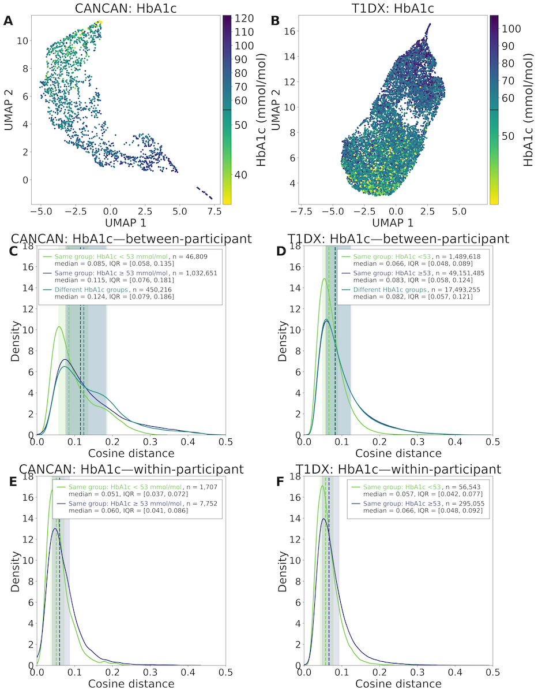
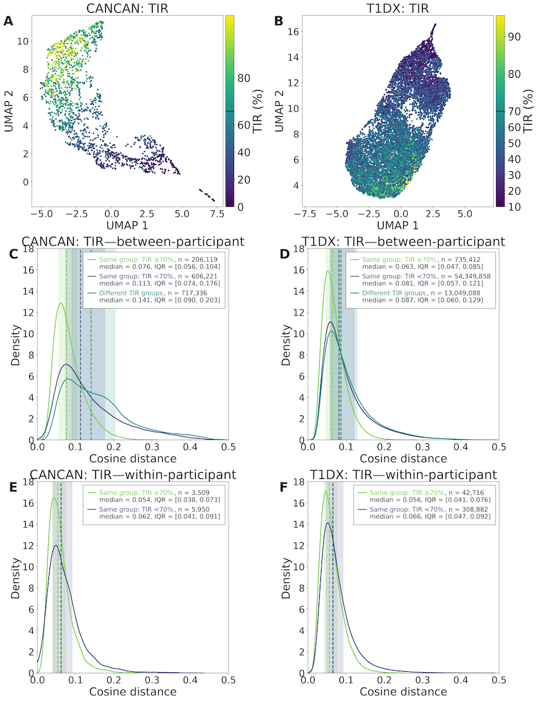
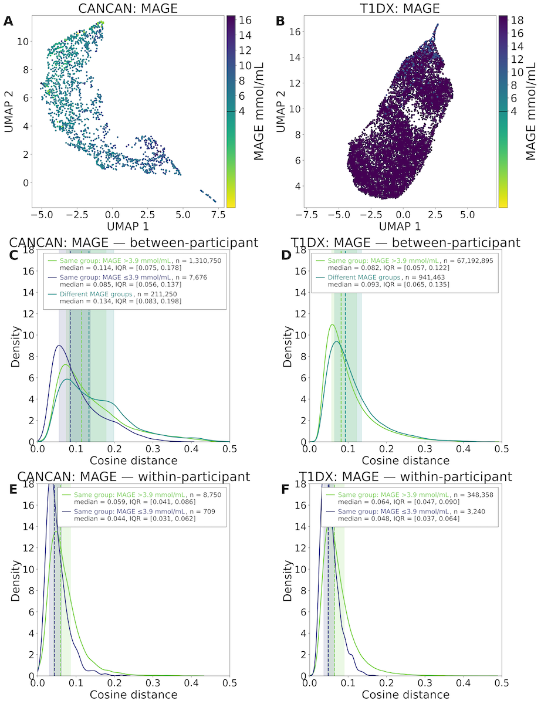
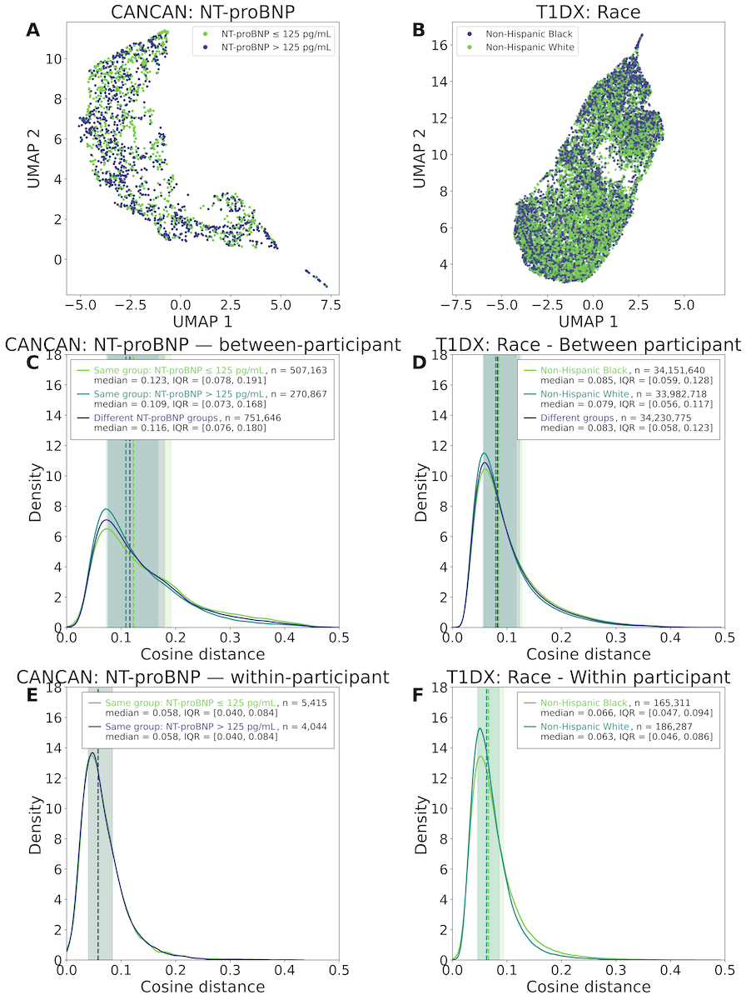

### Cosine Distances
- [ ] Add a very brief text to the figures    
- [ ] fig-cosim_MAGE needs to be changed, the change in resolution messed up the figures + colors needs to be checked to make sure they are in the right order
- [ ] AAI suggests to trim figure text, needs to allocate time to think about that

<!-- In both the CANCAN and T1DX cohorts, within-participant pairs had lower median cosine distances than between-participant pairs (CANCAN: 0.058 [IQR: 0.040–0.084] vs. 0.117 [IQR: 0.076–0.182]; T1DX: 0.064 [IQR: 0.047–0.090] vs. 0.082 [IQR: 0.057–0.122]) (@fig-cosim1). -->

::: {#fig-cosim1 fig-scap='Within- and between-participant comparison results'}

Kernel density plots of cosine distances for within- and between-participants in the  CANCAN dataset (A) and the T1DX dataset (B). With the median shown as a vertical dashed line and the interquartile range shown as a shaded area around the median.<!--  {style="font-size: 85%; opacity: 0.85;"} -->

:::

### Embeddings and Glycemic Control
- [ ] Need to add some text in this section

::: {#fig-cosim_hba1c fig-scap='UMAPs and kernel density plots grouped by HbA1c' width=100%}
::: {.content-visible when-format="html"}
{width=100%}
:::
::: {.content-visible when-format="pdf"}
{width=100%}
:::

UMAPs and kernel density plots over cosine distance pairs for within- and between-participants grouped based on glycemic control metrics for the CANCAN dataset. The UMAPs were colored based on clinical characteristics, with each point in the UMAP representing a single day, colors are assigned to each day at the participant level; thus, the colors reflect overall participant-level rather than day-specific values. The vertical dashed line in the density plots are the medians with the shaded area around the median being interquartile ranges.

:::

::: {#fig-cosim_tir fig-scap='UMAPs and kernel density plots grouped by TIR' width=100%}

::: {.content-visible when-format="pdf"}
{width=100%}
:::

UMAPs and kernel density plots over cosine distance pairs for within- and between-participants grouped based on glycemic control metrics for the T1DX dataset. The UMAPs were colored based on clinical characteristics, with each point in the UMAP representing a single day, colors are assigned to each day at the participant level; thus, the colors reflect overall participant-level rather than day-specific values. The vertical dashed line in the density plots are the medians with the shaded area around the median being interquartile ranges..<!--  {style="font-size: 85%; opacity: 0.85;"} -->

:::

::: {#fig-cosim_MAGE fig-scap='UMAPs and kernel density plots grouped by MAGE' width=100%}

::: {.content-visible when-format="pdf"}
{width=100%}
:::

UMAPs and kernel density plots over cosine distance pairs for within- and between-participants grouped based on MAGE for the two datasets. The UMAPs were colored based on clinical characteristics, with each point in the UMAP representing a single day, colors are assigned to each day at the participant level; thus, the colors reflect overall participant-level rather than day-specific values. The vertical dashed line in the density plots are the medians with the shaded area around the median being interquartile ranges..<!--  {style="font-size: 85%; opacity: 0.85;"} -->

:::

### Embeddings and NT-proBNP in CANCAN and race in T1DX

::: {#fig-cosim-ntprobnp fig-scap='UMAPs and kernel density plots grouped by NT-proBNP' width=95%}

{width=95%}

UMAPs and kernel density plots over cosine distance pairs for within- and between-participants grouped based on CVD and NT-proBNP for the CANCAN dataset. The UMAPs were colored based on clinical characteristics, with each point in the UMAP representing a single day, colors are assigned to each day at the participant level; thus, the colors reflect overall participant-level rather than day-specific values. The vertical dashed line in the density plots are the medians with the shaded area around the median being interquartile ranges..<!--  {style="font-size: 85%; opacity: 0.85;"} -->

:::
