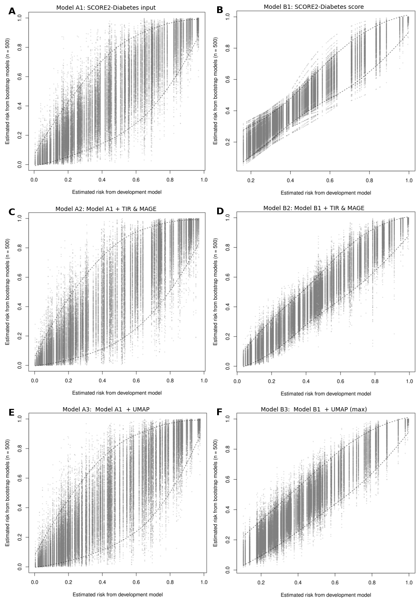

# Study I: Search strings {#sec-suppl-search-strings}

::: {#tbl-medline fig-scap='Search in Ovid MEDLINE' tbl-pos="H"}

```{=latex}

    \begin{table}[H]
        \begin{tabular}{|l|l|l|}
            \hline
            \# & Searches                                    & Results \\\hline
            1  & Blood Glucose  Self-Monitoring/             & 10241   \\\hline
            2  & Continuous Glucose Monitoring/              & 34      \\\hline
            3  & (((blood-glucose or   bloodglucose or glucose) adj2 (monitor\$ or selfmonitor\$)) & \\
               & or cgm or bgm or   iscgm or rtcgm or (time adj3 range)).ti,ab,kf,kw. & 28749   \\\hline
            4  & (Blood Glucose/ or   Glycemic Control/ or (bloodglucose\$ or bloodsugar\$ or &  \\
               & glucose\$ or glyc?emic\$   or sugar\$).ti,ab,kf,kw.) adj5 (flash or fluctuat\$ or& \\
               & intermittent\$ or scan\$   or variabilit\$).ti,ab,kf,kw. &    8669\\\hline
            5  & or/1-4                                      & 38366   \\\hline
            6  & exp Cardiovascular   Diseases/              & 2760764 \\\hline
            7  & (cardiovasc\$ or cvd or   cardiometabol\$ or cardio-metabol\$ or heart\$ or &  \\
               & macrovasc\$ or   vasc\$).ti,ab,kw,kf.   & 2182473 \\\hline
            8  & or/6-7                                      & 3971342 \\\hline
            9  & exp Diabetes Mellitus/                      & 518864  \\\hline
            10 & (diabet\$ or dm1 or dm2 or   dmi or dmii or iddm or & \\
               & niddm or t1d or t2d).ti,ab,kw,kf. &  815092 \\\hline
            11 & or/9-10                                     & 875527  \\\hline
            12 & and/5,8,11                                  & 2416    \\\hline
            13 & exp Animals/ not Humans/                    & 5189493 \\\hline
            14 & 12 not 13                                   & 2300    \\\hline
            \multicolumn{3}{|l|}{Updated search: 11 March   2025}   \\\hline
            15 & limit 14 to   (da="20231201-20261231" or dt="20231201-20261231" or  &  \\
               & ez="20231201-20261231" or ed="20231201-20261231")     &     310 \\\hline
            16 & or/14-15                                    & 2610   \\\hline
            
        \end{tabular}
    \end{table}

```
Search in Ovid MEDLINE (Search date: 22 January 2024)
:::


::: {#tbl-embase fig-scap='Search strategy in Embase (Ovid)' tbl-pos="H"}

```{=latex}
    \begin{table}[H]
        \begin{tabular}{|l|l|l|}
        \hline
        \# & Searches                                & Results \\\hline
        1  & blood glucose monitoring/               & 37574   \\\hline
        2  & exp continuous glucose   monitoring system/ & 5648    \\\hline
        3  & (((blood-glucose or   bloodglucose or glucose) adj2 & \\
           & (monitor\$ or selfmonitor\$)) or & \\
           &cgm or bgm or   iscgm or rtcgm or (time adj3 range)).ti,ab,kf,kw.     & 48502   \\\hline
        4  & (exp glucose blood level/   or glycemic control/ or (bloodglucose\$ or& \\
           & bloodsugar\$ or glucose\$ or   glyc?emic\$ or sugar\$).ti,ab,kf,kw.) &\\
           & adj5 (flash or fluctuat\$ or intermittent\$ or scan\$ or variabilit\$).ti,ab,kf,kw.  & 16430   \\\hline
        5  & or/1-4                                             & 81510   \\\hline
        6  & exp cardiovascular   disease/                      & 5122163 \\\hline
        7  & (cardiovasc\$ or cvd or   cardiometabol\$ or cardio-metabol\$ or&\\\hline
        & heart\$ or macrovasc\$ or   vasc\$).ti,ab,kw,kf. & 3044925 \\\hline
        8  & or/6-7                                             & 6303633 \\\hline
        9  & exp diabetes mellitus/                             & 1239184 \\\hline
        10 & (diabet\$ or dm1 or dm2 or   dmi or dmii or iddm or & \\
           & niddm or t1d or t2d).ti,ab,kw,kf. & 1237019 \\\hline
        11 & or/9-10                                            & 1501812 \\\hline
        12 & and/5,8,11                                         & 11217   \\\hline
        13 & (rat or rats or mouse or   mice or swine or porcine or murine or &\\
           & sheep or lambs or pigs or piglets or   rabbit or rabbits or cat or &\\
           & cats or dog or dogs or cattle or bovine or monkey   or monkeys or &\\
           & trout or marmoset\$1).ti. and animal experiment/ & 1237966 \\\hline
        14 & animal experiment/ not   (human experiment/ or human/) & 2601109 \\\hline
        15 & or/13-14                                               & 2672240 \\\hline
        16 & 12 not 15                                              & 10861   \\\hline
        17 & limit 16 to exclude   medline journals                 & 2176    \\\hline
        \multicolumn{3}{|l|}{Updated search: 11 March   2025}           \\\hline
        18 & limit 17 to   (dc="20231201-20261231" or dd="20231201-20261231" or  & \\ 
           & rd="20231201-20261231") & 467     \\\hline
        19 & or/17-18                                               & 2643 \\  \hline
        \end{tabular}
    \end{table}

```
Search strategy in Embase (Ovid) (Search date: 22 January 2024)

:::
<!-- tbl-colwidths="\[80, 20\]"} -->
# Study I: Included and excluded reports {#sec-suppl-study1-reports}

::: {.landscape}
::: {.small}

::: {#tbl-included tbl-colwidths="[26,6,30,14,5,5,6,8]"}

| Authors | Year | Full title | Journal | Volume | Issue | Pages | DOI |
|:--|:--:|:--|:--|:--:|:--:|:--:|:--|
| | | | | | | | |
| Bergdahl Ebba ; Forsander Gun ; Sundberg Frida ; Milkovic Linda ; Dangardt Frida ; | 2025 | Investigating the presence and detectability of structural peripheral arterial changes in children with well-regulated type 1 diabetes versus healthy controls using ultra-high frequency ultrasound: a single-centre cross-sectional and case-control study. | EClinicalMedicine | 81 |  | 103097 | 10.1016/j. eclinm.2025. 103097 |
| | | | | | | | |
| Bezerra Marta Fernandes; Neves Celestino ; Neves Joao Sergio; Carvalho Davide ; | 2023 | Time in range and complications of diabetes: a cross-sectional analysis of patients with Type 1 diabetes. | Diabetology & metabolic syndrome | 15 | 1 | 244 | 10.1186 /s13098 -023-01 219-2 |
| | | | | | | | |
| Borg R ; Kuenen J C; Carstensen B ; Zheng H ; Nathan D M; Heine R J; Nerup J ; Borch-Johnsen K ; Witte D R; | 2011 | HbA1(c) and mean blood glucose show stronger associations with cardiovascular disease risk factors than do postprandial glycaemia or glucose variability in persons with diabetes: the A1C-Derived Average Glucose (ADAG) study. | Diabetologia | 54 | 1 | 69-72 | 10.1007 /s0012 5-010- 1918-2 |
| | | | | | | | |
| Buscemi S ; Re A ; Batsis J A; Arnone M ; Mattina A ; Cerasola G ; Verga S ; | 2010 | Glycaemic variability using continuous glucose monitoring and endothelial function in the metabolic syndrome and in Type 2 diabetes. | Comment in: Diabet Med. 2011 Jan;28(1):125-6; author reply 127-8 PMID: 21166857 [https://www.ncbi. nlm.nih.gov/ pubmed/211 66857] Comment in: Diabet Med. 2011 Jan;28(1):126; author reply 127-8 PMID: 21166858 [https://www.ncbi. nlm.nih.gov/pubmed /21166858] | 27 | 8 | 872-8 | 10.1111/ j.1464-5491. 2010 .03059.x |
| | | | | | | | |
| Cai Lingli ; Shen Wenqi ; Li Jiang ; Wang Bin ; Sun Ying ; Chen Yi ; Gao Ling ; Xu Fei ; Xiao Xinhua ; Wang Ningjian ; Lu Yingli ; | 2024 | Association between glycemia risk index and arterial stiffness in type 2 diabetes. | Journal of diabetes investigation | 15 | 5 | 614-622 | 10.1111 /jdi.1 4153 |
| | | | | | | | |
| Castaldo Ersilia ; Sabato Donata ; Lauro Davide ; Sesti Giorgio ; Marini Maria Adelaide; | 2011 | Hypoglycemia assessed by continuous glucose monitoring is associated with preclinical atherosclerosis in individuals with impaired glucose tolerance. | PloS one | 6 | 12 | e28312 | 10.1371/ journal. pone.0028 312 |
| | | | | | | | |
| Cesana Francesca ; Giannattasio Cristina ; Nava Stefano ; Soriano Francesco ; Brambilla Gianmaria ; Baroni Matteo ; Meani Paolo ; Varrenti Marisa ; Paleari Felice ; Gamba Pierluigi ; Facchetti Rita ; Alloni Marta ; Grassi Guido ; Mancia Giuseppe ; | 2013 | Impact of blood glucose variability on carotid artery intima media thickness and distensibility in type 1 diabetes mellitus. | Blood pressure | 22 | 6 | 355-61 | 10.31 09/080 37051. 2013. 791413 |
| | | | | | | | |
| Chen Xiao-min ; Zhang Yan ; Shen Xing-ping ; Huang Qun ; Ma Hong ; Huang Yang-Ling ; Zhang Wen-Qiang ; Wu Hao-Jie ; | 2010 | Correlation between glucose fluctuations and carotid intima-media thickness in type 2 diabetes. | Diabetes research and clinical practice | 90 | 1 | 95-9 | 10.1016 /j.diab res.2010. 05.004 |
| | | | | | | | |
| Chen Y ; Jia T ; Yan X ; Dai L ; | 2020 | Blood glucose fluctuations in patients with coronary heart disease and diabetes mellitus correlates with heart rate variability: A retrospective analysis of 210 cases. | Nigerian journal of clinical practice | 23 | 9 | 1194-1200 | 10.41 03/nj cp.njc p_529_ 19 |
| | | | | | | | |
| Cutruzzola Antonio ; Parise Martina ; Scavelli Faustina B; Barone Milena ; Gnasso Agostino ; Irace Concetta ; | 2022 | Time in Range Does Not Associate With Carotid Artery Wall Thickness and Endothelial Function in Type 1 Diabetes. | Journal of diabetes science and technology | 16 | 4 | 904-911 | 10.117 7/193 2296 82199 3178 |
| | | | | | | | |
| De Meulemeester Jolien ; Charleer Sara ; Visser Margaretha M; De Block Christophe ; Mathieu Chantal ; Gillard Pieter ; | 2024 | The association of chronic complications with time in tight range and time in range in people with type 1 diabetes: a retrospective cross-sectional real-world study. | Diabetologia | 67 | 8 | 1527-1535 | 10.100 7/s001 25-024 -0617 1-y |
| | | | | | | | |
| Deng Zixuan ; Wang Shiyun ; Lu Jingyi ; Zhang Rong ; Zhang Lei ; Lu Wei ; Zhu Wei ; Bao Yuqian ; Zhou Jian ; Hu Cheng ; | 2023 | Interaction between haptoglobin genotype and glycemic variability on diabetic macroangiopathy: a population-based cross-sectional study. | Endocrine | 82 | 2 | 311-318 | 10.10 07/s1 2020-0 23-0 3484-7 |
| | | | | | | | |
| Di Flaviani Alessandra ; Picconi Fabiana ; Di Stefano Paola ; Giordani Ilaria ; Malandrucco Ilaria ; Maggio Paola ; Palazzo Paola ; Sgreccia Fabrizio ; Peraldo Carlo ; Farina Fabrizio ; Frajese Gaetano ; Frontoni Simona ; | 2011 | Impact of glycemic and blood pressure variability on surrogate measures of cardiovascular outcomes in type 2 diabetic patients. | Diabetes care | 34 | 7 | 1605-9 | 10.233 7/dc 11-00 34 |
| | | | | | | | |
| Dzhun Yana ; Mankovsky Georgy ; Rudenko Nadiya ; Marushko Yevgen ; Saienko Yanina ; Mankovsky Borys ; | 2023 | Glycemic variability is associated with diastolic dysfunction in patients with type 2 diabetes. | Journal of diabetes and its complications | 37 | 11 | 108519 | 10.10 16/j.jd iacomp.202 3.108519 |
| | | | | | | | |
| El Malahi Anass ; Van Elsen Michiel ; Charleer Sara ; Dirinck Eveline ; Ledeganck Kristien ; Keymeulen Bart ; Crenier Laurent ; Radermecker Regis ; Taes Youri ; Vercammen Chris ; Nobels Frank ; Mathieu Chantal ; Gillard Pieter ; De Block Christophe ; | 2022 | Relationship Between Time in Range, Glycemic Variability, HbA1c, and Complications in Adults With Type 1 Diabetes Mellitus. | The Journal of clinical endocrinology and metabolism | 107 | 2 | e570-e581 | 10.1210 /clinem /dgab688 |
| | | | | | | | |
| Foreman Yuri D; van Doorn William P T M; Schaper Nicolaas C; van Greevenbroek Marleen M J; van der Kallen Carla J H; Henry Ronald M A; Koster Annemarie ; Eussen Simone J P M; Wesselius Anke ; Reesink Koen D; Schram Miranda T; Dagnelie Pieter C; Kroon Abraham A; Brouwers Martijn C G J; Stehouwer Coen D A; | 2021 | Greater daily glucose variability and lower time in range assessed with continuous glucose monitoring are associated with greater aortic stiffness: The Maastricht Study. | Diabetologia | 64 | 8 | 1880-1892 | 10.1007/s001 25-0 21-05 474-8 |
| | | | | | | | |
| Georeli Eirini ; Stamati Athina ; Dimitriadou Meropi ; Chainoglou Athanasia ; Tsinopoulou Assimina Galli; Stabouli Stella ; Christoforidis Athanasios ; | 2024 | Assessment of arterial stiffness in paediatric patients with type 1 diabetes mellitus. | Journal of diabetes and its complications | 38 | 8 | 108782 | 10.1016/j.jdiacomp.2024.108782 |
| Gimenez Marga ; Gilabert Rosa ; Lara Merce ; Conget Ignacio ; | 2011 | Preclinical arterial disease in patients with type 1 diabetes without other major cardiovascular risk factors or micro-/ macrovascular disease. | Diabetes & vascular disease research | 8 | 1 | 05/Nov | 10.11 77/14 79164 11038 8674 |
| | | | | | | | |
| Gordin D ; Ronnback M ; Forsblom C ; Makinen V ; Saraheimo M ; Groop P-H ; | 2008 | Glucose variability, blood pressure and arterial stiffness in type 1 diabetes. | Diabetes research and clinical practice | 80 | 3 | e4-7 | 10.1016 /j.dia bres.2008 .01. 010 |
| | | | | | | | |
| Guo Jinhui ; Wang Juan ; Zhao Zepeng ; Yu Lifang ; | 2021 | Association between glycemic control assessed by continuous glucose monitoring and stroke in patients with atrial fibrillation and diabetes mellitus. | Annals of palliative medicine | 10 | 8 | 9157-9164 | 10.2 1037/ap m-21- 2198 |
| | | | | | | | |
| He Ruibin ; Xuan Yingli ; Zhu Lingling ; Pang Shiqing ; Qin Li ; Tian Jingyan ; Yuan Jiangzi ; | 2023 | Low Blood Glucose Index Associated with Cardiovascular Events in Diabetic Hemodialysis Patients. | Blood purification | 52 | #### | 824-834 | 10.11 59/00 05319 64 |
| | | | | | | | |
| Helleputte Simon ; Calders Patrick ; Rodenbach Arthur ; Marlier Joke ; Verroken Charlotte ; De Backer Tine ; Lapauw Bruno ; | 2022 | Time-varying parameters of glycemic control and glycation in relation to arterial stiffness in patients with type 1 diabetes. | Cardiovascular diabetology | 21 | 1 | 277 | 10.1 186/s1 2933 -022-0 1717-z |
| | | | | | | | |
| Hoffman Robert P; Dye Amanda S; Huang Hong ; Bauer John A; | 2013 | Effects of glucose control and variability on endothelial function and repair in adolescents with type 1 diabetes. | ISRN endocrinology | 2013 |  | 876547 | 10.11 55/20 13/87 6547 |
| | | | | | | | |
| Kakuta Kentaro ; Dohi Kaoru ; Miyoshi Miho ; Yamanaka Takashi ; Kawamura Masaki ; Masuda Jun ; Kurita Tairo ; Ogura Toru ; Yamada Norikazu ; Sumida Yasuhiro ; Ito Masaaki ; | 2017 | Impact of renal function on the underlying pathophysiology of coronary plaque composition in patients with type 2 diabetes mellitus. | Cardiovascular diabetology | 16 | 1 | 131 | 10.1186 /s1293 3-017-0 618-3 |
| | | | | | | | |
| Koroleva Elena A; Korbut Anton I; Bulumbaeva Dinara M; Klimontov Vadim V; | 2022 | Modeling of Risk Factors for Peripheral Artery Disease in Patients with Type 2 Diabetes | 2022 IEEE International Multi-Conference on Engineering, Computer and Information Sciences (SIBIRCON) | NA | NA | 200-205 | 10.11 09/sibi rcon5 6155. 2022. 10017 018 |
| | | | | | | | |
| Li Jinfeng ; Li Ya ; Ma Weiguo ; Liu Yishan ; Yin Xiaohong ; Xie Chuanqing ; Bai Jiao ; Zhang Min ; | 2020 | Association of Time in Range levels with Lower Extremity Arterial Disease in patients with type 2 diabetes. | Diabetes & metabolic syndrome | 14 | 6 | 2081-2085 | 10.10 16/j. dsx.2020. 09.028 |
| | | | | | | | |
| Lu Jingyi ; Ma Xiaojing ; Shen Yun ; Wu Qiang ; Wang Ren ; Zhang Lei ; Mo Yifei ; Lu Wei ; Zhu Wei ; Bao Yuqian ; Vigersky Robert A; Jia Weiping ; Zhou Jian ; | 2020 | Time in Range Is Associated with Carotid Intima-Media Thickness in Type 2 Diabetes. | Diabetes technology & therapeutics | 22 | 2 | 72-78 | 10.1 089/di a.20 19.0251 |
| | | | | | | | |
| Lu Jingyi ; Wang Chunfang ; Shen Yun ; Chen Lei ; Zhang Lei ; Cai Jinghao ; Lu Wei ; Zhu Wei ; Hu Gang ; Xia Tian ; Zhou Jian ; | 2021 | Time in Range in Relation to All-Cause and Cardiovascular Mortality in Patients With Type 2 Diabetes: A Prospective Cohort Study. | Comment in: Diabetes Care. 2021 Feb;44(2):319-320 PMID: 33472967 [https://www.ncbi.nlm.nih.gov/pubmed/33472967] | 44 | 2 | 549-555 | 10.2 337/ dc2 0-1862 |
| | | | | | | | |
| Magri Caroline Jane; Mintoff Dillon ; Camilleri Liberato ; Xuereb Robert G; Galea Joseph ; Fava Stephen ; | 2018 | Relationship of Hyperglycaemia, Hypoglycaemia, and Glucose Variability to Atherosclerotic Disease in Type 2 Diabetes. | Journal of diabetes research | 2018 |  | 7464320 | 10.11 55/2 018/ 74643 20 |
| | | | | | | | |
| Mesa Alex ; Gimenez Marga ; Pueyo Irene ; Perea Veronica ; Vinals Clara ; Blanco Jesus ; Vinagre Irene ; Seres-Noriega Tonet ; Boswell Laura ; Esmatjes Enric ; Conget Ignacio ; Amor Antonio J; | 2022 | Hyperglycemia and hypoglycemia exposure are differentially associated with micro- and macrovascular complications in adults with Type 1 Diabetes. | Diabetes research and clinical practice | 189 |  | 109938 | 10.1 016/ j.di bres.20 22.10 9938 |
| | | | | | | | |
| Mi Shu-Hua ; Su Gong ; Li Zhao ; Yang Hong-Xia ; Zheng Hong ; Tao Hong ; Zhou Yun ; Tian Lei ; | 2012 | Comparison of glycemic variability and glycated hemoglobin as risk factors of coronary artery disease in patients with undiagnosed diabetes. | Chinese medical journal | 125 | 1 | 38-43 | 10.376 0/c ma.j.iss n.0366- 6999 .2012. 01.008 |
| | | | | | | | |
| Mita Tomoya ; Katakami Naoto ; Okada Yosuke ; Yoshii Hidenori ; Osonoi Takeshi ; Nishida Keiko ; Shiraiwa Toshihiko ; Kurozumi Akira ; Taya Naohiro ; Wakasugi Satomi ; Sato Fumiya ; Ishii Ryota ; Gosho Masahiko ; Shimomura Iichiro ; Watada Hirotaka ; | 2023 | Continuous glucose monitoring-derived time in range and CV are associated with altered tissue characteristics of the carotid artery wall in people with type 2 diabetes. | Diabetologia | 66 | 12 | 2356-2367 | 10.1 007/s0 0125 -023-0 6013-3 |
| | | | | | | | |
| Mo Yifei ; Zhou Jian ; Li Mei ; Wang Yuwei ; Bao Yuqian ; Ma Xiaojing ; Li Ding ; Lu Wei ; Hu Cheng ; Li Minghua ; Jia Weiping ; | 2013 | Glycemic variability is associated with subclinical atherosclerosis in Chinese type 2 diabetic patients. | Cardiovascular diabetology | 12 |  | 15 | 10.118 6/1 475 -2840- 12-15 |
| | | | | | | | |
| Morandi Anita ; Piona Claudia ; Corradi Massimiliano ; Marigliano Marco ; Giontella Alice ; Orsi Silvia ; Emiliani Federica ; Tagetti Angela ; Marcon Denise ; Fava Cristiano ; Maffeis Claudio ; | 2023 | Risk factors for pre-clinical atherosclerosis in adolescents with type 1 diabetes. | Diabetes research and clinical practice | 198 |  | 110618 | 10.1016/ j.dia bres.2023. 110618 |
| | | | | | | | |
| Pena Alexia S; Couper Jennifer J; Harrington Jennifer ; Gent Roger ; Fairchild Jan ; Tham Elaine ; Baghurst Peter ; | 2012 | Hypoglycemia, but not glucose variability, relates to vascular function in children with type 1 diabetes. | Diabetes technology & therapeutics | 14 | 6 | 457-62 | 10.10 89/dia. 2011. 0229 |
| | | | | | | | |
| Pertseva N ; Moshenets K ; | 2023 | Definition of the relationships between ambulatory blood pressure characteristics and blood glucose levels in type 2 diabetes patients with well-controlled arterial hypertension | Romanian Journal of Diabetes, Nutrition and Metabolic Diseases | 30 | 2 | 215-221 | 10.463 89/ rjd-20 23-12 90 |
| | | | | | | | |
| Piona Claudia ; Marigliano Marco ; Mancioppi Valentina ; Mozzillo Enza ; Occhiati Luisa ; Zanfardino Angela ; Iafusco Dario ; Maltoni Giulio ; Zucchini Stefano ; Delvecchio Maurizio ; Passanisi Stefano ; Lombardo Fortunato ; Maffeis Claudio ; | 2023 | Glycemic variability and Time in range are associated with the risk of overweight and high LDL-cholesterol in children and youths with Type 1 Diabetes. | Hormone research in paediatrics |  |  |  | 10.11 59/000 5355 54 |
| | | | | | | | |
| Pulkkinen Mari-Anne ; Tuomaala Anna-Kaisa ; Hero Matti ; Gordin Daniel ; Sarkola Taisto ; | 2020 | Motivational Interview to improve vascular health in Adolescents with poorly controlled type 1 Diabetes (MIAD): a randomized controlled trial. | BMJ open diabetes research & care | 8 | 1 |  | 10.113 6/bmj drc-2 020-001 216 |
| | | | | | | | |
| Sheng Xia ; Li Ting ; Hu Yi ; Xiong Cheng-Shun ; Hu Ling ; | 2023 | Correlation Between Blood Glucose Indexes Generated by the Flash Glucose Monitoring System and Diabetic Vascular Complications. | Diabetes, metabolic syndrome and obesity : targets and therapy | 16 |  | 2447-2456 | 10.21 47/DMS O.S418 224 |
| | | | | | | | |
| Snell-Bergeon J K; Roman R ; Rodbard D ; Garg S ; Maahs D M; Schauer I E; Bergman B C; Kinney G L; Rewers M ; | 2010 | Glycaemic variability is associated with coronary artery calcium in men with Type 1 diabetes: the Coronary Artery Calcification in Type 1 Diabetes study. | Diabetic medicine : a journal of the British Diabetic Association | 27 | 12 | 1436-42 | 10.111 1/j.146 4-549 1.201 0.031 27.x |
| | | | | | | | |
| Su Gong ; Mi Shuhua ; Tao Hong ; Li Zhao ; Yang Hongxia ; Zheng Hong ; Zhou Yun ; Ma Changsheng ; | 2011 | Association of glycemic variability and the presence and severity of coronary artery disease in patients with type 2 diabetes. | Cardiovascular diabetology | 10 |  | 19 | 10.11 86/14 75-2 840-10 -19 |
| | | | | | | | |
| Taya Naohiro ; Katakami Naoto ; Mita Tomoya ; Okada Yosuke ; Wakasugi Satomi ; Yoshii Hidenori ; Shiraiwa Toshihiko ; Otsuka Akihito ; Umayahara Yutaka ; Ryomoto Kayoko ; Hatazaki Masahiro ; Yasuda Tetsuyuki ; Yamamoto Tsunehiko ; Gosho Masahiko ; Shimomura Iichiro ; Watada Hirotaka ; | 2021 | Associations of continuous glucose monitoring-assessed glucose variability with intima-media thickness and ultrasonic tissue characteristics of the carotid arteries: a cross-sectional analysis in patients with type 2 diabetes. | Cardiovascular diabetology | 20 | 1 | 95 | 10.11 86/s1 2933- 021- 0128 8-5 |
| | | | | | | | |
| Torimoto Keiichi ; Okada Yosuke ; Mita Tomoya ; Tanaka Kenichi ; Sato Fumiya ; Katakami Naoto ; Yoshii Hidenori ; Nishida Keiko ; Tanaka Yoshiya ; Ishii Ryota ; Gosho Masahiko ; Shimomura Iichiro ; Watada Hirotaka ; | 2025 | Association of Glycaemia Risk Index With Indices of Atherosclerosis: A Cross-Sectional Study. | Journal of diabetes | 17 | 3 | e70065 | 10.1111/ 1753- 0407. 70065 |
| | | | | | | | |
| Wakasugi Satomi ; Mita Tomoya ; Katakami Naoto ; Okada Yosuke ; Yoshii Hidenori ; Osonoi Takeshi ; Kuribayashi Nobuichi ; Taneda Yoshinobu ; Kojima Yuichi ; Gosho Masahiko ; Shimomura Iichiro ; Watada Hirotaka ; | 2021 | Associations between continuous glucose monitoring-derived metrics and arterial stiffness in Japanese patients with type 2 diabetes. | Cardiovascular diabetology | 20 | 1 | 15 | 10.118 6/s129 33-020- 011 94-2 |
| | | | | | | | |
| Watanabe Makoto ; Kawai Yasuyuki ; Kitayama Michihiko ; Akao Hironubu ; Motoyama Atsushi ; Wakasa Minoru ; Saito Ryuhei ; Aoki Hirofumi ; Fujibayashi Kousuke ; Tsuchiya Taketsugu ; Nakanishi Hiroaki ; Saito Kazuyuki ; Takeuchi Masayoshi ; Kajinami Kouji ; | 2017 | Diurnal glycemic fluctuation is associated with severity of coronary artery disease in prediabetic patients: Possible role of nitrotyrosine and glyceraldehyde-derived advanced glycation end products. | Journal of cardiology | 69 | 4 | 625-631 | 10.101 6/j.j jcc.2 016.07. 001 |
| | | | | | | | |
| Wei Wei ; Zhao Shi ; Fu Sha-Li ; Yi Lan ; Mao Hong ; Tan Qin ; Xu Pan ; Yang Guo-Liang ; | 2019 | The Association of Hypoglycemia Assessed by Continuous Glucose Monitoring With Cardiovascular Outcomes and Mortality in Patients With Type 2 Diabetes. | Frontiers in endocrinology | 10 |  | 536 | 10.33 89/fe ndo.2 019.00 536 |
| | | | | | | | |
| Wei Yinghua ; Liu Chunyan ; Liu Yanyu ; Zhang Zhen ; Feng Zhouqin ; Yang Xinyi ; Liu Juan ; Lei Haiyan ; Zhou Hui ; Shen Qiuyue ; Lu Bin ; Gu Ping ; Shao Jiaqing ; | 2022 | The association between time in the glucose target range and abnormal ankle-brachial index: a cross-sectional analysis. | Cardiovascular diabetology | 21 | 1 | 281 | 10.1186/s12 933-022 -0171 8-y |
| | | | | | | | |
| Yano Yuichiro ; Hayakawa Manabu ; Kuroki Kazuo ; Ueno Hiroaki ; Yamagishi Sho-ichi ; Takeuchi Masayoshi ; Eto Takuma ; Nagata Naoto ; Nakazato Masamitsu ; Shimada Kazuyuki ; Kario Kazuomi ; | 2013 | Nighttime blood pressure, nighttime glucose values, and target-organ damages in treated type 2 diabetes patients. | Atherosclerosis | 227 | 1 | 135-9 | 10.10 16/j. athe roscl erosis. 2012.12. 006 |
| | | | | | | | |
| Yokota Shun ; Tanaka Hidekazu ; Mochizuki Yasuhide ; Soga Fumitaka ; Yamashita Kentaro ; Tanaka Yusuke ; Shono Ayu ; Suzuki Makiko ; Sumimoto Keiko ; Mukai Jun ; Suto Makiko ; Takada Hiroki ; Matsumoto Kensuke ; Hirota Yushi ; Ogawa Wataru ; Hirata Ken-Ichi ; | 2019 | Association of glycemic variability with left ventricular diastolic function in type 2 diabetes mellitus. | Cardiovascular diabetology | 18 | 1 | 166 | 10.11 86/s12 933-01 9-0971 -5 |
| | | | | | | | |
| Zhang Xingguang ; Xu Xiuping ; Jiao Xiumin ; Wu Jinxiao ; Zhou Shujing ; Lv Xiaofeng ; | 2013 | The effects of glucose fluctuation on the severity of coronary artery disease in type 2 diabetes mellitus. | Journal of diabetes research | 2013 |  | 576916 | 10.11 55/201 3/576 916 |
| | | | | | | | |
| Zhang X-G ; Zhang Y-Q ; Zhao D-K ; Wu J-X ; Zhao J ; Jiao X-M ; Chen B ; Lv X-F ; | 2014 | Relationship between blood glucose fluctuation and macrovascular endothelial dysfunction in type 2 diabetic patients with coronary heart disease. | European review for medical and pharmacological sciences | 18 | 23 | 3593-600 | https:// www.europe anreview .org/wp /wp-conte nt/uplo ads/3593- 3600.pdf |
| | | | | | | | |
| Zhang Chuangbiao ; Tang Meili ; Lu Xiaohua ; Zhou Yan ; Zhao Wane ; Liu Yu ; Liu Yan ; Guo Xiujie ; | 2020 | Relationship of ankle-brachial index, vibration perception threshold, and current perception threshold to glycemic variability in type 2 diabetes. | Medicine | 99 | 12 | e19374 | 10.1 097/M D.0000 00000 0019374 |
| | | | | | | | |
| Zhou Hui ; Wang Wei ; Shen Qiuyue ; Feng Zhouqin ; Zhang Zhen ; Lei Haiyan ; Yang Xinyi ; Liu Jun ; Lu Bin ; Shao Jiaqing ; Gu Ping ; | 2022 | Time in range, assessed with continuous glucose monitoring, is associated with brachial-ankle pulse wave velocity in type 2 diabetes: A retrospective single-center analysis. | Frontiers in endocrinology | 13 |  | 1014568 | 10.3389/ fendo. 2022.101 4568 |


:::{.tbl-note}
Note. Table shows included studies identified in the review. Ovid export links and reference type fields were omitted to improve readability. DOI values are shown where available.
:::

:::

:::

:::

::: {#tbl-excluded  tbl-colwidths="\[80, 20\]"}
|     Reference    |     Reason for exclusion    |
|---|---|
|     Barbieri M, Rizzo MR, Marfella R, Boccardi V,   Esposito A, Pansini A, Paolisso G. Decreased carotid atherosclerotic process   by control of daily acute glucose fluctuations in diabetic patients treated   by DPP-IV inhibitors. Atherosclerosis. 2013 Apr;227(2):349-54.    |     Not CGM metric    |
|  |  |
|     Cai J, Liu J, Lu J, Ni J, Wang C, Chen L, Lu W,   Zhu W, Xia T, Zhou J. Impact of time in tight range on all-cause and   cardiovascular mortality in type 2 diabetes: A prospective cohort study. Diabetes Obes   Metab. 2025 Apr;27(4):2154-62.     |     Studies post-surgery    |
|  |  |
|     Catargi B, Gerbaud E. Glucose fluctuations and   hypoglycemia as new cardiovascular risk factors in diabetes. Ann Endocrinol   (Paris). 2021 Jun;82(3-4):144-5.    |     Not original article    |
|  |  |
|     Chernikova NA, Kamynina LL, Ametov AS. [The   сardiometabolic assessment of the glycemic variability in patients with   diabetes mellitus: the role of the glucocardiomonitoring]. Kardiologiia. 2020   Jun 3;60(5):902.    |     Not CVD outcome    |
|  |  |
|     Costantino S, Paneni F, Battista R, Castello L,   Capretti G, Chiandotto S, Tanese L, Russo G, Pitocco D, Lanza GA, Volpe M,   Lüscher TF, Cosentino F. Impact of Glycemic Variability on Chromatin   Remodeling, Oxidative Stress, and Endothelial Dysfunction in Patients With   Type 2 Diabetes and With Target HbA1c Levels. Diabetes. 2017   Sep;66(9):2472-82.     |     Not CVD outcome    |
|  |  |
|     Ehrmann D, Chatwin H, Schmitt A, Soeholm U,   Kulzer B, Axelsen JL, Broadley M, Haak T, Pouwer F, Hermanns N. Reduced heart   rate variability in people with type 1 diabetes and elevated diabetes   distress: Results from the longitudinal observational DIA-LINK1 study. Diabet   Med. 2023 Apr;40(4):e15040.    |     Not CVD outcome    |
|  |  |
|     Howsawi AA, Alem MM. Clinical implications and   pharmacological considerations of glycemic variability in patients with type   2 diabetes mellitus. Sci Rep. 2024 Oct 14;14(1):24062.    |     Not CGM metric    |
|  |  |
|     Huang J, Zhang X, Li J, Tang L, Jiao X, Lv X.   Impact of glucose fluctuation on acute cerebral infarction in type 2   diabetes. Can J Neurol Sci. 2014 Jul;41(4):486-92.    |     Studies post-surgery    |
|  |  |
|     Inaba Y, Tsutsumi C, Haseda F, Fujisawa R, Mitsui   S, Sano H, Terasaki J, Hanafusa T, Imagawa A. Impact of glycemic variability   on the levels of endothelial progenitor cells in patients with type 1   diabetes. Diabetol Int. 2017 Sep 4;9(2):113-20.     |     Not CVD outcome    |
|  |  |
|     Ito T, Ichihashi T, Fujita H, Sugiura T, Yamamoto   J, Kitada S, Nakasuka K, Kawada Y, Ohte N. The impact of intraday glucose   variability on coronary artery spasm in patients with dysglycemia. Heart   Vessels. 2019 Aug;34(8):1250-7.     |     Studies post-surgery    |
|  |  |
|     Karnebeek K,   Rijks JM, Dorenbos E, Gerver WM, Plat J, Vreugdenhil ACE. Changes   in Free-Living Glycemic Profiles after 12 Months of Lifestyle Intervention in   Children with Overweight and with Obesity. Nutrients. 2020 Apr 26;12(5):1228.    |     Not CVD outcome    |
|  |  |
|     Kietsiriroje N, Pearson SM, O'Mahoney LL, West   DJ, Ariëns RA, Ajjan RA, Campbell MD. Glucose variability is associated with   an adverse vascular profile but only in the presence of insulin resistance in   individuals with type 1 diabetes: An observational study. Diab Vasc Dis Res.   2022 May-Jun;19(3):14791641221103217.    |     Not CVD outcome    |
|  |  |
|     Klimontov VV,   Koroleva EA, Khapaev RS, Korbut AI, Lykov AP. Carotid Artery   Disease in Subjects with Type 2 Diabetes: Risk Factors and Biomarkers. J Clin   Med. 2021 Dec 24;11(1):72.    |     Not CGM metric    |
|  |  |
|     Koroleva EA,   Khapaev RS, Lykov AP, Korbut AI, Klimontov VV. Association of   carotid atherosclerosis and peripheral artery disease in patients with type 2   diabetes: risk factors and biomarkers. Diabetes Mellitus. 2023;26(2):172-81.   Russian.    |     Language not understood    |
|  |  |
|     Maiorino MI, Della Volpe E, Olita L, Bellastella   G, Giugliano D, Esposito K. Glucose variability inversely associates with   endothelial progenitor cells in type 1 diabetes. Endocrine. 2015   Feb;48(1):342-5.    |     Not CVD outcome    |
|  |  |
|     Musurakis C, Poudel B, Chitrakar S, Qureshi F,   Gilden JL. Evaluation Of Glucose Variability By Continuous Glucose Monitoring   In Patients With Diabetes Mellitus And History Of Stroke. J Endocr Soc. 2023   Oct-Nov;7(Suppl 1): bvad114.970.    |     Not original article    |
|  |  |
|     Singh S, Singh DP, Singh SS, Srivastava AK. High   Glycaemic Variability is a Pro-arrhythmic Factor in Patient of Type-2   Diabetes Mellitus With Heart Failure. Int J Diabetes Dev Ctries. 2019   Nov;39(Suppl 1):S1-S42.    |     Not original article    |
|  |  |
|     Stahn A, Pistrosch F, Ganz X, Teige M, Koehler C,   Bornstein S, Hanefeld M. Relationship between hypoglycemic episodes and   ventricular arrhythmias in patients with type 2 diabetes and cardiovascular   diseases: silent hypoglycemias and silent arrhythmias. Diabetes Care. 2014   Feb;37(2):516-20.    |     Not CVD outcome    |
|  |  |
|     Sugimoto T, Saji N, Omura T, Tokuda H, Miura H,   Kawashima S, Ando T, Nakamura A, Uchida K, Matsumoto N, Fujita K, Kuroda Y,   Crane PK, Sakurai T. Cross-sectional association of continuous glucose   monitoring-derived metrics with cerebral small vessel disease in older adults   with type 2 diabetes. Diabetes Obes Metab. 2024 Aug;26(8):3318-27.    |     Not CVD outcome    |
|  |  |
|     Tang X, Li S, Wang Y, Wang M, Yin Q, Mu P, Lin S,   Qian X, Ye X, Chen Y. Glycemic variability evaluated by continuous glucose   monitoring system is associated with the 10-y cardiovascular risk of diabetic   patients with well-controlled HbA1c. Clin Chim Acta. 2016 Oct 1;461:146-50.    |     Not CVD outcome    |
|  |  |
|     Tateishi K, Saito Y, Kitahara H, Kobayashi Y.   Impact of glycemic variability on coronary and peripheral endothelial   dysfunction in patients with coronary artery disease. J Cardiol. 2022   Jan;79(1):65-70.    |     Not CVD outcome    |
|  |  |
|     Tong L, Chi C, Zhang Z. Association of various   glycemic variability indices and vascular outcomes in type-2 diabetes   patients: A retrospective study. Medicine (Baltimore). 2018   May;97(21):e10860.    |     Not CGM metric    |
|  |  |
|     Wang X, Zhao X, Dorje T, Yan H, Qian J, Ge J.   Glycemic variability predicts cardiovascular complications in acute   myocardial infarction patients with type 2 diabetes mellitus. Int J Cardiol.   2014 Mar 15;172(2):498-500.    |     Studies post-surgery    |
|     Xia J, Xu J, Hu S, Hao H, Yin C, Xu D. Impact of   glycemic variability on the occurrence of periprocedural myocardial   infarction and major adverse cardiovascular events (MACE) after coronary   intervention in patients with stable angina pectoris at 6months follow-up.   Clin Chim Acta. 2017 Aug;471:196-200.    |     Not CGM metric    |
|  |  |
|     Yamamoto K, Ito T, Nagasato T, Shinnakasu A,   Kurano M, Arimura A, Arimura H, Hashiguchi H, Deguchi T, Maruyama I, Nishio   Y. Effects of glycemic control and hypoglycemia on Thrombus formation   assessed using automated microchip flow chamber system: an exploratory   observational study. Thromb J. 2019 Sep 2;17:17.     |     Not CVD outcome    |
|  |  |
|     Yang XJ, He H, Lü XF, Wen XR, Wang C, Chen DW, Li   XJ, Ran XW. [Association of glycaemic variability and carotid intima-media   thickness in patients with type 2 diabetes mellitus]. Sichuan Da Xue Xue Bao   Yi Xue Ban. 2012 Sep;43(5):734-8. Chinese.    |     Language not understood    |
|  |  |
|     Yang X, Su G, Zhang T, Yang H, Tao H, Du X, Dong   J. Comparison of admission glycemic variability and glycosylated hemoglobin   in predicting major adverse cardiac events among type 2 diabetes patients   with heart failure following acute ST-segment elevation myocardial   infarction. J Transl Int Med. 2024 May 21;12(2):188-196.     |     Studies post-surgery    |
|  |  |
|     Yu MG, Jangolla   SVT, Ziemniak N, Viebranz E, Chokshi T, Park K, Wu IH, Shah H, King GL. Cardiac   Imaging And Metabolomics Studies Suggest Differential Risk And Protective   Biomarkers For Cardiovascular Disease In Renoprotected, Long-Duration Type 1   Diabetes. J Endocr Soc. 2024 Oct-Nov;8(Suppl 1):bvae163.691.    |     Other reason (not yet published)    |
|  |  |
|     Zhang J, Li L, Zhai H, Chen H, Wang L, Li N, Liu   R, Xia Y. Impact of blood glucose fluctuation on endothelial dysfunction and   severity of stenosis in aged acute coronary syndrome patients. Int J Clin Exp   Med. 2016;9(11):2210-9.    |     Studies post-surgery    |
|  |  |
|     Zhang J, Yang J, Liu L, Li L, Cui J, Wu S, Tang   K. Significant abnormal glycemic variability increased the risk for   arrhythmias in elderly type 2 diabetic patients. BMC Endocr Disord. 2021 Apr   27;21(1):83.    |     Not CVD outcome    |
|  |  |

Excluded records from database searches
:::

::: {#tbl-excluded2  tbl-colwidths="\[80, 20\]"}

|     Reference    |     Reason for exclusion    |
|---|---|
|     Gohbara M, Hibi K, Mitsuhashi T, Maejima N,   Iwahashi N, Kataoka S, Akiyama E, Tsukahara K, Kosuge M, Ebina T, Umemura S,   Kimura K. Glycemic Variability on Continuous Glucose Monitoring System   Correlates With Non-Culprit Vessel Coronary Plaque Vulnerability in Patients   With First-Episode Acute Coronary Syndrome - Optical Coherence Tomography   Study. Circ J. 2016;80(1):202-10.    |     Studies post-surgery    |
| | |
|     Jin SM, Kim TH, Bae JC, Hur KY, Lee MS, Lee MK,   Kim JH. Clinical factors associated with absolute and relative measures of   glycemic variability determined by continuous glucose monitoring: an analysis   of 480 subjects. Diabetes Res Clin Pract. 2014 May;104(2):266-72.    |     CGM metric as outcome    |
| | |
|     Kataoka S, Gohbara M, Iwahashi N, Sakamaki K,   Nakachi T, Akiyama E, Maejima N, Tsukahara K, Hibi K, Kosuge M, Ebina T,   Umemura S, Kimura K. Glycemic Variability on Continuous Glucose Monitoring   System Predicts Rapid Progression of Non-Culprit Lesions in Patients With   Acute Coronary Syndrome. Circ J. 2015;79(10):2246-54.    |     Studies post-surgery    |
| | |
|     Sugimoto H, Hironaka K, Yamada T, Otowa-Suematsu   N, Hirota Y, Otake H, Hirata K, Sakaguchi K, Ogawa W, Kuroda S. Three   components of glucose dynamics – value, variability, and autocorrelation –   are independently associated with coronary plaque vulnerability. medRxiv   2023.11.21.23298816.    |     Other reason (preprint)    |
| | |

Excluded records from citation search
::: 
# Study I: Geographical location {#sec-suppl-geo-map}

Asia (n=27)

* China (n=19)
* Japan (n=8)

Europe (n=22)

* Italy (n=7)
* Belgium (n=3)
* Ukraine (n=2)
* Finland (n=2)
* Spain (n=2)
* Greece (n=1)
* Malta (n=1)
* Sweden (n=1)
* The Netherlands (n=1)
* Portugal (n=1)
* Russia  (n=1)

North America (n=2)

* USA (n=2)

Australia / Oceania (n=1)

* Australia (n=1)

Borg 2011(ADAG study) had study centers in:

* Europe: Netherlands, Denmark, Italy
* Africa: 2011
* North America: USA

Borg R, Kuenen J C, Carstensen B, Zheng H, Nathan D M, Heine R J, et al. HbA1(c) and
mean blood glucose show stronger associations with cardiovascular disease risk factors than do postprandial glycaemia or glucose variability in persons with diabetes: the A1C-Derived Average Glucose (ADAG) study. 2011; ADAG Study Group, editor. Diabetologia. 54: 69–72. doi:10.1007/s00125-010-1918-2

# Study I: Subclinical results {#sec-suppl-subclin-results}

- [ ] Add table with subclinical study design overviews
- [ ] Add table overview of subclinical results
- [ ] Add adjustment column to @tbl-main-clinical-findings the same way as I did witht he first two studies
- [ ] Add subclinical table from the suppl. of the published ScR study down in supplementary as well


::: {.landscape}
::: {.small}

::: {#tbl-study1-clinical-overview tbl-colwidths="\[9, 14, 20, 5, 14, 14, 14, 10\]"}

| Author, year | Study Design | Population | Size | Age (Years) | Diabetes duration (Years) | HbA1c, mmol/mol (%) | CGM duration |
|:---|:---|:---|:---:|:---|:---|:---|:---|
| Chen, 2020$^\dagger$ | Longitudinal (prospective) and cross-sectional (retrospective)\newline FU: in-hospital or within 3 months after discharge from hospital | T2D with CAD (Only male)\newline BG control, n = 90\newline BG fluctuation, n = 120 | 210 | BG controls: 55.53 $\pm$ 7.30\newline BG fluctuation: 56.41 $\pm$ 7.67 | BG controls: 6.59 $\pm$ 2.30\newline BG fluctuation group: 6.92 $\pm$ 2.25 | nr | 2 days |
| | | | | | | | |
| He, 2023 | Longitudinal (prospective)\newline FU: 1 year | T2D with kidney disease on hemodialysis\newline High TIR, n = 12\newline Low TIR, n = 15 | 27 | High TIR: 66 [63, 73]\newline Low TIR: 70 [64, 75] | High TIR: 2 [1.7, 10]\newline Low TIR: 5 [0.75, 20] | High TIR: 43 [37, 51] mmol/mol (6.1 [5.5, 6.8]%)\newline Low TIR: 66 [46, 70] mmol/mol (8.2 [6.4, 8.6]%) | 14 days |
| | | | | | | | |
| Lu, 2021 | Longitudinal (prospective)\newline FU: until death occurred or 3–13 years\newline Median: 6.9 years | T2D, hospitalized | 6225 | mean age = 61.7 years | mean: 9.7 years | 74.0 $\pm$ 24.0 mmol/mol (8.9 $\pm$ 2.2%) | 72 hours |
| | | | | | | | |
| Wei, 2019 | Longitudinal (prospective)\newline Median FU [IQR]: 31 months (22, 56) | T2D Divided into three groups:\newline 1) No hypo, n = 1173\newline 2) Mild hypo (lvl1), n = 323\newline 3) Severe hypo (lvl3), n = 24 | 1520 | No hypoglycemia: 58.59 $\pm$ 11.26\newline Hypoglycemia: 62.27 $\pm$ 11.58 | No hypoglycemia: 6.46 $\pm$ 6.00\newline Hypoglycemia: 7.78 $\pm$ 7.37 | No hypoglycemia: (8.19 $\pm$ 2.10%)\newline Hypoglycemia: (7.73 $\pm$ 1.96%) | 3 days |
| | | | | | | | |
| Bezerra, 2023 | Cross-sectional | T1D | 161 | 37.4 $\pm$ 13.4 | 17.7 $\pm$ 10.6 | (7.5 $\pm$ 1.1%) | 14 days |
| | | | | | | | |
| De Meulemeester, 2024$^\dagger$ | Cross-sectional | T1D | 808 | 44.8 $\pm$ 15.2 | 23.1 $\pm$ 13.6 | 63 $\pm$ 13 mmol/mol (7.9 $\pm$ 1.2%) | 2 weeks |
| | | | | | | | |
| Deng, 2023 | Cross-sectional | T2D | 860 | HP 1 carriers: 53.5 $\pm$ 13.3\newline HP 2-2: 51.7 $\pm$ 14.6 | HP 1 carriers: 8.6 $\pm$ 6.4\newline HP 2-2: 8.6 $\pm$ 6.7 | HP1 carriers: 73.0 $\pm$ 24.0 mmol/mol (8.8 $\pm$ 2.2%)\newline Hp2-2: 72.0 $\pm$ 23.0 mmol/mol (8.7 $\pm$ 2.1) | 3 days |
| | | | | | | | |
| El Malahi, 2022 | Cross-sectional | T1D starting on sensor-augmented pump therapy | 515 | Mean $\pm$ SD [years]:\newline42.2 $\pm$ 12.5 | 22.3 $\pm$ 11.6 | 60 $\pm$ 9.8 mmol/mol (7.6 $\pm$ 0.9 %) | 2 weeks |
| | | | | | | | |
| Guo, 2021 | Cross-sectional | T1D or T2D with atrial fibrillation\newline With Stroke, n = 48\newline Without Stroke, n = 462 | 510 | Stroke: 70.3 $\pm$ 12.1\newline No stroke: 68.1 $\pm$ 9.4 | nr | No Stroke: 7.4 $\pm$ 2.1\newline Stroke: 8.2 $\pm$ 1.7 | 72 hour |
| | | | | | | | |
| Li, 2020 | Cross-sectional | T2D with LEAD, n = 179\newline T2D without LEAD, n = 157 | 336 | Without LEAD: 55.94 $\pm$ 12.45\newline With LEAD: 65.56 $\pm$ 11.99 | Without LEAD: 6.92 $\pm$ 3.54\newline With LEAD: 10.32 $\pm$ 4.14 | Without LEAD: 7.85 $\pm$ 1.41%\newline With LEAD: 8.97 $\pm$ 1.63% | 72 hours |
| | | | | | | | |
| Magri, 2018$^\dagger$ | Cross-sectional | T2D | 121 | 64 [57, 68] | 3 [2, 5] | median: 45 mmol/mol (6.8%) | 72 hours |
| | | | | | | | |
| Mi, 2012 | Cross-sectional | T2D with chest pain\newline Without CAD, n = 202\newline With CAD, n = 84 | 286 | Without CAD: 62.8 $\pm$ 8.7\newline With CAD: 66.6 $\pm$ 9.2 | nr | Non-CAD: 7.51 $\pm$ 0.80%\newline CAD: 7.75 $\pm$ 0.92% | 72 hours (Only intermediate 48 hours were used) |
| | | | | | | | |
| Sheng, 2023 | Cross-sectional | T2D, hospitalized | 545 | mean age of (61.22 $\pm$ 11.21) years | nr | 8.51 $\pm$ 1.85% | 7-14 days |
| | | | | | | | |
| Su, 2011 | Cross-sectional | T2D with chest pain\newline Without CAD, n = 92\newline With CAD, n = 252 | 344 | Without CAD: 61 $\pm$ 9\newline With CAD: 65 $\pm$ 9 | Without CAD: 4.8 $\pm$ 5.7\newline With CAD: 6.5 $\pm$ 6.4 | non-CAD: 7.5 $\pm$ 1.4%\newline CAD: 7.6 $\pm$ 1.5% | 72 hours (only 48 hours used) |
| | | | | | | | |
| Watanabe, 2017 | Cross-sectional | Prediabetes, hospitalized | 28 | 64.3 $\pm$ 12.8 | nr | 5.41 $\pm$ 0.35% | 72 hours (Only used the middle 48 hours) |
| | | | | | | | |
| Zhang, 2013 | Cross-sectional | T2D with cardiovascular complications\newline Group A: healthy individuals\newline Group B: T2D without cardiovascular complications\newline Group C: T2D with cardiovascular complications | 92 | Group A: 56.3 $\pm$ 6.1\newline Group B: 56.1 $\pm$ 6.6\newline Group C: 61.7 $\pm$ 7.2 | nr | Group A: 5.3 $\pm$ 0.3%\newline Group B: 6.6 $\pm$ 1.2%\newline Group C: 7.5 $\pm$ 1.4% | 72 hours |


::: {.content-visible when-format="pdf"}
```{=latex}
\tablenote[0.90\linewidth]{
    \textsuperscript{$\dagger$}  This study appears both in the clinical and subclinical disease outcome tables due to investigating multiple CVD outcomes.\
    Note: Age is reported in years either as an interval, mean $\pm$ SD, or median (IQR). Diabetes duration values originally reported in months were converted to years for consistency (months $\div$ 12).
    \textit{Abbreviations:} CGM: continuous glucose monitoring, FU: follow-up, T1D: type 1 diabetes, T2D: type 2 diabetes, CAD: coronary artery disease, hypo: hypoglycemia, LEAD: lower extremity arterial disease, IQR: interquartile range, nr: not reported.

}
```
:::

::: {.content-visible when-format="html"}
<p style="font-size:75%">
$^\dagger$ This study appears both in the clinical and subclinical disease outcome tables due to investigating multiple CVD outcomes.
</p>
*Note:* Age is reported in years either as an interval, mean $\pm$ SD, or median (IQR). Diabetes duration values originally reported in months were converted to years for consistency (months $\div$ 12). <br>
*Abbreviations:* CGM, continuous glucose monitoring; FU, follow-up; T1D, type 1 diabetes; T2D, type 2 diabetes; CAD, coronary artery disease; hypo, hypoglycemia; LEAD, lower extremity arterial disease; IQR, interquartile range; nr, not reported.

</p>
:::

Study design and demographics of the included clinical cardiovascular outcome studies

:::
:::
:::


::: {.landscape}
::: {.small}

::: {#tbl-study1-subclinical-overview tbl-colwidths="\[9, 24, 25, 14, 14, 14\]"}

| Author, year | Study Design | Population + age [years] | Size of population | CGM duration | Adjusted |
|---|---|---|---|---|---|
| Chen, 2020† | Longitudinal and cross-sectional  FU: within 3 months | T2D + CAD,\newline Only male\newline  Age: 45-70 \newline| 210 | 3rd and 5th day of the study | Univariate |
| Mita, 2023 | Longitudinal  FU: 104 weeks | T2D  Age: 30-80 | 553 | 14 days at baseline and at week 104\newline| Demographic\newline  Anthropometric \newline Lifestyle\newline  Medical History\newline  Physiological\newline  Biochemical\newline  Medication\newline  CVD marker\newline |
| Bergdahl, 2025 | Cross-sectional | T1D, n = 50  Normal controls, n = 41  Age 6-15.99 | 91 |  | Demographic\newline   Anthropometric\newline   Physiological\newline   Biochemical\newline   CGM/GV metrics\newline  |
| Borg, 2011 | Cross-sectional | T1D = 268 \newline T2D = 159   \newline Age: 18-70 | 427 | 48 hours *3 times | Demographic\newline  Lifestyle \newline Medical History \newline|
| Buscemi, 2010 | Cross-sectional | Metabolic syndrome = 23\newline   Withhout metabolic syndrome = 30 \newline  T2D not diagnosed prior to study = 22 \newline    Age: 30-65\newline  | 75 | 46-48 hours | nr |
| Cai, 2024 | Cross-sectional | T2D \newline  Age ≥ 18 year | 342 | 14 days | Demographic \newline  Anthropometric\newline   Lifestyle \newline  Medical History \newline  Physiological \newline  Biochemical\newline  |
| Castaldo, 2011 | Cross-sectional | Normal glucose tolerance = 36  \newline Impaired glucose tolerance = 43   \newline  Age: 23–70 | 79 | 72 hours | Demographic \newline  Anthropometric \newline  Lifestyle  \newline Physiological \newline  Biochemical \newline  CGM/GV metrics\newline  |
| Cesana, 2013 | Cross-sectional | T1D, \newline free of CVD \newline  Mean age±SD: 40.8 ± 7.6\newline  | 17 | 24 hours | Univariate |
| Chen, 2010 | Cross-sectional | T2D with  CVD = 16 \newline  T2D without  CVD = 20 \newline  Normal  controls = 10   \newline  Age: 33–86 \newline | 46 | 72 hours | Univariate |
| Cutruzzola, 2022 | Cross-sectional | T1D = 70 \newline  Mean age: 35 ± 13  \newline    Controls, n = 35  \newline comparable on sex and age \newline  Mean age±SD: 32 ± 13\newline  | 105 | 6 months | nr |
| De Meulemeester, 2024† | Cross-sectional | T1D    \newline Mean age±SD: 44.8 ± 15.2 | 808 | 2 weeks | Demographic \newline  Anthropometric \newline  Lifestyle \newline  Medical History \newline  Biochemical  \newline Medication \newline |
| Di Flaviani, 2011 | Cross-sectional | T2D  Mean age±SD: 59.2 ± 10.6 | 26 | 24 hours | Demographic \newline  Physiological \newline  Biochemical  \newline CGM/GV metrics \newline  CVD marker \newline |
| Dzhun, 2023 | Cross-sectional | T2D without coronary artery disease\newline   Mean age±SD: 47.5 ± 4 | 78 | 6 days | Demographic \newline  Anthropometric  \newline Medical History  \newline Physiological \newline  Biochemical \newline  CVD marker\newline  |
| Foreman, 2021 | Cross-sectional | Euglycemia, n = 454 \newline  Prediabetes, n = 175  \newline T1D, n = 2  \newline T2D, n = 185 \newline  Age: 40-75 | 643-816 | 7 days | Demographic \newline  Anthropometric \newline  Lifestyle \newline  Physiological\newline   Biochemical \newline  Medication \newline  CGM/GV metrics\newline  |
| Georeli, 2024 | Cross-sectional | T1D  Age: 4-21 | 124 | 24 hours | Demographic \newline \newline   Anthropometric \newline |
| Gimenez, 2011 | Cross-sectional | T1D = 38 \newline  Normal controls = 22 \newline  Age- and sex-matched \newline  Age > 18 years\newline  | 60 | 72 hours | Univariate |
| Gordin, 2008 | Cross-sectional | T1D, males only   \newline  Age: 25.9 ± 5.6\newline  | 22 | 72 hours | ct |
| Helleputte, 2022 | Cross-sectional | T1D free of CVD \newline  Age > 18 \newline | 54 | 7 days | Univariate |
| Hoffman, 2013 | Cross-sectional | T1D  Age: 13.1 ± 1.6 | 17 | 3 days | Univariate |
| Kakuta, 2017 | Cross-sectional | T2D with coronary artery disease or \newline suspected coronary artery disease  \newline Age >20 | 71 | 7 days | nr |
| Koroleva, 2022 | Cross-sectional | T2D on antihyperglycemic therapy  \newline Age>40 | 194 | 3 days | Demographic \newline  Medical History \newline  Biochemical \newline |
| Lu, 2020 | Cross-sectional | T2D  Age ≥ 18 | 2215 | 3 days | Demographic  \newline Anthropometric \newline  Lifestyle  \newline Medical History  \newline Physiological  \newline Biochemical \newline  Medication \newline |
| Magri, 2018† | Cross-sectional | T2D \newline  Median age (IQR): 64 (57–68) | 121 | 72 hours | Anthropometric \newline  Lifestyle \newline  Biochemical  \newline CGM/GV metrics \newline |
| Mesa, 2022 | Cross-sectional | T1D  Age ≥ 40 | 152 | 14 days | Demographic \newline  Medical History \newline  Physiological \newline  Biochemical  \newline Medication \newline |
| Mo, 2013 | Cross-sectional | T2D  Age: 40-86 | 216 | 72 hours | Demographic \newline  Anthropometric \newline  Lifestyle \newline  Medical History \newline  Physiological \newline  Biochemical \newline  Medication  \newline CGM/GV metrics \newline |
| Morandi, 2023 | Cross-sectional | T1D  Age: 9-23 | 267 | 4 weeks | nr \newline \newline |
| Pena, 2012 | Cross-sectional | T1D =52  Mean age±SD: 14±2.7 \newline  Normal controls = 50 \newline  (Age and sex matched) \newline  Mean age(SD): 14.8±3.3 | 102 | 4 days  Days 0 and 3 where not used  (Results in 48 hours used for calculations) \newline | Anthropometric \newline  Medical History\newline  |
| Pertseva 2023 | Cross-sectional | T2D, n = 53 \newline  Normal control, \newline n = 10  Age, \newline sex and BMI matched \newline  Age: 51-65 \newline | 63 | 24 hours | Univariate |
| Piona, 2023 | Cross-sectional | T1D  Age: 2-18 years | 895 | 2 weeks previsit and 4 weeks previsit | Demographic\newline   Anthropometric \newline  Medical History\newline   Biochemical \newline  Medication \newline  CGM/GV metrics \newline |
| Pulkkinen, 2020 | Cross-sectional | T1D  \newline Age:12-15.9\newline  | 39 | 6 days for baseline +  12 months | Univariate |
| Snell, Bergeon, 201031 | Cross-sectional | T1D, no history of coronary artery disease \newline  Age 19-56 years | 75 | 5 days | Demographic  \newline Medical History \newline  CGM/GV metrics  \newline CVD marker \newline |
| Taya, 2021 | Cross-sectional | T2D , no history of CVD \newline  age 30-80 | 600 | 3-10 days | Demographic \newline  Anthropometric\newline   Lifestyle \newline  Medical History \newline  Physiological \newline  Biochemical \newline |
| Torimoto, 2025 | Cross-sectional | T2D no history of CVD \newline  Age: 30–80 | 999 |  | Demographic\newline   Anthropometric \newline  Lifestyle \newline  Medical History \newline  Physiological  \newline Biochemical  \newline Medication\newline  |
| Wakasugi, 2021 | Cross-sectional | T2D, no history of CVD\newline   Age 30-80 | 445 | 14 days | Demographic \newline  Anthropometric \newline  Lifestyle \newline  Medical History \newline  Physiological \newline  Biochemical \newline  Medication \newline |
| Wei, 2022 | Cross-sectional | T2D \newline  Median age(IQR): 55.0 (47 - 65) | 405 | 72 hours | Demographic \newline  Anthropometric \newline  Medical History \newline  Physiological  \newline Biochemical \newline  CGM/GV metrics\newline  |
| Yano, 2013 | Cross-sectional | T2D  Age ≥ 20 | 49 | 72 hours | Physiological |
| Yokota, 2019 | Cross-sectional | T2D, free of CVD \newline  Mean age±: 60 ± 14 | 100 | 72 hours | Demographic \newline  Anthropometric\newline   Medical History \newline  Biochemical \newline  Medication\newline   CVD marker\newline  |
| Zhang, 2014 | Cross-sectional | T2D  - With CAD, n=52  \newline - Without CAD, n = 36  Healthy controls, n=30  Age: 50-70 | 118 | 72 hours | Physiological  \newline Biochemical\newline  |
| Zhang, 2020 | Cross-sectional | T2D\newline  Age: 25-75\newline  | 78 | 72 hours | Univariate |
| Zhou, 2022 | Cross-sectional | T2D, hospitalized,\newline  no history of CVD \newline  Median age(IQR): 55 (47,64) | 469 | 72 hours | Demographic  \newline Anthropometric \newline  Medical History\newline   Physiological \newline  Biochemical\newline  |


::: {.content-visible when-format="pdf"}
```{=latex}
\tablenote[0.90\linewidth]{
    \textsuperscript{$\dagger$}  This study appears both in the clinical and subclinical disease outcome tables due to investigating multiple CVD outcomes.\
    Note: Age is reported in years either as an interval, mean $\pm$ SD, or median (IQR).\newline
    \textit{Abbreviations:} CGM: continuous glucose monitoring, FU: follow-up, T1D: type 1 diabetes, T2D: type 2 diabetes, CAD: coronary artery disease, CVD: cardiovascular disases, BMI: body mass index, GV: glycemic variability, nr: not reported, ct: cannot tell.
,

}
```
:::

::: {.content-visible when-format="html"}
<p style="font-size:75%">
$^\dagger$ This study appears both in the clinical and subclinical disease outcome tables due to investigating multiple CVD outcomes.
</p>
*Note:* Age is reported in years either as an interval, mean $\pm$ SD, or median (IQR). Diabetes duration values originally reported in months were converted to years for consistency (months $\div$ 12).<br>
*Abbreviations:* CGM: continuous glucose monitoring, FU: follow-up, T1D: type 1 diabetes, T2D: type 2 diabetes, CAD: coronary artery disease, CVD: cardiovascular disases, BMI: body mass index, GV: glycemic variability, nr: not reported, ct: cannot tell.
</p>
:::

Study design, demographics, and adjustments of the included subclinical cardiovascular outcome studies

:::
:::
:::





# Study II: Cosine distances {#sec-suppl-cosim}
- [ ] Add supplementary tables here (median and IQR) for NT-proBNP and race in cosine distances. Data is saved in figures/4_results_fig


# Study II: Prediction stability {#sec-suppl-pred-stability}
Prediction stability plots (@fig-pred-stability) revealed more stability the fewer predictors. 

::: {#fig-pred-stability width=75%}

{width=75%}

Prediction stability plots show the predictions (estimated risk) for the full dataset from the development model (equivalent to the apparent model) on the x-axis,  and the predictions from all bootstrap models on the y-axis. Tight alignment along the diagonal indicates higher prediction stability.

:::

# Study III: Surveillance Error Grid {#sec-suppl-seg-results}

::: {#tbl-seg-white tbl-colwidths="[12,18,15,9,9,9,9,9,10]"}

| Group | Model | Zone | 0 | 20 | 40 | 60 | 80 | 100 |
|:------|:------|:-----|--:|--:|--:|--:|--:|--:|
| White | LOCF | None | 69% | 69% | 69% | 69% | 69% | 69% |
| | | Slight | 26% | 26% | 26% | 26% | 26% | 26% |
| | | Moderate | 4% | 4% | 4% | 4% | 4% | 4% |
| | | High | 0% | 0% | 0% | 0% | 0% | 0% |
| | | Extreme | 0% | 0% | 0% | 0% | 0% | 0% |
| | Base- | None | 66% | 66% | 66% | 66% | 66% | 66% |
| | Individual| Slight | 28% | 28% | 28% | 28% | 28% | 28% |
| | | Moderate | 6% | 6% | 6% | 6% | 6% | 6% |
| | | High | 0% | 0% | 0% | 0% | 0% | 0% |
| | | Extreme | 0% | 0% | 0% | 0% | 0% | 0% |
| | Base- | None | 72% | 73% | 73% | 73% | 73% | 73% |
| | Generalized| Slight | 25% | 25% | 25% | 24% | 24% | 24% |
| | | Moderate | 3% | 3% | 3% | 3% | 3% | 3% |
| | | High | 0% | 0% | 0% | 0% | 0% | 0% |
| | | Extreme | 0% | 0% | 0% | 0% | 0% | 0% |
| | Transfer | None | 72% | 72% | 73% | 73% | 73% | 73% |
| | Learned| Slight | 25% | 24% | 24% | 24% | 24% | 24% |
| | | Moderate | 3% | 3% | 3% | 3% | 3% | 3% |
| | | High | 0% | 0% | 0% | 0% | 0% | 0% |
| | | Extreme | 0% | 0% | 0% | 0% | 0% | 0% |

Results from the Surveillance Error Grid for White participants. Values are reported as percentages.
:::


::: {#tbl-seg-black tbl-colwidths="[12,18,15,9,9,9,9,9,10]"}

| Group | Model | Zone | 0 | 20 | 40 | 60 | 80 | 100 |
|:------|:------|:-----|--:|--:|--:|--:|--:|--:|
| Black | LOCF | None | 71% | 71% | 71% | 71% | 71% | 71% |
| | | Slight | 24% | 24% | 24% | 24% | 24% | 24% |
| | | Moderate | 4% | 4% | 4% | 4% | 4% | 4% |
| | | High | 0% | 0% | 0% | 0% | 0% | 0% |
| | | Extreme | 0% | 0% | 0% | 0% | 0% | 0% |
| | Base- | None | 66% | 66% | 66% | 66% | 66% | 66% |
| | Individual| Slight | 27% | 27% | 27% | 27% | 27% | 27% |
| | | Moderate | 6% | 6% | 6% | 6% | 6% | 6% |
| | | High | 0% | 0% | 0% | 0% | 0% | 0% |
| | | Extreme | 0% | 0% | 0% | 0% | 0% | 0% |
| | Base | None | 75% | 74% | 75% | 75% | 74% | 75% |
| | -Generalized| Slight | 23% | 23% | 22% | 22% | 22% | 22% |
| | | Moderate | 3% | 3% | 3% | 3% | 3% | 3% |
| | | High | 0% | 0% | 0% | 0% | 0% | 0% |
| | | Extreme | 0% | 0% | 0% | 0% | 0% | 0% |
| | Transfer | None | 75% | 74% | 75% | 75% | 74% | 75% |
| | Learned| Slight | 22% | 23% | 22% | 22% | 22% | 22% |
| | | Moderate | 3% | 3% | 3% | 3% | 3% | 3% |
| | | High | 0% | 0% | 0% | 0% | 0% | 0% |
| | | Extreme | 0% | 0% | 0% | 0% | 0% | 0% |

Results from the Surveillance Error Grid for Black participants. Values are reported as percentages.
:::


::: {.content-visible when-format="pdf"}
# Full papers {#sec-papers}

## Paper I

\newpage

## Paper II

\newpage

## Paper III

:::